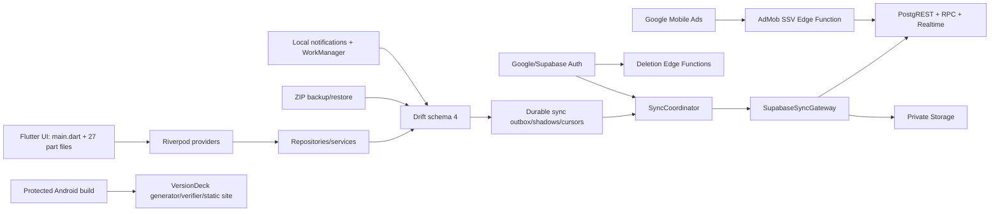
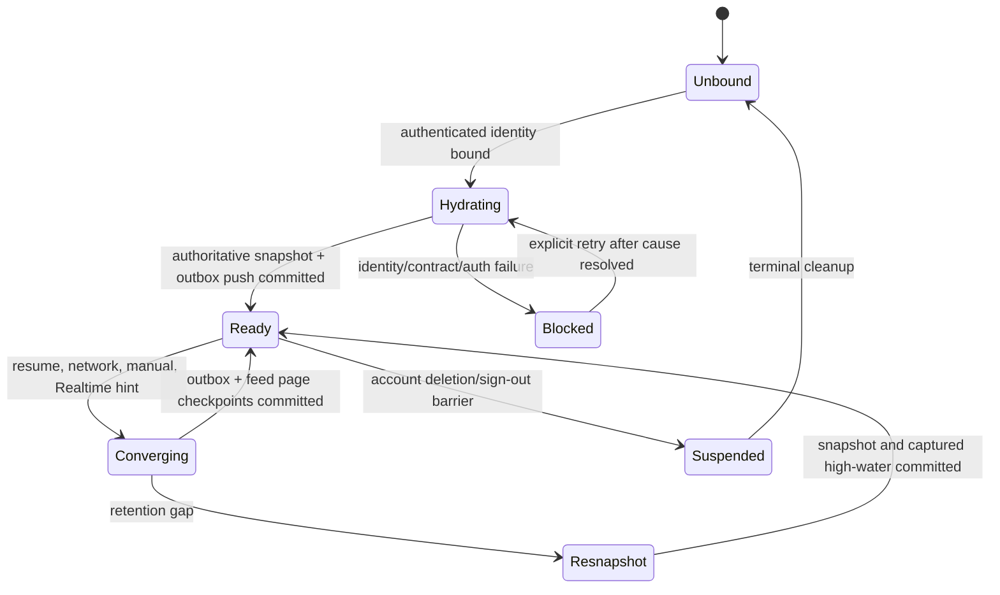
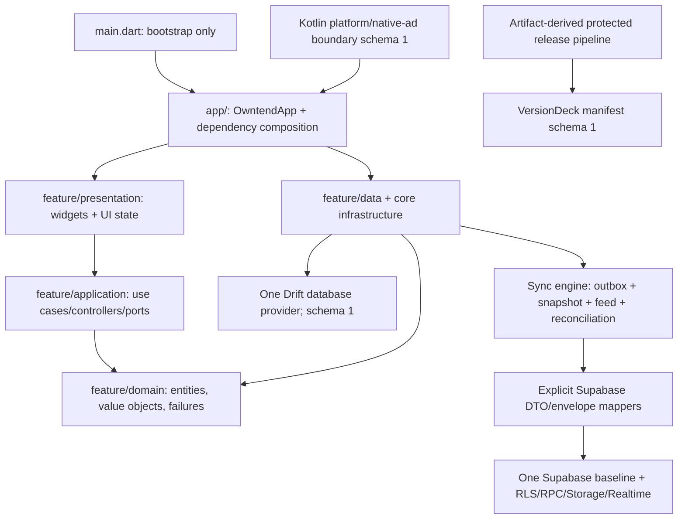
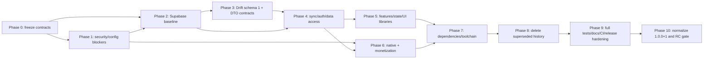

# Owntend production-v1 audit and remediation plan

## 1. Audit metadata

| Field | Audited value |
|---|---|
| Repository | `zuhak5/Owntend`, local checkout `F:\Owntend` |
| Lifecycle | Pre-launch: the authoritative `AGENTS.md` checkbox is `[ ]`; zero production users and no production-data or backward-compatibility obligation |
| Branch | `main`, tracking the locally recorded `origin/main` |
| Audited commit | `13d37d14a3ef70c7cc28f6e94dccb2a1ab3d7466` |
| Commit timestamp/subject | 2026-08-21 02:30:25 +03:00, `perf(android): deduplicate Android 12 splash resources (#61)` |
| Audit date | 2026-08-21, Asia/Baghdad |
| Initial working tree | Clean; `main...origin/main`; 539 tracked files; no pre-existing user changes |
| Deliverable constraint | Audit and plan only. No product, schema, test, configuration, documentation, or release fix was implemented. This file is the only intentional tracked change. |
| Target release | App `1.0.0`, Android build `1`, Drift schema `1`, one canonical initial Supabase migration representing cloud baseline `1` |
| Local toolchain | Flutter 3.47.0 stable; Dart 3.13.0; Java 17.0.17; Node 24.11.1; npm 11.7.0; Deno 2.9.3; Supabase CLI 2.114.0 |
| Declared Android/toolchain | compile SDK 37; target SDK 36; minimum SDK 24; AGP 9.3; Kotlin 2.4.10; Gradle 9.6.1; Java 17 in `config/toolchain.json`, while release workflows install Java 21 |

The audit followed `AGENTS.md` and `docs/governance/documentation-maintenance.md`. Documentation impact for this audit-only change is limited to this plan: it records future documentation changes but does not claim that current behavior changed. No remote branch was fetched during the audit, so “origin/main” means the locally recorded remote-tracking ref at the audited SHA.

## 2. Executive summary

Owntend is **not ready for a production-v1 release**. Its test baseline is unusually strong—Flutter analysis, 718 Flutter tests, 121 Node tests, 53 Deno tests, 481 pgTAP assertions, database lint, localization generation, production configuration validation, and a dev debug APK build all passed. The release is blocked by contract and source-of-truth problems that passing tests currently encode rather than expose: artificial unpublished version and migration history, divergent local/cloud models, a disabled canonical change feed with a second legacy pull protocol, a discarded local notification mutation type, stale Drift generated output, incomplete Edge telemetry scrubbing, an unsafe media staging order, and VersionDeck validation tied to an all-zero placeholder commit.

There are **28 findings**: **0 P0**, **13 P1**, **13 P2**, and **2 P3**. P0 is intentionally zero: no confirmed exploitable secret, authorization bypass, or demonstrated data-loss path met the critical threshold in the evidence available. All P1 findings are pre-release blockers.

| Category | Count | Finding IDs |
|---|---:|---|
| Release/version normalization | 3 | REL-001, REL-002, REL-003 |
| Database/Supabase | 4 | DB-001 through DB-004 |
| Sync/data integrity | 5 | SYNC-001 through SYNC-005 |
| Architecture/cleanup | 4 | ARCH-001, ARCH-002, CLEAN-001, CLEAN-002 |
| Security/privacy | 3 | SEC-001, SEC-002, PRIV-001 |
| Media/reliability | 1 | MEDIA-001 |
| Testing/quality | 2 | TEST-001, TEST-002 |
| Dependencies/tooling/codegen | 3 | CODEGEN-001, DEP-001, TOOL-001 |
| Documentation | 2 | DOC-001, DOC-002 |
| Performance | 1 | PERF-001 |

The top release blockers are:

1. The repository says `1.0.0+5`, Drift schema `4`, backup format `2`, sync protocol `1.0.1`, several RPC capabilities `1.1.0`/`1.2.0`, and VersionDeck manifest schema `5`, despite a never-released v1 target.
2. Twelve same-day Supabase migrations construct and then patch an unpublished database, leaving archive tables, a legacy `notifications` table, redundant private implementations, and a disabled rollout capability.
3. Drift and PostgreSQL disagree on required containment, due dates, uniqueness, photo-primary enforcement, and maintenance-record shape.
4. Incremental sync selects between a disabled feed and `_pullAllLegacy`; feed/parity/point-fetch errors can become “disabled,” an empty result, or a missing record, and feed upserts make one network fetch per change.
5. Drift enqueues `device_notification` mutations even though no sync entity supports them; the coordinator discards unknown mutations.
6. `dart run build_runner build --only-check` reports `lib/src/core/database/app_database.g.dart` as incorrect/missing expected output.
7. Edge Sentry captures raw exceptions and only removes `user`/`request` plus scrubs string tags; exception values and stack frames are not scrubbed.
8. Media bytes are uploaded before the server records a staging operation, and the server trusts a client-supplied digest without proving it describes the stored object.
9. Completed but unacknowledged deletion receipts receive a 90-day expiry but are explicitly excluded from pruning, conflicting with the stated 90-day retention.
10. VersionDeck accepts an artifact built at the zero placeholder SHA and rejects one built at the audited SHA; its control file says active while the checked-in manifest says disabled.
11. `integration_test/supabase_sync_test.dart` does not connect to Supabase or exercise sync; no application-to-real-local-backend, multi-device, Storage, or deletion integration suite exists.
12. Twenty-seven `part` files share `main.dart` private scope, major units exceed 2,000 lines, and two distinct Riverpod providers named `databaseProvider` can create separate database ownership paths.

The recommended target is one ordinary v1 architecture: standalone feature libraries, one dependency-composition root, one Drift database provider, one canonical domain contract, explicit Drift-row and Supabase-DTO mappers, a durable outbox, a single always-on change-feed protocol with an authoritative snapshot path for initial hydration/retention gaps, one initial Supabase migration, private definer implementations behind least-privilege public wrappers, and release artifacts derived from `pubspec.yaml` plus the verified APK rather than handwritten metadata.

## 3. Scope and methodology

The audit was read-only except for dependency restoration/build artifacts in ignored locations and this plan. It used executable sources before prose and covered:

- all 539 tracked files and every top-level area;
- root lifecycle/instructions, ignore rules, status, history, and binary/generated-file classification;
- Flutter application layers, all Riverpod providers, GoRouter routes, Drift tables/migrations/triggers/indexes, repositories, services, sync, auth/deletion, backup/restore, notifications/background work, permissions/weather, ads/monetization, observability, localization, and Android host code;
- all 12 Supabase migrations, 27 database tests, the live locally reset final schema, 29 public tables, 45 Owntend public/private functions, 83 public RLS policies, 59 public indexes, triggers, grants, Storage policies, Realtime publication behavior, and all three Edge Functions plus shared code;
- all manifests and lockfiles, eight workflows, Dependabot policy, build/release/SBOM/provenance tooling, and VersionDeck/static-site sources;
- all 36 files under `docs/` plus root README, CHANGELOG, privacy, security, contributing, licenses, and notices;
- exact searches for TODO/FIXME/HACK/placeholder, legacy/versioned names, secret patterns, obsolete routes/keys/tables, and duplicated implementations;
- current official sources for [Flutter releases](https://docs.flutter.dev/release/release-notes), [Supabase changelog](https://supabase.com/changelog), [Supabase CLI releases](https://github.com/supabase/cli/releases), [RLS guidance](https://supabase.com/docs/guides/database/postgres/row-level-security), and [Edge Function limits](https://supabase.com/docs/guides/functions/limits).

The audit did not deploy, link to, reset, or mutate a hosted Supabase project; sign or publish Android artifacts; create a Sentry release; publish VersionDeck; invoke protected workflows; use production credentials; alter Git history; or implement remediation.

## 4. Repository coverage ledger

### 4.1 Top-level tracked inventory

| Area | Tracked files | Coverage and disposition |
|---|---:|---|
| `.github/` | 10 | Dependabot, PR template, and all eight workflows inspected; release/environment guards and pinned actions traced |
| `android/` | 62 | Gradle/settings/wrapper properties, manifests, Kotlin host/factory, resources, permissions, backup rules, flavors, signing guards, and release properties inspected |
| `assets/` | 12 | Fonts, audio, and image provenance/size inspected; three PNGs exceed 1 MiB |
| `config/` | 5 | Dev/prod examples, toolchain, and asset provenance inspected; ignored real configuration confirmed |
| `docs/` | 36 | Every document reviewed; stale claims and broken links are mapped to DOC-001/DOC-002 |
| `download-site/` | 30 | HTML/CSS/JS, service worker, icons, manifest schema/cache, account deletion, releases manifest, and accessibility behavior inspected |
| `integration_test/` | 1 | Read in full; name/coverage mismatch recorded in TEST-001 |
| `lib/` | 134 | All source and generated categories mapped; high-risk subsystems read in depth; main-library coupling and large files measured |
| `supabase/` | 54 | Config, roles, every migration/test/function/import map/lockfile inspected; local reset/lint/tests and live catalog reconstruction completed |
| `test/` | 124 | Inventory, skips/tags, golden coverage, legacy-contract coupling, and suite execution reviewed |
| `test_driver/` | 1 | Integration driver inspected |
| `tool/` | 48 | Every script/test family inventoried; build, release, VersionDeck, dependency, provenance, SBOM, and validation paths traced |
| Root files | 22 | Instructions, Git attributes/ignore, manifests/locks, analysis/l10n/test config, README/CHANGELOG/privacy/security/licenses/notices reviewed |

Tracked extensions include 235 Dart, 39 SQL, 36 MJS, 12 JS, 44 Markdown, 60 PNG, 25 XML, 15 JSON, nine YML, eight PowerShell, seven TypeScript, eight CSS plus two HTML, four lockfiles, and Android/Kotlin/resource assets. Generated source categories are Drift (`app_database.g.dart`), localization Dart, Android resource output, VersionDeck build output, release evidence/manifests, and SBOM/notices. Only source-controlled generated artifacts were judged; ignored build output was not treated as source.

### 4.2 Manifests, locks, and build systems

| Ecosystem | Sources of truth reviewed |
|---|---|
| Flutter/Dart | `pubspec.yaml`, `pubspec.lock`, `analysis_options.yaml`, `dart_test.yaml`, `l10n.yaml`, `.metadata` |
| Android | `android/settings.gradle.kts`, `android/build.gradle.kts`, `android/app/build.gradle.kts`, `android/gradle/wrapper/gradle-wrapper.properties`, manifests/resources |
| Node | `package.json`, `package-lock.json` |
| Deno | root `deno.json`/`deno.lock`; per-function `deno.json`; function locks where present |
| Supabase | `supabase/config.toml`, `supabase/roles.sql`, 12 migrations, function configuration/import maps |
| Release/static site | `tool/versiondeck-control.json`, `download-site/releases.json`, schema/generator/verifier/build scripts, eight workflows |
| Toolchain policy | `config/toolchain.json`, dependency/action policy scripts, asset provenance, SBOM/notices tooling |

### 4.3 Historical and duplicate candidates dispositioned

| Candidate | Evidence-based disposition |
|---|---|
| Twelve Supabase migrations | Unpublished patch history; replace with one canonical initial migration after reconstructing and testing the final schema |
| `owntend_archive.*_20260720` | Only migrations/tests reference them; no user data exists; delete tables, tests, and archive schema |
| `public.notifications` / Drift `AppNotifications` | No scheduler ownership found; Drift produces unsupported `device_notification`; remove on both sides and retain only local schedule snapshots plus real `notification_inbox` |
| `_pullAllLegacy` and capability fallback | Unreleased parallel incremental protocol; replace with authoritative snapshot + one feed path |
| `_recoverLegacyMaintenanceConflict` | Compatibility-by-exception for a prior backend; remove after the canonical RPC always returns structured status |
| permission v2/v3 and `notifications_enabled` fallbacks | Pre-v1 settings migrations; choose one canonical key/payload and remove fallbacks |
| `_GoogleProfileAvatar` | Comment explicitly says retained for source compatibility while no live caller needs it; delete |
| Build-44 monetization fallback/capability 1.1/1.2 | Pre-release server compatibility; collapse into canonical RPC responses and ordinary names |
| VersionDeck `*_v5` implementations + generic wrappers | Keep a manifest format boundary, reset the unpublished schema to 1, move implementation to generic names, delete wrappers/versioned filenames |
| Android `values-v27/v29/v31`, `arm64-v8a`, XML 1.0 | Legitimate Android/platform/ABI/XML external contracts; preserve |
| SPDX 2.3, PostgreSQL 17, SDK/API levels | External standards/toolchain versions; preserve and do not normalize to product v1 |
| Restore journal/cache/redaction schema 1 | Legitimate persisted crash-recovery/cache/privacy boundaries already at baseline 1; preserve with ownership tests |

No credible source TODO/FIXME/HACK was found beyond a documented temporary Kotlin-plugin compatibility workaround. No tracked sensitive filename was found. Current and history regex scans found no AWS key, Google API key, Supabase secret key, private-key block, or GitHub token pattern; this is not a substitute for a dedicated secret scanner.

## 5. Current architecture

The runtime is offline-first. Domain writes enter Drift and trigger durable outbox rows. `SyncCoordinator` pushes mutations, maintains account binding, revisions/shadows, hydration state, retry/backoff, and Realtime hints. Initial hydration and the currently selected incremental path use per-entity snapshot/keyset logic; a server change feed exists but its checked-in capability row is disabled. Realtime is correctly treated as an invalidation hint, not authoritative payload. Account deletion suspends sync, requires same-identity recent reauthentication, invokes protected backend cleanup, validates a recovery receipt, and then performs local cleanup. Monetization decisions and balances are correctly server-authoritative.

The principal structural fault is compilation-scope ownership: `main.dart` declares 27 parts spanning startup, router, most feature screens, providers, and shared UI. Private identifiers therefore cross feature boundaries invisibly. Separate core files use ordinary imports, but several are still 1,000–3,300 lines and mix persistence, mapping, orchestration, retries, reconciliation, presentation, and error translation. The duplicate `databaseProvider` definitions at `lib/src/core/database/app_database.dart:13` and `lib/src/features/startup/presentation/startup_bootstrap.dart:456` demonstrate how ownership has split.

## 6. Source-of-truth and contract analysis

### 6.1 Conflicting ownership matrix

| Concern | Current sources | Conflict | Final canonical source | Derived consumers |
|---|---|---|---|---|
| App version/build | `pubspec.yaml` (`1.0.0+5`), CHANGELOG, tests, VersionDeck manifest, workflow inputs | Handwritten files describe build 1, 4, 5, or historical Build 44 | `pubspec.yaml` set once to `1.0.0+1`; verified APK metadata is release evidence | Gradle/PackageInfo/Sentry/VersionDeck/release notes |
| Drift schema | `AppDatabase.currentSchemaVersion = 4`, generated code, backup manifest, docs say 3 | Source, generated output, backup compatibility, and docs disagree | `app_database.dart` baseline schema `1`; regenerated `app_database.g.dart` | Backup manifest, diagnostics, tests, docs |
| Cloud schema | 12 migrations plus patch tests and archive tables | The replay is development history, not an intentional initial schema | One `initial_schema.sql`; no invented runtime schema table | Local reset, hosted bootstrap, database tests |
| Sync entities/shapes | Drift tables, `sync_dtos.dart`, local store, gateway, migrations/RPCs | Nullability, fields, metadata, and supported entities diverge | A checked contract matrix and typed mappers owned by sync/data boundary | Drift mapper, Supabase DTO, tests, RPC payloads |
| Incremental sync | Capability table/protocol 1.0.1, server feed, legacy keyset pull, parity RPC | Two current implementations and fallback-on-error | One feed response contract at boundary version `1`; one authoritative snapshot operation | Coordinator, server functions/triggers, integration tests |
| Notification state | OS scheduler snapshots, Drift `notifications`, cloud `notifications`, inbox | Three concepts overlap; one mutation type is discarded | Local schedule snapshots for OS state; `notification_inbox` for user-visible cloud inbox | Notification service, backup, sync |
| Media state | Local relative path, Storage object, client staging call, DB staging/cleanup tables | Storage write precedes durable saga; digest is client assertion | Server-issued staging intent + stored-object verification + durable cleanup state | Gateway, Storage policies, RPCs, sync cleanup worker |
| Deletion retention | SQL expiry, prune function, PRIVACY, deletion docs | “90 days” coexists with never pruning completed rows | Explicit bounded retention and scheduled deletion, with acknowledged/unacknowledged windows | SQL, Edge receipts, privacy/docs, tests |
| Edge telemetry | Mobile scrubber, Edge shared Sentry | Mobile deeply scrubs exception/context; Edge does not | One shared redaction policy/fixture semantics across runtimes | Sentry bootstrap/tests/docs |
| Native-ad palette | Dart map schema 2, Kotlin constant 2, parity test/docs | Two manually synchronized authorities and artificial pre-v1 increment | A baseline-1 bridge contract fixture plus generated/asserted consumers | Dart/Kotlin/tests/docs |
| VersionDeck | schema-v5 files, generic wrappers, manifest schema 5, zero commit, active control | Public artifact identity and source revision disagree | Generic schema implementation at baseline 1; generated manifest bound to audited/release SHA | Generator, validator, site, service worker, workflows |
| Toolchain Java | `config/toolchain.json` says 17; release workflows install 21 | Local validation and protected release do not exercise same Java | Choose and pin one supported JDK after plugin matrix verification | Local docs, CI setup, toolchain validator |

### 6.2 Canonical cross-layer data decisions to freeze in Phase 0

1. Areas own rooms and rooms own assets. The current UI/local model requires both relationships; use non-null containment in Drift and PostgreSQL and make permanent subtree deletion behavior explicit and identical. Do not sanitize server-created orphans at startup.
2. Enabled maintenance plans always have a next due date. If a draft state is required, model it explicitly rather than using cloud nullability that Drift cannot represent.
3. Choose only fields the v1 product uses for maintenance records. Remove unused server-only cost/provider/rating/recurrence fields or add them deliberately end-to-end; do not keep unmapped columns.
4. Normalize uniqueness: owner-scoped area name; area-scoped room name; owner-scoped case-insensitive tag name; at most one primary photo per asset. Enforce these in both databases, not only repository transactions.
5. Keep domain entities independent of Drift rows, PostgREST maps, and transport metadata. A sync envelope owns revision, operation, cursor, and key; it must not synthesize legacy `sync_seq` from timestamps.
6. Preserve initial full hydration and retention-gap resnapshot as explicit authoritative snapshot operations. They are not “legacy.” Remove only the second incremental protocol and its capability rollout machinery.
7. Keep a network contract version of `1` only because mobile and backend deploy independently. Reject incompatible versions; do not run two protocol implementations.
8. Keep legitimate third-party/platform versions at their required boundaries. Product/build/database normalization does not rewrite Android API qualifiers, ABI identifiers, SPDX 2.3, PostgreSQL 17, Flutter, Gradle, or dependency versions.

## 7. Baseline diagnostic results

| Check | Result | Evidence/meaning |
|---|---|---|
| Initial status and final pre-plan status | PASS | Clean tracked tree at audited SHA; ignored build artifacts only |
| `flutter pub get` | PASS | Lockfile hash unchanged; dependency graph restored |
| `dart format --output=none --set-exit-if-changed lib test integration_test` | PASS | 233 files, zero formatting changes after dependencies were restored |
| `flutter analyze --no-pub` | PASS | No issues; an earlier dependency-unavailable run produced 28,153 cascading issues and is excluded as an invalid environment baseline |
| Full Flutter tests | PASS | 718 tests; concurrency 1; production-config tag excluded; approximately 10m48s |
| Production configuration schema test | PASS | Example production Supabase contract enabled under `VERIFY_PRODUCTION_CONFIG=true` |
| Localization generation/parity | PASS | `flutter gen-l10n` produced no tracked diff; untranslated report `{}`; English/Arabic key, placeholder, plural, RTL and golden tests passed |
| Drift/build_runner presubmit | **FAIL** | `dart run build_runner build --only-check` reports `lib/src/core/database/app_database.g.dart` incorrect/missing expected output (CODEGEN-001) |
| Dev debug APK | PASS with warnings | `app-dev-debug.apk` built in 1261.4s; Flutter warns `flutter_foreground_task`, `sentry_flutter`, and `workmanager_android` still apply KGP; Java source/target 8 deprecation warnings |
| `npm ci --ignore-scripts` | PASS | 20 packages; 0 npm audit vulnerabilities reported |
| Node validation | PASS | Test inventory, 121/121 Node tests, toolchain, dependency policy (316 packages), and Google contracts |
| Deno formatting/check/tests | PASS | 10 formatted files; 53/53 tests across AdMob SSV, deletion, and deletion status |
| Supabase local reset | PASS on minimal stack | All 12 migrations replayed from empty local PostgreSQL |
| Supabase DB lint | PASS | No errors across public and Owntend schemas |
| Supabase database tests | PASS | 27 files, 481 assertions |
| Full Supabase local stack | BLOCKED | Storage, pg_meta, and Studio failed health checks; minimal PostgreSQL/Auth/PostgREST/Kong stack was used for reset/lint/tests |
| Live final DB catalog review | PASS | 29 public tables, 45 Owntend functions, 83 public RLS policies, 59 public indexes; all public tables RLS-enabled; grants inspected |
| Change-feed launch state | CONFIRMED DISABLED | `global:false:1.0.1:0`; feed empty after reset |
| VersionDeck Node suites | PASS | Generator/verifier/site/unit validation tests pass against their encoded contracts |
| VersionDeck audited-SHA build | **FAIL** | Validator rejects SHA `13d37d…` because manifest generator commit is all zeros; the same artifact validates at the zero placeholder (REL-002) |
| Markdown internal links | **FAIL** | Four broken targets: one native-ad Kotlin path and three obsolete migration links (DOC-001) |
| Dependency currency | OUTDATED | Three safe direct Dart upgrades, one Flutter plugin major available, Supabase CLI 2.115 vs 2.114, Sentry Deno 10.70 vs 8.55.2, and small Deno std updates |
| Secret-pattern scan | PASS, limited | Current/history regex and sensitive-filename scans found no credible credential; dedicated secret/SCA scanners were unavailable |
| Representative golden inspection | PASS, limited | English/Arabic dashboard plus short/scaled onboarding/restore baselines show no clipping/overflow; test font prevents production typography judgment |
| Live static-site browser inspection | BLOCKED | Browser runtime could not initialize (`failed to write kernel assets: path not found`); no standalone browser substitution was used |
| Hosted/protected/release checks | NOT RUN | No hosted advisors, Google sign-in, real ads/SSV, protected workflows, release signing, Sentry mutation, public deployment, or physical-device checks were authorized/available |

The analyzer, Flutter tests, and APK compile against the checked-in generated Drift file; they do not negate the build-runner mismatch. The generated-file presubmit is the authoritative freshness check.

## 8. Critical fixes

There are no P0 findings. Every P1 below blocks the release candidate even where current tests pass.

Finding-field convention: each **Exact remediation / impact** bullet states the immediate file/object work; the exhaustive **file/database impact** for that ID is the union of the rows tagged with it in sections 20 and 21. Each **Verification / acceptance** bullet contains both the exact proving checks and objective completion condition. This avoids repeating long path/object lists while retaining every required finding field.

### REL-001 — Normalize the unpublished product and internal schema history

- **Category / severity / confidence:** Release/version normalization; P1; Confirmed.
- **Evidence:** `pubspec.yaml:19` is `1.0.0+5`; `app_database.dart:479` is schema 4; `backup_service.dart:21-22` is format 2 accepting 1; `change_feed_contract.dart:4` is 1.0.1; monetization migrations/resolvers expose 1.1.0/1.2.0; native ad Dart/Kotlin use schema 2; `download-site/manifest-schema-v5.js:1` uses 5; CHANGELOG already declares `1.0.0 (Build 1)` and starts with an orphan bullet.
- **Problem / root cause / impact:** Iterative pre-release changes were recorded as shipped compatibility boundaries. Release identity is split across code, docs, manifests, keys, RPC payloads, and tests. A v1 artifact would be internally inconsistent and future maintainers could preserve history that never had consumers.
- **Fresh-v1 decision / canonical target:** Reset application to `1.0.0+1`, Drift to 1, backup archive to format 1, custom VersionDeck/native-ad/network boundary schemas to baseline 1, and cloud to one initial migration. Keep only versions required by real independent boundaries; do not rewrite third-party/platform versions.
- **Exact remediation / impact:** Change `pubspec.yaml`; rebuild CHANGELOG as Unreleased until the release gate; reset schema/format constants and storage keys; replace capability semvers with a single integer contract 1 where independent deployment requires it; regenerate Drift/localization/VersionDeck outputs; update tests and all affected docs. Do not hand-edit APK- or manifest-derived release facts.
- **Dependencies:** Phase 0 contract freeze; DB-001, DB-003, SYNC-001, REL-002, REL-003, CLEAN-001, CODEGEN-001.
- **Verification / acceptance:** A repository-wide version search classifies every remaining marker; `pubspec.yaml` is the only app/build authority; APK reports versionName 1.0.0/versionCode 1; Drift `PRAGMA user_version=1`; empty Supabase bootstrap uses one migration; backup and custom project schemas report 1; CHANGELOG has one Unreleased section until publication. Complexity **L**.

### DB-001 — Replace the 12-file development migration museum with one final schema

- **Category / severity / confidence:** Database/Supabase; P1; Confirmed.
- **Evidence:** `supabase/migrations/20260815000001_…` through `…000012_…` create then patch the same schema; the live reset contains two `owntend_archive` tables, `public.notifications`, a disabled `sync_feed_capabilities` row, and multiple compatibility/private implementations. Tests explicitly mention legacy, expanded, v2, hardening, prior problems, and removed categories.
- **Problem / root cause / impact:** The chain preserves implementation chronology rather than a coherent fresh database. Security/grant fixes depend on late patches, archived tables imply nonexistent production history, and future review must reconstruct thousands of lines to know the initial state.
- **Fresh-v1 decision / canonical target:** Delete all 12 migrations after deriving their required final behavior. Create one `supabase/migrations/<timestamp>_initial_schema.sql` containing only final tables, constraints, indexes, RLS, grants, functions, triggers, Storage policies, Realtime publication, seed configuration, and deletion jobs. Do not add a schema-version table merely to display “1.”
- **Exact remediation / impact:** Preserve verified monetization, deletion, sync, media, and auth behavior; remove archive objects, legacy notifications, disabled rollout capability, compatibility overloads, and redundant hash-qualified implementations; reorganize/rewrite the 27 pgTAP files around the final object model; regenerate any database-derived contract artifacts.
- **Dependencies:** DB-002 and Phase 0 domain decisions; SEC-001/SEC-002/PRIV-001/MEDIA-001/SYNC-001 targets must be frozen before writing baseline SQL.
- **Verification / acceptance:** Delete local volumes in the authorized pre-launch environment, run a clean `supabase db reset --local --no-seed`, lint, execute all canonical pgTAP tests, inspect catalogs/grants/policies, generate a schema diff that is empty after reset, and prove a fresh hosted-project bootstrap in a protected disposable project. Exactly one canonical migration remains. Complexity **XL**.

### DB-002 — Make Drift and PostgreSQL enforce one domain model

- **Category / severity / confidence:** Database/Supabase; P1; Confirmed.
- **Evidence:** Drift requires `Rooms.areaId` (`app_database.dart:36`), `Assets.roomId` (`:59`), and `MaintenancePlans.nextDueDate` (`:182`), while live PostgreSQL makes all nullable and uses `ON DELETE SET NULL`. Drift uniquely constrains area names and `(areaId,name)` rooms (`:22`, `:49-51`), while PostgreSQL lacks equivalent constraints. PostgreSQL maintenance records include cost/provider/rating/recurrence/revision fields absent from Drift (`:211-222`).
- **Problem / root cause / impact:** Separate schemas evolved without a checked contract. Remote rows can be valid to PostgreSQL but impossible in Dart, causing startup sanitization, failed mapping, divergent deletion, lost fields, and conflict ambiguity.
- **Fresh-v1 decision / canonical target:** Freeze a single field/nullability/default/enum/key/delete matrix. Recommendation: required area→room→asset containment, required due date for an enabled plan, identical owner-scoped uniqueness, identical enum/check bounds, and only fields intentionally supported end-to-end.
- **Exact remediation / impact:** Update Drift table declarations and final SQL together; choose cascade/restrict/archive semantics explicitly; delete unused server-only fields or add them to domain/local/UI intentionally; add mapping fixtures and contract tests that compare every synced entity. Update backup inclusion and deletion/sync behavior.
- **Dependencies:** Phase 0 product decisions; DB-001 and DB-003 execute the decision; SYNC-004 supplies clean DTO separation.
- **Verification / acceptance:** Generated contract matrix has no unexplained difference; invalid rows fail identically; round-trip fixtures for every entity preserve values; subtree deletion/archive and restore work offline and after sync; multi-device tests cannot create an unrepresentable row. Complexity **XL**.

### SYNC-001 — Remove the disabled dual incremental-sync architecture

- **Category / severity / confidence:** Sync/data integrity; P1; Confirmed.
- **Evidence:** Live capability is `global:false:1.0.1:0`; `sync_coordinator.dart:827-849` chooses feed only when enabled and otherwise `_pullAllLegacy`; lines 878-885 fall back mid-feed; lines 969-986 resnapshot through the same legacy path; docs explicitly say the launch capability remains disabled.
- **Problem / root cause / impact:** A rollout strategy for a nonexistent installed base became permanent architecture. The tested launch path is the timestamp/keyset implementation, while the intended feed remains dormant. Two cursor models and mid-page fallback multiply correctness states and prevent one auditable convergence proof.
- **Fresh-v1 decision / canonical target:** Keep two operations, not two protocols: `pullAuthoritativeSnapshot` for first hydration/retention gap and one always-on `pullChangeFeed` for incremental convergence. Return boundary contract version 1 and fail closed on mismatch; remove the capability table/RPC/flag and legacy naming.
- **Exact remediation / impact:** Redesign feed rows to carry canonical upsert payloads and typed delete keys (or a bounded batch payload); make snapshot and feed checkpoint commits atomic; preserve durable outbox, account epoch checks, Realtime hints, retention-gap marker, and delete reconciliation; remove `_pullAllLegacy`, capability discovery, mid-page fallback, and associated tests/docs.
- **Dependencies:** DB-001/DB-002, SYNC-004; target contract frozen in Phase 0.
- **Verification / acceptance:** Fresh hydration, restart every checkpoint, missed Realtime, pagination, retention gap, deletes, concurrent local mutation, clock skew, and two-device convergence pass against real local Supabase. No capability row, legacy cursor branch, or second incremental implementation remains. Complexity **XL**.

### SYNC-002 — Stop converting sync failures into success-shaped results

- **Category / severity / confidence:** Sync/data integrity; P1; Confirmed.
- **Evidence:** `supabase_sync_gateway.dart:980-1000` converts any capability error to disabled; `:1026-1035` converts parity errors to `[]`; `:1038-1060` converts point-fetch errors to `null`. `sync_coordinator.dart:990-1016` interprets an empty parity result as zero repairs. Feed upserts advance a page after a per-row fetch loop even when a failed point fetch became null (`:919-956`).
- **Problem / root cause / impact:** Transport, permission, incompatible-schema, absence, and valid-empty states collapse together. Healing can report success without checking anything; a transient point-fetch failure can omit a changed row while advancing the feed cursor.
- **Fresh-v1 decision / canonical target:** Use a closed error/result model: `found`, `absent`, `retryable failure`, `authorization failure`, and `incompatible contract`. Never advance a checkpoint unless every page item is applied or durably deferred.
- **Exact remediation / impact:** Remove catch-and-default behavior; centralize Supabase failure classification; return payloads with feed entries or batch-fetch all keys; make parity a server/CI invariant or a client operation that fails visibly; add transactional page application and durable retry/dead-letter state for malformed entries.
- **Dependencies:** SYNC-001 contract; ARCH-002 error boundary split.
- **Verification / acceptance:** Inject timeout, 401/403, 404/empty, malformed payload, one failed item, and page replay. Cursor remains unchanged on incomplete application; zero repairs is returned only after a successful parity query; UI/status distinguishes retryable and blocked states. Complexity **L**.

### SYNC-003 — Remove the notification mutation that is silently discarded

- **Category / severity / confidence:** Sync/data integrity; P1; Confirmed.
- **Evidence:** Drift includes `AppNotifications` (`app_database.dart:224-235`, database list `:459`) and generates outbox entity `device_notification` (`:667`). `sync_dtos.dart:143-439` defines 17 entities but no `device_notification`. `local_sync_store.dart:1330-1333` returns null for an unknown spec; `sync_coordinator.dart:1667-1675` discards the mutation. The live cloud also contains `public.notifications`, while actual scheduler state uses reminder snapshots and user-facing messages use `notification_inbox`.
- **Problem / root cause / impact:** Writes produce durable intent that is then treated as obsolete data and deleted. This violates the core outbox invariant and leaves three overlapping notification models.
- **Fresh-v1 decision / canonical target:** Delete Drift/cloud `notifications` and their triggers/policies/tests. Keep OS schedule snapshots local-only and `notification_inbox` synchronized. If a distinct delivered-notification audit is actually required, specify and implement it end-to-end instead of relying on this table.
- **Exact remediation / impact:** Trace and move any remaining backup/pristine/cleanup tests; remove table declarations, SQL table, indexes, RLS, triggers, feed exclusions, outbox trigger, generated code, and legacy localization fixtures; make unknown outbox entities an incompatible-schema error, never auto-discard.
- **Dependencies:** Phase 0 notification ownership; DB-001/DB-003 and CODEGEN-001.
- **Verification / acceptance:** Repository search finds no `AppNotifications`, `public.notifications`, or `device_notification`; schedule/inbox tests pass; every possible outbox entity maps to a contract; an injected unknown entity blocks visibly without deletion. Complexity **M**.

### ARCH-001 — Establish one composition root and independent feature libraries

- **Category / severity / confidence:** Architecture/cleanup; P1; Confirmed.
- **Evidence:** `main.dart:92-118` declares 27 parts covering most UI and startup providers. `app_database.dart:13-17` and `startup_bootstrap.dart:456` each define `databaseProvider`. Shared private scope allows untracked dependencies; the duplicate provider can own separate `AppDatabase` instances/lifecycles.
- **Problem / root cause / impact:** The effective module is the whole application, so file paths do not enforce feature boundaries. Provider identity, disposal, dependency direction, and testing can diverge without analyzer errors.
- **Fresh-v1 decision / canonical target:** `main.dart` performs bootstrap only. `OwntendApp` and a single provider-composition module own app wiring. Every feature/presentation file is a standalone Dart library with explicit imports. Exactly one `databaseProvider` owns one process database connection.
- **Exact remediation / impact:** Create `lib/src/app/owntend_app.dart` and `app_dependencies.dart`; convert all 27 part files to ordinary libraries; move shared public widgets/formatters into focused modules; remove the startup provider; update imports/tests incrementally without introducing `*_v2` or `legacy` modules.
- **Dependencies:** Phase 0 dependency rules; DB-003 establishes the database API; ARCH-002 decomposes large units after imports are explicit.
- **Verification / acceptance:** `rg '^part '` returns only generator-required parts such as Drift; provider identity/lifecycle test proves one DB; feature dependency checks reject presentation→concrete infrastructure imports; analyzer and all tests pass after each feature slice. Complexity **XL**.

### SEC-001 — Scrub Edge exception payloads before Sentry capture

- **Category / severity / confidence:** Security/privacy; P1; Confirmed.
- **Evidence:** `supabase/functions/_shared/sentry.ts:44` calls `captureException(error)`. `beforeSend` at `:66-76` deletes `event.user` and `event.request` and sanitizes string tags only. It does not scrub `event.exception.values[*].value`, stack frames, contexts, breadcrumbs, or extras. Mobile has a substantially deeper `sentry_event_scrubber.dart`.
- **Problem / root cause / impact:** Raw thrown messages/stack data can contain request-derived values, object paths, identifiers, or user content, contradicting AGENTS/privacy/Sentry policy.
- **Fresh-v1 decision / canonical target:** Edge emits only allowlisted technical error codes, sanitized function/release tags, and safe stack metadata. Raw request bodies, headers, paths, tokens, identifiers, and arbitrary exception text never leave the function.
- **Exact remediation / impact:** Introduce an Edge scrubber mirroring mobile policy semantics; normalize captured errors to safe code/class before capture; recursively remove request/user/breadcrumb/context/extras and sanitize exception/stack data; add adversarial fixtures to `_shared` tests and each function; update Sentry/privacy operations docs.
- **Dependencies:** None for implementation; complete before hosted test traffic. Coordinate with SEC-002.
- **Verification / acceptance:** Fixtures containing email, JWT, recovery key, Storage path, names, raw URL/query/body, and filesystem path produce no sensitive substring in the serialized event; Sentry disabled/no-DSN behavior remains fail-safe; Deno tests/check pass. Complexity **M**.

### MEDIA-001 — Make media staging durable before Storage mutation and verify object facts

- **Category / severity / confidence:** Media/reliability; P1; Confirmed.
- **Evidence:** `supabase_sync_gateway.dart:942-951` reads/hashes then uploads bytes; only afterward do lines `952-963` call `stage_media_upload`. If that RPC fails, the object exists with no staging row. The client supplies size, MIME, and SHA-256; finalization uses recorded claims, and no repository evidence proves a trusted server recomputation against the stored object.
- **Problem / root cause / impact:** Lost responses and partial failures create untracked/orphan objects; `upsert:true` can replace content before the saga is durable; a client assertion is treated as integrity evidence.
- **Fresh-v1 decision / canonical target:** The server issues a staging ID/path and records expected constraints first. Upload goes to that immutable staged path. A trusted server path checks Storage metadata/content digest as feasible before atomically attaching it; cleanup can discover every incomplete stage.
- **Exact remediation / impact:** Split prepare/upload/finalize; remove direct deterministic final-path upsert; add idempotency key and expiry; verify size/MIME/path ownership and either compute/verify digest server-side or explicitly label it advisory; enqueue cleanup on finalize failure; update Storage policies/RPCs/gateway/local cleanup/test fixtures.
- **Dependencies:** DB-001 baseline and DB-002 photo contract; SEC-002 resource limits.
- **Verification / acceptance:** Fault-inject before/after each step and replay; no unreachable object or row remains after expiry worker; cross-user/path overwrite denied; altered bytes fail finalization; duplicate finalize is idempotent; 10 MiB bound is enforced on trusted input. Complexity **L**.

### PRIV-001 — Define and enforce finite deletion-receipt retention

- **Category / severity / confidence:** Security/privacy; P1; Confirmed.
- **Evidence:** migration 5 sets completed expiry to +90 days (`:313-317`) but prune deletes expired rows only when `stage <> 'completed'` (`:87-88`). `PRIVACY.md:82` says completed rows are retained for 90 days and also says they are never pruned until acknowledgement. A client that never acknowledges causes indefinite retention.
- **Problem / root cause / impact:** Recovery safety and data minimization have no resolved terminal policy. Documentation implies a bound SQL does not enforce.
- **Fresh-v1 decision / canonical target:** Choose explicit finite windows: recommended seven days for incomplete/acknowledged operations and 90 days maximum for completed-unacknowledged recovery capability, after which the row is deleted because remote account deletion is already terminal.
- **Exact remediation / impact:** Update final table/checks/prune function/cron and Edge status semantics; make post-expiry response unambiguously “receipt expired, remote deletion cannot be undone”; test clock boundaries, late acknowledgement, retries, and legal/backup caveats; align PRIVACY and deletion docs.
- **Dependencies:** Phase 0 privacy decision; DB-001.
- **Verification / acceptance:** Time-shifted pgTAP proves every stage has a maximum lifetime and completed rows disappear after the documented window; hosted cron/job evidence captured; docs state exactly the same rules. Complexity **M**.

### REL-002 — Bind VersionDeck validation and publication state to the real source SHA

- **Category / severity / confidence:** Release/version normalization; P1; Confirmed.
- **Evidence:** `download-site/releases.json:5` uses forty zeros and is expired; its publication is disabled (`:11-15`), while `tool/versiondeck-control.json:4-8` says active. PR workflow lines `108-113` build using the manifest’s generator commit. Locally, build+validation at audited SHA failed “Build source revision and manifest generator commit disagree”; build+validation at zero passed.
- **Problem / root cause / impact:** The PR gate validates internal agreement with a placeholder, not provenance to the reviewed commit. Control and manifest disagree about whether release publication is active.
- **Fresh-v1 decision / canonical target:** Pre-release control is disabled. CI generates a fresh disabled manifest in a temporary build bound to `GITHUB_SHA`; publication becomes active only in the protected, artifact-verified initial-release flow. Generated files are never hand-authored as proof.
- **Exact remediation / impact:** Change control state, PR workflow, generator tests, manifest generation flow, release workflow assertions, and runbooks; regenerate checked-in inert manifest if it remains source; enforce current lease/source/package/version/build/signer relationships.
- **Dependencies:** REL-001/REL-003 and final release contract; protected publication remains Phase 10.
- **Verification / acceptance:** PR build validates only at `GITHUB_SHA`; substituting zero/another SHA fails; disabled manifest cannot expose downloads; verified mode requires exact signed APK evidence; control and generated manifest status match; service-worker revision is the same source SHA. Complexity **L**.

### TEST-001 — Add real application/backend and multi-device integration coverage

- **Category / severity / confidence:** Testing/quality; P1; Confirmed.
- **Evidence:** `integration_test/supabase_sync_test.dart` renders `AccountScreen` offline in English/Arabic; it does not authenticate, call PostgREST/RPC, use Realtime/Storage, or run sync. Flutter unit fakes and pgTAP/Deno suites are strong but do not prove their serialized contracts compose.
- **Problem / root cause / impact:** The highest-risk boundary—Flutter DTO/outbox/coordinator ↔ actual Supabase schema/RLS/RPC/Storage—is untested. Both sides can pass independently while disagreeing, as DB-002 demonstrates.
- **Fresh-v1 decision / canonical target:** A deterministic local-Supabase integration harness creates two users and two simulated devices with real JWT/RLS, PostgREST, RPC, Realtime where stable, and private Storage. It exercises fresh bootstrap and canonical sync only.
- **Exact remediation / impact:** Replace/rename the misleading test; add fixture account provisioning with local-only credentials, per-test cleanup, contract seed helpers, two-device convergence/deletion/media/monetization/deletion tests, and a CI job that starts required services. Keep physical Google/ad tests separate.
- **Dependencies:** DB-001 through DB-004, SYNC-001 through SYNC-004, MEDIA-001; writing obsolete integration tests earlier would create rework.
- **Verification / acceptance:** At minimum prove owner/cross-user/anon denial, full hydration, offline push, conflicts, deletes, missed Realtime, retention resnapshot, media saga, charged-operation lost response, and deletion suspension/recovery against a fresh local stack. CI is repeatable and fails on DTO/schema drift. Complexity **XL**.

### CODEGEN-001 — Regenerate and gate Drift output from the final source schema

- **Category / severity / confidence:** Dependencies/tooling/codegen; P1; Confirmed.
- **Evidence:** `dart run build_runner build --only-check` completed generation analysis and failed specifically on `lib/src/core/database/app_database.g.dart`. `git status` remained clean because only-check did not apply the expected output.
- **Problem / root cause / impact:** Checked-in generated code is not reproducible from the declared source and locked generator. Analyzer/tests compile stale output, masking what a clean generation would change.
- **Fresh-v1 decision / canonical target:** `app_database.dart` schema 1 is the sole Drift source; checked-in `app_database.g.dart` is generated once after final schema changes and verified in CI with `--only-check`.
- **Exact remediation / impact:** Do not regenerate now as a standalone fix. Complete DB-003/SYNC-003 first, run `dart run build_runner build`, inspect the full generated diff, update tests for deliberate API changes, and add the only-check command to the standard CI gate.
- **Dependencies:** DB-003, SYNC-003, REL-001; must finish before broad application refactoring is declared green.
- **Verification / acceptance:** A clean checkout runs generation with no diff; `build_runner build --only-check` exits 0; analyzer/tests/debug/release-like compile use the regenerated API; no manual edits exist in `.g.dart`. Complexity **M**.

## 9. Security remediation

The reconstructed final database has RLS enabled on all 29 public tables. Owner CRUD policies use authenticated identity, service-only tables are limited to `service_role`, and reviewed public RPC grants are explicit. Final patch migrations generally place definer implementations in non-exposed Owntend schemas with empty `search_path`, while invoker wrappers remain public. Storage paths are owner-prefixed and the `user-media` bucket is private. Mobile observability disables default PII, screenshots, replay, view hierarchy, and raw HTTP bodies and has a deep scrubber. Google ad rewards and charged creation remain server-authoritative and idempotent. These controls should be preserved while consolidating the baseline.

Required security work is SEC-001 plus the following finding. The final migration must retest every policy for owner success, cross-user denial, anonymous denial, invalid input, and update-with-select behavior; every definer function must have fixed `search_path`, revoked PUBLIC execute, explicit grants, and an authorization test. A dedicated secret/dependency scanner should complement—not replace—the current pin, hash, notice, and action-policy tests.

### SEC-002 — Establish repository-controlled Edge request and abuse bounds

- **Category / severity / confidence:** Security/privacy; P2; Evidence-limited.
- **Evidence:** Edge handlers validate method/auth/payload fields and Supabase documents platform runtime limits, but repository code has no explicit content-length/body-byte cap or per-subject/IP rate policy for deletion status and AdMob SSV. Hosted gateway/WAF/rate settings were unavailable. Official limits and gateway capabilities are documented at [Supabase Edge Function limits](https://supabase.com/docs/guides/functions/limits) and [Edge Functions](https://supabase.com/docs/guides/functions).
- **Problem / root cause / impact:** Correct authorization does not bound parse cost, repeated capability probes, or webhook abuse. Platform defaults cannot be claimed as configured protection without hosted evidence.
- **Fresh-v1 decision / canonical target:** Small explicit request limits in code, replay/idempotency at the database, and documented hosted rate/resource policies keyed appropriately for authenticated users, recovery capabilities, and Google SSV traffic.
- **Exact remediation / impact:** Reject oversized/missing-length bodies before JSON parsing where runtime APIs permit; bound every string/array; add per-user/operation cooldown and transaction replay protection; configure gateway/WAF/function limits in the protected environment; add safe 413/429 responses and sanitized telemetry. Do not rate-limit Google callbacks in a way that drops valid retries.
- **Dependencies:** SEC-001 safe telemetry; MEDIA-001 upload limits; hosted operations access.
- **Verification / acceptance:** Unit/property tests cover boundary bytes and malformed encodings; load/abuse tests prove bounded work and valid retries; protected evidence records deployed policies without secrets; operations docs name owners and alert thresholds. Complexity **M**.

Security release requirements also include: run a dedicated history-aware secret scanner and OSV-equivalent SCA; rotate/purge only if an actual credential is found; capture hosted Supabase security/performance advisors; verify Google OAuth client/package/SHA contracts; run real SSV signature/replay tests; inspect the signed release manifest, certificate ancestry, debuggable flag, network security, and minimum permissions; and verify Sentry events in a non-production project using planted canary secrets that must not arrive.

## 10. Database and Supabase redesign

The canonical baseline should contain the following intentional groups:

- **Owned domain data:** `profiles`, `areas`, `rooms`, `assets`, four asset-detail tables, `tags`, `asset_tags`, `asset_photos`, `maintenance_plans`, `maintenance_plan_metadata`, `maintenance_records`, `notification_inbox`, `streaks`, and `user_settings`.
- **Sync infrastructure:** `server_change_feed` with typed identity, operation, boundary contract 1, and canonical upsert payload/delete key; no rollout-capability table. Retention must be sufficient for documented offline behavior and gaps force authoritative resnapshot.
- **Media saga:** staging and cleanup tables with server-issued immutable paths, idempotency, trusted object facts, expiry, retry state, and owner-only visibility.
- **Monetization:** wallet, transactions, reward claims, SSV receipts, charged operations, config, and bounded technical event records; all balance/credit/debit decisions server-authoritative.
- **Account deletion:** private operation and cleanup-job tables with bounded retention and service-only functions.
- **Security boundary:** public invoker RPCs for app operations; narrowly granted public service-only entry points where Edge Functions require them; definer implementations in non-exposed schemas with fixed search path.

### DB-003 — Reset Drift and backup compatibility to a single local baseline

- **Category / severity / confidence:** Database/Supabase; P2; Confirmed.
- **Evidence:** `app_database.dart:479` declares schema 4 and `:549-569` migrates through category removal and next-due changes. Backup format 2 accepts format 1 and opens older SQLite through `AppDatabase`; `_requiredTablesForSchema(int)` ignores its argument and always returns current tables (`backup_service.dart:1349-1351`). Tests exercise schema 2→4 and older backup behavior.
- **Problem / root cause / impact:** Nonexistent installed databases/backups drive migration and restore branches, generated output, tests, and docs. The ignored schema argument implies compatibility validation is more precise than it is.
- **Fresh-v1 decision / canonical target:** Drift `schemaVersion=1` with `onCreate` only; secure backup archive format 1 containing the final schema-1 database and current hash/size/path-traversal protections; no older-format migration path.
- **Exact remediation / impact:** Rewrite table declarations to final contract; remove `onUpgrade`, category artifacts, old setting seeds, format-1-to-2 branches/warnings, and old fixtures; retain manifest/hash/entry/size validation, safety backup, journal, staged media, rollback, and account isolation; regenerate Drift output and update backup docs/tests.
- **Dependencies:** DB-002, SYNC-003, REL-001; execute before CODEGEN-001.
- **Verification / acceptance:** Fresh create has `user_version=1`; no migration test/branch remains; backup format/schema both 1; corrupt/oversize/traversal/account-mismatch/rollback/restart tests still pass; restore accepts exactly the documented initial format. Complexity **L**.

### DB-004 — Enforce important local invariants in SQLite, not only repositories

- **Category / severity / confidence:** Database/Supabase; P2; Confirmed.
- **Evidence:** PostgreSQL has partial unique index `idx_asset_photos_single_primary`; Drift `AssetPhotos` only declares a primary key (`app_database.dart:160-170`). Repository transactions usually maintain one primary photo, but direct restore/sync/test writes can bypass that. Several server length/range/enum checks also lack local equivalents.
- **Problem / root cause / impact:** Corrupt or concurrent local inputs can create states rejected or normalized differently by cloud. Restore and sync are exactly the paths where repository-only invariants are weakest.
- **Fresh-v1 decision / canonical target:** All data-integrity invariants that can be represented in both engines are enforced in both. Server-only authorization and local-only operational state remain explicitly classified.
- **Exact remediation / impact:** Add Drift custom constraints/indexes/triggers for single primary photo, enum/range/length and normalized uniqueness as supported; validate them during restore before commit; keep repository transactions for user-facing atomic behavior, not as the only guard.
- **Dependencies:** DB-002 contract; DB-003 source rewrite; CODEGEN-001.
- **Verification / acceptance:** Direct SQL and concurrent repository tests fail duplicate primary/invalid values locally and remotely; sync/restore cannot persist a row remote would reject; constraint matrix documents intentional engine differences. Complexity **M**.

The database reset procedure is therefore explicit: derive and approve the field/object matrix; create the one initial migration; delete the 12 old files; reset local Supabase from empty; lint and run rewritten pgTAP tests; inspect object/grant/policy catalogs; generate any contract/type snapshots; run the real application integration suite; then bootstrap a protected disposable hosted project and capture advisors. No linked destructive reset is authorized by this plan itself.

## 11. Local database and sync redesign

The target sync state machine is:

Preserve the current durable outbox generation/CAS behavior, account binding/epoch checks, hydration journal, retry classification/backoff, explicit failed-visible state, maintenance completion idempotency, reminder reconciliation, Realtime-as-hint rule, and deletion suspension. Replace transport-shaped records and parallel pulls as follows.

### SYNC-004 — Separate domain entities from synthesized transport metadata

- **Category / severity / confidence:** Sync/data integrity; P2; Confirmed.
- **Evidence:** `SyncRecord` carries `originDeviceId`, `syncSeq`, `serverUpdatedAt`, and `deletedAt` (`sync_dtos.dart:484-497`). Remote parsing defaults missing origin to empty and derives sequence-like ordering from timestamps in gateway/local paths even though the final tables use revisions/updated timestamps and the feed owns sequence.
- **Problem / root cause / impact:** A single object represents local mutation, canonical remote row, feed event, and tombstone. Fake/default metadata can influence ordering/conflict logic without being authoritative.
- **Fresh-v1 decision / canonical target:** Plain domain objects; explicit Drift row mappers; explicit Supabase row DTOs; `SyncMutationEnvelope` for local operation/generation/time; `ChangeFeedEntry` for sequence/operation/key/payload; `RemoteSnapshotRow` for revision/update facts.
- **Exact remediation / impact:** Replace `SyncRecord` construction across `sync_dtos.dart`, local store, gateway, coordinator, media cache, and tests; choose one conflict comparison based on server revision plus durable local intent; reject absent required metadata rather than inventing it.
- **Dependencies:** DB-002 and SYNC-001 contract; ARCH-002 decomposition.
- **Verification / acceptance:** No DTO field has an empty/synthesized sentinel; mappers are exhaustive and property-tested; feed sequence never appears on a canonical row; conflict tests preserve newer local intent under skew/replay. Complexity **L**.

### SYNC-005 — Make local media-file cleanup durable and observable

- **Category / severity / confidence:** Sync/data integrity; P2; Confirmed.
- **Evidence:** Cloud object cleanup has durable `sync_media_cleanup`, but `_deleteLocalPhotoFile` catches every error and comments that stale local media is best-effort (`local_sync_store.dart:2752-2760`). Database deletion can therefore finish while local files remain indefinitely.
- **Problem / root cause / impact:** Storage leaks accumulate silently and backup/account-cleanup behavior may disagree with database authority. Best-effort is acceptable for one attempt, not as the terminal lifecycle.
- **Fresh-v1 decision / canonical target:** A local durable cleanup queue/reconciliation scan owns orphan removal, with bounded retry and failed-visible diagnostics. Database state remains authoritative without making cleanup unowned.
- **Exact remediation / impact:** Record local relative paths before row deletion; enqueue cleanup transactionally; retry on startup/background maintenance; sweep only within app-owned directories using sidecar/active-journal protections; surface terminal technical status without logging paths.
- **Dependencies:** DB-003 local schema, MEDIA-001, backup/restore ownership.
- **Verification / acceptance:** Locked-file/permission/restart fault tests prove eventual removal or visible terminal state; traversal/outside-root targets are refused; active restore/backup sidecars are preserved; account cleanup clears queue and media. Complexity **M**.

## 12. Architectural and refactoring work

### ARCH-002 — Decompose oversized mixed-responsibility units behind stable ports

- **Category / severity / confidence:** Architecture/cleanup; P2; Confirmed.
- **Evidence:** Non-generated files include `components.dart` 3,291 lines, `sync_coordinator.dart` 2,769, `local_sync_store.dart` 2,763, `monetization.dart` 2,477, backup screen 2,327, dashboard 2,050, settings 1,834, and several 1,000+ line services/repositories/tests.
- **Problem / root cause / impact:** Orchestration, persistence, mapping, retries, UI, and policy cohabit. Changes require broad private context, tests become giant scenario files, and catch/default behavior lacks a single owner.
- **Fresh-v1 decision / canonical target:** Split only by observed responsibilities: outbox/shadow/checkpoint stores; snapshot/feed/push/reconciliation services; typed Supabase gateway; backup engine vs presentation; ad SDK vs wallet/reward operations; focused UI component modules. Avoid generic framework layers.
- **Exact remediation / impact:** Establish ports at domain/application boundary, move code with tests one responsibility at a time, and delete the superseded source immediately after callers move. Keep Riverpod as composition/state ownership and GoRouter as navigation.
- **Dependencies:** ARCH-001 explicit imports; DB/SYNC contracts first.
- **Verification / acceptance:** Dependency-direction test passes; no replacement has `new`, `v2`, or `legacy` naming; each unit has a coherent reason to change and focused tests; analyzer shows no circular/private-scope workaround. Complexity **XL**.

The allowed target dependency direction is `presentation -> application -> domain`, with `data/infrastructure -> domain ports` and the app composition root wiring implementations. Domain must not import Flutter, Riverpod, Drift, Supabase, Google Mobile Ads, Sentry, WorkManager, or Android. Presentation may read application providers but not concrete gateways/tables. Infrastructure may map to domain but must not own user navigation or widget state. Native Kotlin is limited to platform channels and Google native-ad rendering contracts.

## 13. Cleanup and removal plan

### CLEAN-001 — Delete pre-v1 compatibility and dead behavior after canonical callers move

- **Category / severity / confidence:** Architecture/cleanup; P2; Confirmed.
- **Evidence:** `_GoogleProfileAvatar` is explicitly retained for source compatibility (`dashboard_screen.dart:1011`); permission state bootstraps v2 into v3; settings still reads `notifications_enabled`; notification localization accepts legacy English title/body records; monetization handles “immediately previous backend. Build 44” (`monetization.dart:590`); maintenance has `_recoverLegacyMaintenanceConflict`; backup accepts the old format.
- **Problem / root cause / impact:** Unreleased compatibility branches obscure the current contract and multiply tests/storage keys/error paths.
- **Fresh-v1 decision / canonical target:** One ordinary implementation and one canonical key/payload per concept. Valuable behavior—safe parsing, idempotency, recovery, localization—is retained without old shapes.
- **Exact remediation / impact:** Move callers to canonical permission/notification/RPC/backup paths; verify; delete old symbols, keys, parsers, fixtures, comments, and docs; rename the remaining implementation to the domain name where needed.
- **Dependencies:** REL-001, DB-003, SYNC-001, ARCH-001. Delete only after reference and behavior tests prove replacement.
- **Verification / acceptance:** Targeted `rg` finds none of the enumerated legacy/build44/v2/v3 compatibility tokens except external standards or historical audit prose; no dual-read/write/fallback remains; canonical behavior tests pass. Complexity **L**.

### CLEAN-002 — Rename historical test and migration-era terminology

- **Category / severity / confidence:** Architecture/cleanup; P3; Confirmed.
- **Evidence:** pgTAP has duplicate `0020`/`0021` prefixes and names such as `expanded_sync`, `sync_protocol_v2`, `problem_004`, and `problem_007`; Dart tests contain `problem_008` and task-number titles.
- **Problem / root cause / impact:** The test tree narrates remediation history instead of current guarantees, and duplicate ordering makes inventory ambiguous.
- **Fresh-v1 decision / canonical target:** Domain/behavior names and unique deterministic numbering; no “problem,” task number, hardening era, or v2 name where only one implementation exists.
- **Exact remediation / impact:** Rename/reorganize tests after canonical behavior is frozen; update inventory scripts/docs and workflow path references; delete obsolete assertions rather than renaming tests for deleted behavior.
- **Dependencies:** All behavior-changing phases; perform in Phase 8/9.
- **Verification / acceptance:** Inventory validator passes; every test name states a production invariant; unique SQL sequence/order; no stale workflow/doc link. Complexity **S**.

Deletion evidence and actions are explicit:

| Delete candidate | Proof required before deletion | Replacement/retained behavior |
|---|---|---|
| All 12 current migrations | Final-object reconstruction + canonical pgTAP parity | One initial migration |
| Two `owntend_archive` tables/schema | Repository reference search shows only migrations/tests; zero data/users | None |
| Drift/cloud notifications tables | Scheduler/inbox ownership trace + all outbox specs checked | Local schedule snapshots + `notification_inbox` |
| `sync_feed_capabilities`, discovery RPC, legacy pull | Canonical feed/snapshot integration suite | Boundary contract 1 fail-closed |
| Hash-qualified/prior capability RPC implementations | All callers moved and grants/tests inspected | One ordinary wrapper/implementation per operation |
| `_GoogleProfileAvatar` | No live reference | Current account/avatar widget |
| Permission v2, notification boolean/title parsers, Build-44 fallback | Canonical key/RPC fixtures pass | Canonical JSON/code/status contracts |
| Backup format/schema migration fixtures | Fresh-v1 backup adversarial suite passes | Format/schema 1 protections |
| VersionDeck v5 wrappers/files/cache keys | Baseline-1 generator/site tests pass | Generic canonical schema files |

## 14. Dependency and tooling work

### DEP-001 — Upgrade dependencies deliberately and clear Kotlin-plugin migration warnings

- **Category / severity / confidence:** Dependencies/tooling/codegen; P2; Confirmed.
- **Evidence:** Direct compatible updates: `archive 4.0.9→4.1.0`, `sqlite3 3.5.1→3.5.2`, `workmanager 0.10.7→0.10.9`; `flutter_foreground_task 10→11` is a major. Supabase CLI 2.114→2.115; Deno Sentry 8.55.2→10.70.0 major; std/assert patches available. Debug build warns three plugins still apply KGP under Flutter built-in Kotlin migration.
- **Problem / root cause / impact:** Patch debt is small, but plugin/tooling majors can affect background execution, privacy, generated code, or Kotlin build semantics. Updating everything mechanically would obscure the architecture change; leaving KGP warnings risks future Flutter build failure.
- **Fresh-v1 decision / canonical target:** Latest compatible, pinned, policy-approved dependencies with no unused package and one verified Kotlin strategy. Upgrade in small lockfile-reviewed batches after core contracts stabilize; move a major earlier only if required for the canonical build.
- **Exact remediation / impact:** Apply safe direct patches first with lock diffs/SBOM/notices; evaluate foreground-task 11 and Sentry 10 changelogs/API/privacy; verify workmanager/sentry KGP support; remove the temporary KGP workaround only after all plugins support built-in Kotlin; update Deno locks consistently.
- **Dependencies:** TOOL-001 JDK/Kotlin decision; architecture contracts; no production behavior hidden behind a dependency update.
- **Verification / acceptance:** Outdated report has only documented deferrals; full Flutter/Node/Deno/Android/background/observability suites pass; SBOM/notices and dependency-policy hashes regenerate; dedicated vulnerability scan has no unresolved release-blocking advisory. Complexity **L**.

### TOOL-001 — Align local and protected Android toolchains and make clean builds reproducible

- **Category / severity / confidence:** Dependencies/tooling/codegen; P2; Confirmed.
- **Evidence:** `config/toolchain.json` declares Java 17; both production Android workflows install Java 21. The local successful debug build used Android Studio JBR, emitted Java 8 source/target deprecation warnings, and generated ignored wrapper launchers/jar from tracked wrapper properties. Toolchain validator passes its current policy but does not eliminate this mismatch.
- **Problem / root cause / impact:** Local validation and release compilation exercise different JDKs. Generated wrapper executables are not directly integrity-reviewed in Git, and plugin Java/Kotlin compatibility warnings can surface only late.
- **Fresh-v1 decision / canonical target:** Choose one JDK supported by Flutter/AGP/Kotlin/plugins (likely 21 if verified) and declare it once in toolchain policy, local docs, and workflows; preserve Gradle distribution checksum and deterministic wrapper/bootstrap validation.
- **Exact remediation / impact:** Test JDK 17 vs 21 matrix once, choose one, update config/workflows/docs/tests, add clean-machine wrapper/bootstrap verification, enable actionable deprecation diagnostics, and document why generated wrapper artifacts are ignored or track them if policy changes.
- **Dependencies:** DEP-001 plugin matrix; no release build until aligned.
- **Verification / acceptance:** Local and CI report identical JDK/Flutter/Gradle/AGP/Kotlin versions; clean checkout builds without hidden manual Android Studio state; toolchain/dependency/action checks pass; no unexplained Kotlin/Java warning remains. Complexity **M**.

Preserve current strengths: exact Flutter/Deno/action pins, Gradle checksum, dependency policy across Pub/npm/Deno, package/signature/provenance verification, SBOM/notices generation, protected environment/main guards, and separation of local checks from publication.

## 15. Configuration and CI/CD work

Configuration must remain fail-closed and secret-free. `config/*.example.json` defines shape only; real files remain ignored. The composition root should parse a typed immutable `AppConfig` once, validate environment/flavor combinations, and provide it through Riverpod. Gradle should consume derived Flutter version/flavor data and enforce release-only production keys/signing without duplicating values. Edge secrets remain hosted environment variables; no service-role key enters Flutter or the static site.

CI changes required by findings:

1. Add `dart run build_runner build --only-check` after dependency restore and before analyzer/tests.
2. Make localization generation fail on a diff and preserve English/Arabic parity/goldens.
3. Rewrite Supabase CI around the one baseline; require clean reset, lint, 481-equivalent canonical assertions, and the new real app/backend integration job with all necessary local services.
4. Make VersionDeck PR artifacts use `GITHUB_SHA`, generated disabled control, and a current lease; keep verified publication protected and artifact-derived.
5. Pin one JDK everywhere and assert it in toolchain validation.
6. Add Markdown link/path validation, dedicated secret scan, dependency vulnerability scan, and generated SBOM/notices diff gate.
7. Preserve linked migration reset as a manually selected, protected, pre-launch-only operation. The plan does not authorize running it; remove the reset option after launch.
8. Keep signer, checksum, package/version/build, non-debuggable, mapping/symbol, Sentry, provenance, exact-SHA backend workflow, and protected-main checks.

No configuration key should be renamed with dual reads. Since there are no users or production environments to preserve, change the example, parser, native/workflow consumers, tests, and docs atomically and delete the old key.

## 16. Testing and verification work

### TEST-002 — Rewrite tests that preserve obsolete contracts and split giant suites

- **Category / severity / confidence:** Testing/quality; P2; Confirmed.
- **Evidence:** Full suites pass but assert schema 2→4 migration, backup format 1→2, permission v2, disabled feed fallback, legacy notification localization, Build-44 capability values, archive tables, schema-v2 native ads, and migration-era problem names. `widget_test.dart` is 6,475 lines and sync tests are approximately 2,900 lines.
- **Problem / root cause / impact:** Green tests freeze the exact pre-v1 history that must be removed. Giant files make ownership and missing boundary coverage difficult to see.
- **Fresh-v1 decision / canonical target:** Tests describe only v1 invariants, organized by feature/application/data/contract; historical migration/compatibility tests are deleted, not weakened. Adversarial safety tests remain.
- **Exact remediation / impact:** Build a finding-to-test map; rewrite DB/backup/sync/version/native-ad fixtures at baseline 1; split large suites by responsibility; retain goldens and Arabic/RTL/accessibility cases; add unknown-outbox, error-state, contract-matrix, and clean-generation checks.
- **Dependencies:** All canonical contracts; Phase 9 final organization, with focused tests added alongside earlier changes.
- **Verification / acceptance:** No test expects deleted history; inventory validator maps every production invariant; line/file organization has clear owners; mutation/fault tests prove fail-closed behavior; full suite passes from clean checkout. Complexity **L**.

### PERF-001 — Remove feed N+1 work and establish measured budgets

- **Category / severity / confidence:** Performance; P2; Confirmed for N+1, Evidence-limited for device budgets.
- **Evidence:** `sync_coordinator.dart:919-950` performs `fetchRecordByKey` for each feed upsert. Full Flutter suite takes about 10m48s serially; debug APK initial build takes about 21m; several runtime units and three PNG assets exceed 1 MiB. No checked production-device startup/sync/memory/battery budget was found.
- **Problem / root cause / impact:** A 100-entry page can cause 101 network operations, increasing latency, battery, rate-limit exposure, and partial-failure states. Without measured budgets, large assets/background/sync regressions are release-blind.
- **Fresh-v1 decision / canonical target:** Feed page contains bounded canonical payloads or one batch fetch; integration performance budgets cover cold/warm start, hydration, 1k/10k entity convergence, search, backup/restore, media, memory, APK size, and background battery behavior.
- **Exact remediation / impact:** Eliminate per-row fetch; benchmark local DB queries and ensure indexes match; add release-like device traces and size budgets; shard CI tests only after preserving deterministic coverage; optimize assets only with visual/provenance verification.
- **Dependencies:** SYNC-001/002, target architecture, release-like device access.
- **Verification / acceptance:** Network calls are O(pages), not O(rows); documented percentile budgets pass on named low/mid/high devices; no unbounded memory/read path; APK/component and asset-size reports meet approved thresholds. Complexity **L**.

The verification strategy combines unit/property tests, Drift integration, pgTAP, Deno tests, real local-Supabase application tests, Flutter widget/goldens in English and Arabic, Android instrumentation/manual release-like device checks, static-site browser/accessibility tests, fault injection, and protected release evidence. Test doubles never substitute for the contract-composition suite.

## 17. Documentation work

### DOC-001 — Repair objectively broken and stale documentation references

- **Category / severity / confidence:** Documentation; P2; Confirmed.
- **Evidence:** Link audit found `docs/architecture/monetization.md:11` pointing at the old `app/zuhak5/Owntend` Kotlin path and three obsolete migration links in `docs/operations/google-play-data-safety-evidence.md:70-72`. `docs/architecture/data-model.md:99` says Drift schema 3 while code is 4. README still presents categories after category removal.
- **Problem / root cause / impact:** Contributors and release reviewers cannot trace evidence to executable sources; privacy/store evidence can cite nonexistent SQL.
- **Fresh-v1 decision / canonical target:** Documentation links to stable current source/tests or the one baseline migration, avoids copied mutable numbers where possible, and describes only final v1 behavior.
- **Exact remediation / impact:** Correct paths, replace obsolete migration citations with final objects/tests, update data model/README, add a CI internal-link/path checker, and re-run the documentation matrix.
- **Dependencies:** Final file/object names from Phases 2–8.
- **Verification / acceptance:** Zero broken internal links/paths; every command and code claim resolves; docs checker runs in CI; documentation review list is included in implementation PR. Complexity **M**.

### DOC-002 — Reconcile architecture, privacy, feature, and release prose with the clean v1

- **Category / severity / confidence:** Documentation; P2; Confirmed.
- **Evidence:** Sync/system docs describe disabled feed plus legacy fallback; backup docs describe older-format migration; feature catalog mentions historical Build 44/legacy compatibility; monetization documents native-ad schema 2; privacy deletion retention is internally contradictory; CHANGELOG declares a release that has not occurred; VersionDeck docs describe current artifacts that are placeholder/expired.
- **Problem / root cause / impact:** Prose makes transitional behavior appear intentional production design and can mislead privacy, store, and release decisions.
- **Fresh-v1 decision / canonical target:** One system overview and focused domain docs describe final contracts, limitations, and locally vs protected evidence. CHANGELOG remains Unreleased until the release is actually published.
- **Exact remediation / impact:** Update architecture/system/data/sync/backup/auth/monetization/Sentry/backend docs; privacy and Google Play evidence; configuration/testing/toolchain docs; VersionDeck/release/containment runbooks; feature catalog/README/CHANGELOG. Supersede or update ADRs without rewriting historical decisions as current facts.
- **Dependencies:** Corresponding implementation phases; docs ship in the same change as each contract.
- **Verification / acceptance:** Documentation-maintenance matrix completed; claims checked against source/tests/workflows; privacy/permissions/data-retention/store declarations agree; protected-only evidence is labeled and not claimed locally. Complexity **L**.

Documents reviewed in this audit were all 36 files under `docs/`, plus `README.md`, `CHANGELOG.md`, `PRIVACY.md`, `SECURITY.md`, `CONTRIBUTING.md`, `LICENSE`, `NOTICE`, and `THIRD_PARTY_NOTICES.md`. Only this plan is changed now because implementation was explicitly forbidden; the file map below assigns every required documentation update to its implementation phase.

## 18. Version normalization

### REL-003 — Remove VersionDeck’s parallel v5 filenames and stale cache history

- **Category / severity / confidence:** Release/version normalization; P3; Confirmed.
- **Evidence:** `download-site/manifest-schema.js` only re-exports `manifest-schema-v5.js`; generic generator/verifier files wrap `_v5` implementations; `abi-downloads.js` imports v5 directly; service worker caches both; application cache key says `v6` while the manifest says schema 5.
- **Problem / root cause / impact:** Generic and historical names coexist, implying supported parallel versions and making imports inconsistent.
- **Fresh-v1 decision / canonical target:** One generic `manifest-schema.js`, `generate_versiondeck_manifest.mjs`, and `versiondeck_apk_verifier.mjs`, all baseline schema 1. One cache schema/key baseline 1. The numeric boundary remains because a served manifest can outlive a deployment, not because v5 consumers must be preserved.
- **Exact remediation / impact:** Move implementation into generic files; reset constants/fixtures/cache keys to 1; update every import, service-worker asset, workflow, test, and doc; delete `_v5` files/wrappers.
- **Dependencies:** REL-002 source binding and REL-001 normalization.
- **Verification / acceptance:** No `v5`/`v6` project artifact remains; baseline-1 manifest validates, caches/migrates by deliberate clear rather than fallback, and fail-closed download tests pass. Complexity **S**.

### 18.1 Version source-of-truth matrix

| Concern | Current sources | Final canonical source | Derived consumers | Required change |
|---|---|---|---|---|
| Product version | `pubspec.yaml`, CHANGELOG, manifest/docs/tests | `pubspec.yaml: version: 1.0.0+1` | PackageInfo, Gradle, Sentry, build status, release tooling | Normalize and remove handwritten competing values |
| Android versionName/code | Flutter-derived Gradle values | Derived from `pubspec.yaml` | APK/AAB manifest, artifact index, VersionDeck | Assert 1.0.0/1; never hardcode elsewhere |
| Drift schema | constant 4 + upgrade branches + generated file | `AppDatabase.currentSchemaVersion = 1` | SQLite user_version, backup, diagnostics | Rewrite baseline and regenerate |
| Supabase production schema | 12 timestamp migrations | One initial migration, conceptually baseline 1 | Local/hosted bootstrap | Delete chain; do not invent marker table |
| Backup archive format | current 2/minimum 1 | Format 1 | Export/preview/import/docs | Keep security features; remove old-format path |
| Sync mobile/backend contract | semver 1.0.1 + capability table | Integer contract 1 in canonical feed response | Client fail-closed check | Delete capability rollout and legacy fallback |
| Monetization RPC capabilities | 1.1.0/1.2.0 and Build-44 fallback | Ordinary structured result under network contract 1 | Resolver/gateway/tests | Remove compatibility versions/overloads |
| Deletion client capability | `owntend-v1.0.0`, `web-v1.0`, default `client-v1.0` | Derive optional `client_release=1.0.0` for audit, or remove if unused | Receipt/status only | No hardcoded capability negotiation |
| Native-ad bridge | schema 2 in Dart/Kotlin/docs | Bridge schema 1 fixture/constant | Dart palette, Kotlin renderer, parity test | Reset and centralize/assert |
| VersionDeck manifest | schema 5 and `*_v5` files | Generic manifest schema 1 | Generator, verifier, site, service worker | Reset; delete parallel names |
| VersionDeck control/build inventory/cache | mostly schema 1, cache key v6 | Each legitimate persisted artifact baseline 1 | Site build/runtime | Use named owner constants; reset stale keys |
| Restore journal/sidecar/redaction | baseline 1 | Keep baseline 1 | Crash recovery/privacy export | Preserve; they are real persisted boundaries |
| Toolchain/asset/provenance JSON | schema 1 | Keep schema 1 | Validators/workflows | Preserve |
| Third-party/platform identifiers | Flutter 3.47, Dart 3.13, PG17, SPDX2.3, API v31 resources, ABI `*-v8a` | Upstream-required values | Tooling/runtime/platform | Explicitly exempt from product normalization |

The release is normalized only when a clean search shows every numeric/versioned marker is either derived from `pubspec.yaml`, baseline 1 at a named project-owned boundary, an opaque content revision/hash, test fixture data unrelated to current identity, or a cited external standard/dependency/platform version.

## 19. Target production-v1 architecture

### 19.1 Layer and ownership rules

- **App/composition:** owns startup ordering, config parsing, provider overrides, router construction, and lifecycle hooks. It creates exactly one database and one account-scoped sync graph.
- **Presentation:** owns widgets, accessibility, localized messages, transient view state, and explicit loading/empty/error/offline/signed-out/blocked states. It calls application controllers/use cases only.
- **Application:** owns workflows such as create asset, complete maintenance, reconcile reminders, sign out/delete account, backup/restore, and reward recovery. It translates domain failures into stable UI states without parsing SDK strings.
- **Domain:** owns entities/value objects, invariants, operation IDs, and typed failure categories. It is platform/framework independent.
- **Data/infrastructure:** Drift repositories, Supabase gateway/DTOs, Auth/Storage/Realtime adapters, notification/background adapters, ads, Sentry, secure storage, and filesystem. Mapping occurs at this boundary.
- **Local database:** schema 1 owns authoritative offline user data plus explicit local-only outbox/shadow/checkpoint/hydration/schedule/cleanup state. No cloud-only compatibility table exists locally.
- **Sync:** one coordinator facade serializes account-scoped runs; focused push, snapshot, feed, checkpoint, conflict, and cleanup components own separate state transitions. Only completed inbound transactions advance checkpoints.
- **Supabase:** one initial schema; owner derived from `auth.uid()`; private buckets; public invoker API and private fixed-search-path definer implementations; server-authoritative monetization; bounded deletion/media sagas.
- **Configuration:** one typed config object, fail-closed environment/flavor validation, examples only in Git, hosted secrets only in protected environments.
- **Errors/observability:** a sealed technical failure model; no catch-and-success for authoritative work; localized presentation at the edge; allowlisted redacted telemetry in both Dart and Deno.
- **Generated code:** source schemas/ARB/configs are authoritative; generated output is never manually edited and CI runs no-diff presubmits.
- **Testing:** domain/application unit tests; repository/Drift tests; contract/property tests; pgTAP/Deno; real local-Supabase composition tests; widget/golden/RTL/accessibility; Android/device and protected release evidence.

This target removes the observed problems without adding an abstract framework: explicit Dart libraries stop private-scope coupling, one composition root fixes provider ownership, typed mappers expose DB drift, a single feed removes cursor bifurcation, and baseline schemas remove migration/compatibility branches.

## 20. File-level change map

The following is the implementation file map. Glob rows are intentional exhaustive families: every matched file must be reviewed, and files preserving deleted behavior must be deleted or rewritten rather than silently left unchanged.

| Path | Action | Reason | Finding IDs | Phase |
|---|---|---|---|---:|
| `pubspec.yaml`, `pubspec.lock` | modify | Normalize 1.0.0+1; apply reviewed dependency updates | REL-001, DEP-001 | 7/10 |
| `CHANGELOG.md` | rewrite | One Unreleased v1 narrative until publication | REL-001, DOC-002 | 9/10 |
| `lib/main.dart` | modify | Bootstrap only; remove 27 feature parts | ARCH-001 | 5 |
| `lib/src/app/owntend_app.dart` | create | Own app widget/router surface | ARCH-001 | 5 |
| `lib/src/app/app_dependencies.dart` | create | Single Riverpod composition/config/database/sync root | ARCH-001 | 5 |
| `lib/src/core/providers/app_providers.dart` | convert/modify | Standalone provider library; no duplicate infrastructure ownership | ARCH-001 | 5 |
| `lib/src/ui/enum_formatters.dart`, `lib/src/ui/shared_widgets.dart` | convert/modify | Standalone explicit shared UI APIs | ARCH-001 | 5 |
| All 24 feature presentation parts named in `main.dart:95-118` | convert/modify | Ordinary libraries with explicit imports; split oversized screens | ARCH-001, ARCH-002 | 5 |
| `lib/src/ui/components.dart` | split/delete | Replace 3,291-line component bucket with focused `lib/src/ui/components/*.dart` | ARCH-002 | 5 |
| `lib/src/core/database/app_database.dart` | rewrite | Final schema 1, one provider, constraints, no upgrade/legacy notifications | REL-001, DB-002, DB-003, DB-004, SYNC-003 | 3 |
| `lib/src/core/database/app_database.g.dart` | regenerate | Match final source; no manual edits | CODEGEN-001 | 3 |
| `lib/src/core/domain/contracts.dart`, `models.dart` | modify/split | Framework-free canonical domain and backup contracts | DB-002, SYNC-004 | 0/3 |
| `lib/src/core/data/row_mappers.dart` | modify | Exhaustive Drift↔domain mapping for final fields | DB-002, SYNC-004 | 3 |
| `lib/src/core/data/settings_repository.dart` | modify | Remove notification boolean/permission v2 compatibility | CLEAN-001 | 5 |
| `lib/src/features/permissions/data/permission_education_repository.dart` | modify | One baseline key/state | CLEAN-001, REL-001 | 5 |
| `lib/src/core/services/notification_service.dart` | modify | Local scheduler snapshot ownership; canonical message codes only | SYNC-003, CLEAN-001 | 5 |
| `lib/src/core/services/backup_service.dart` | rewrite/split | Format/schema 1 only; retain untrusted-input safeguards | DB-003, ARCH-002 | 3/5 |
| `lib/src/core/services/restore_journal.dart`, `sidecar_registry.dart` | modify | Preserve baseline-1 recovery; integrate durable cleanup | SYNC-005 | 3/4 |
| `lib/src/core/sync/change_feed_contract.dart` | rewrite/rename | Boundary contract 1 without capability rollout | SYNC-001, REL-001 | 4 |
| `lib/src/core/sync/sync_dtos.dart` | rewrite/split | Domain/row/feed/mutation envelopes separated | DB-002, SYNC-004 | 4 |
| `lib/src/core/sync/sync_coordinator.dart` | split/consolidate | Facade over one snapshot/feed/push state machine | SYNC-001, SYNC-002, ARCH-002, PERF-001 | 4 |
| `lib/src/core/sync/local_sync_store.dart` | split/consolidate | Outbox/shadow/checkpoint/hydration/cleanup stores | SYNC-004, SYNC-005, ARCH-002 | 3/4 |
| `lib/src/core/sync/supabase_sync_gateway.dart` | rewrite/split | Typed results, feed payload/batch, prepare-upload-finalize | SYNC-002, MEDIA-001 | 4 |
| `lib/src/core/sync/media_download_cache.dart` | modify | Use real remote revision/content identity | SYNC-004 | 4 |
| `lib/src/core/sync/sync_account_context.dart`, `sync_scheduler.dart`, `sync_realtime.dart` | modify | Preserve identity/barrier/scheduling/hint semantics against new engine | SYNC-001, ARCH-002 | 4 |
| `lib/src/core/data/asset_repository.dart`, `home_structure_repository.dart`, `maintenance_repository.dart` | modify | Enforce canonical containment/photo/completion contracts | DB-002, DB-004 | 3/4 |
| `lib/src/features/monetization/monetization.dart` | split/delete | Focused ad, wallet, reward, draft modules; remove Build-44 fallback | CLEAN-001, ARCH-002 | 5/6 |
| `lib/src/features/monetization/charged_operation_resolver.dart` | modify | One structured canonical status; no capability semvers | REL-001, CLEAN-001 | 4/6 |
| `lib/src/features/auth/data/supabase_auth_repository.dart` | modify | Derived client release if retained; bounded deletion receipt contract | PRIV-001, REL-001 | 4 |
| `lib/src/core/observability/sentry_event_scrubber.dart` | preserve/test | Reference privacy semantics for Edge | SEC-001 | 1 |
| `lib/src/features/dashboard/presentation/dashboard_screen.dart` | modify | Delete `_GoogleProfileAvatar`; standalone/split presentation | CLEAN-001, ARCH-001/002 | 5/8 |
| `lib/l10n/app_en.arb`, `app_ar.arb` | modify if messages change | Localize new error/status text with exact parity | SYNC-002, SEC-002, PRIV-001 | each relevant phase |
| `lib/l10n/app_localizations*.dart` | regenerate | ARB-derived output | CODEGEN-001 | each relevant phase |
| `android/app/src/main/kotlin/app/owntend/mobile/OwntendNativeAdFactory.kt` | modify | Native-ad bridge baseline 1; remove duplicate authority | REL-001 | 6 |
| `android/app/build.gradle.kts`, `android/settings.gradle.kts`, `android/build.gradle.kts` | modify | Aligned JDK/Kotlin/plugin/release contract | DEP-001, TOOL-001 | 6/7 |
| `android/gradle/wrapper/gradle-wrapper.properties`, `config/toolchain.json` | modify if selected matrix changes | One reproducible toolchain | TOOL-001 | 7 |
| `config/dev.example.json`, `config/prod.example.json`, `docs/reference/configuration.md` | modify only for frozen key changes | Atomic configuration contract; no dual read | REL-001, TOOL-001 | 0/7/9 |
| `supabase/migrations/20260815000001_*.sql` through `20260815000012_*.sql` | delete | Remove unpublished patch history | DB-001 | 2 |
| `supabase/migrations/<timestamp>_initial_schema.sql` | create | Single final cloud baseline | DB-001, DB-002, all backend findings | 2 |
| `supabase/roles.sql`, `supabase/config.toml` | modify if required | Least-privilege/bootstrap/runtime alignment | DB-001, SEC-002, TOOL-001 | 2/7 |
| All 27 `supabase/tests/database/*.test.sql` | rewrite/rename/delete | Test canonical objects; remove legacy/problem/v2/archive assertions | DB-001, CLEAN-002, TEST-002 | 2/9 |
| `supabase/functions/_shared/sentry.ts` | rewrite | Deep exception/context redaction | SEC-001 | 1 |
| Shared Edge test fixture module (proposed `supabase/functions/_shared/sentry_test.ts`) | create | Cross-function adversarial privacy fixtures | SEC-001 | 1 |
| `supabase/functions/delete-account/index.ts`, `account-deletion-status/index.ts`, tests | modify | Request bounds and finite receipt semantics | SEC-002, PRIV-001 | 1/2 |
| `supabase/functions/admob-ssv-handler/index.ts`, tests | modify | Request/rate/replay bounds and scrubbed errors | SEC-001, SEC-002 | 1 |
| Root/per-function `deno.json` and `deno.lock` files | modify/regenerate | Reviewed Sentry/std updates and consistent lock policy | DEP-001 | 7 |
| `integration_test/supabase_sync_test.dart` | rename/rewrite | Real backend composition, not offline AccountScreen only | TEST-001 | 4/9 |
| Proposed `integration_test/supabase/**` helpers/scenarios | create | Two-user/two-device/PostgREST/RPC/Storage suite | TEST-001 | 4/9 |
| `test/sync_coordinator_test.dart`, `sync_store_test.dart`, `problem_008_live_runtime_updates_test.dart` | rewrite/split/rename | Canonical sync/error/contract tests | SYNC-001/002/004, CLEAN-002, TEST-002 | 4/9 |
| `test/backup_service_test.dart`, backup/restore fixtures/tests | rewrite | Format/schema 1; retain adversarial restore cases | DB-003, TEST-002 | 3/9 |
| `test/widget_test.dart` and feature widget/golden suites | split/modify | Focused ownership; preserve English/Arabic/a11y/goldens | ARCH-002, TEST-002 | 5/9 |
| `test/native_ad_factory_contract_test.dart` | rewrite | Baseline-1 bridge parity | REL-001 | 6 |
| `test/user_settings_contract_test.dart`, permission/notification tests | rewrite | Remove old keys/parser behavior | CLEAN-001, SYNC-003 | 5/9 |
| `download-site/manifest-schema-v5.js` | rename/consolidate to `manifest-schema.js` | Canonical baseline-1 implementation | REL-003 | 8 |
| `download-site/manifest-schema.js` current wrapper | replace | Real implementation, not re-export | REL-003 | 8 |
| `tool/generate_versiondeck_manifest_v5.mjs`, `tool/versiondeck_apk_verifier_v5.mjs` | rename/consolidate to generic files | Remove parallel history | REL-003 | 8 |
| Current generic VersionDeck wrapper scripts | replace | Canonical implementation/CLI only | REL-003 | 8 |
| `download-site/abi-downloads.js`, `app.js`, `cache-policy.js`, `sw.js` | modify | Generic schema imports, baseline-1 cache/revision | REL-002, REL-003 | 8/9 |
| `download-site/releases.json`, `tool/versiondeck-control.json` | regenerate/modify | Disabled pre-release state bound to real SHA | REL-002 | 9/10 |
| `tool/build_versiondeck_site.mjs`, `validate_versiondeck.mjs`, VersionDeck tests | modify | Enforce SHA/status/version/build/signer/lease contracts | REL-002/003 | 8/9 |
| `.github/workflows/deploy-download-site.yml` | modify | PR uses `GITHUB_SHA`; protected verified publication only | REL-002 | 9 |
| `.github/workflows/validate-flutter.yml` | modify | Generated no-diff, docs, secret/SCA gates | CODEGEN-001, DOC-001, DEP-001 | 9 |
| `.github/workflows/validate-google-backend.yml` | modify | Canonical reset plus real integration and hosted evidence separation | DB-001, TEST-001, SEC-002 | 2/9 |
| Android build/release workflows | modify | One JDK, build 1 assertions, preserved protected evidence | REL-001, TOOL-001 | 7/10 |
| `deploy-supabase-migrations.yml`, advisor workflow | modify | One baseline, prelaunch-only reset, final hosted gate | DB-001 | 2/9/10 |
| `package.json`, `package-lock.json`, validation/test inventory scripts | modify | Add canonical link/secret/SCA/codegen/integration inventory | DEP-001, DOC-001, TEST-001 | 7/9 |
| `README.md`, `docs/product/feature-catalog.md` | modify | Remove categories/history; final v1 feature truth | DOC-001/002 | 9 |
| `PRIVACY.md`, data-safety evidence, auth/deletion docs | modify | Finite retention, media/telemetry/request behavior | SEC-001/002, PRIV-001, MEDIA-001 | 1/2/9 |
| Architecture docs: system, data-model, sync, backup, monetization, Sentry ADR | modify | Final boundaries/schema/version/error model | all architecture findings | same phase/9 |
| Backend docs: Supabase, migrations/functions | modify | One baseline/object/grant/reset model | DB-001/002 | 2/9 |
| Testing/toolchain/dependency/localization docs | modify | Exact validated commands and remaining protected checks | TEST-001/002, DEP-001, TOOL-001 | 7/9 |
| VersionDeck/release/containment/runbooks | modify | SHA-bound disabled→verified initial publication | REL-001/002/003 | 9/10 |
| `OWNTEND_V1_AUDIT_AND_REMEDIATION_PLAN.md` | update status only during remediation | Track finding completion/evidence without becoming competing architecture docs | all | 0–10 |

## 21. Database object transition map

### 21.1 Tables and schemas

| Current object | Problem/status | Final object | Action | Findings |
|---|---|---|---|---|
| `public.profiles` | Keep; remove historical media/profile revision patch assumptions | `public.profiles` | Recreate final constraints/RLS/metadata/feed trigger | DB-001/002 |
| `public.areas` | Local/cloud uniqueness differs | `public.areas` | Align owner/name/kind constraints and feed metadata | DB-002/004 |
| `public.rooms` | Cloud nullable/SET NULL vs required local | `public.rooms` | Make containment/delete/unique semantics canonical | DB-002 |
| `public.assets` | Cloud nullable/SET NULL vs required local | `public.assets` | Align required room and deletion/archive semantics | DB-002 |
| `public.device_details`, `pet_details`, `plant_details`, `safety_details` | Keep; verify every mapped field/check | Same names | Recreate canonical owner/FK/check/RLS/feed objects | DB-002 |
| `public.tags`, `asset_tags` | Mostly canonical; verify case-insensitive uniqueness/key mapping | Same names | Recreate final constraints/indexes/RLS/feed | DB-002/004 |
| `public.asset_photos` | Server primary uniqueness; media claims/order need redesign | `public.asset_photos` | Align local constraint and new staged-object attachment | DB-004, MEDIA-001 |
| `public.maintenance_plans` | Nullable due date and field-name/shape differences | Same name | Align required fields/enums/checks | DB-002 |
| `public.maintenance_plan_metadata` | Keep only fields used end-to-end | Same name or fold if ownership proves simpler | Freeze contract, recreate | DB-002 |
| `public.maintenance_records` | Extra unmapped server fields; operation compatibility | Same name | Remove unused fields or implement all; retain explicit idempotency | DB-002, CLEAN-001 |
| `public.notification_inbox` | Real synchronized inbox; legacy null message code accepted | Same name | Require canonical code/args or explicitly model generic messages | CLEAN-001 |
| `public.notifications` | Legacy/duplicated with local scheduler; unsupported outbox entity | none | Delete with policies/indexes/triggers/tests | SYNC-003 |
| `public.streaks`, `user_settings` | Keep; settings include old keys | Same names | Recreate with canonical keys only | CLEAN-001 |
| `public.server_change_feed` | Feed disabled and rows require N+1 fetch | `public.server_change_feed` | Store bounded canonical payload/delete key, retention metadata | SYNC-001/002, PERF-001 |
| `public.sync_feed_capabilities` | Rollout flag for no installed base | none | Delete table, seed, RLS, RPCs | SYNC-001 |
| `public.media_staging_objects` | Row created after upload; client facts trusted | Same conceptual table | Redesign prepare-first immutable stage and trusted verification | MEDIA-001 |
| `public.media_cleanup_queue` | Valuable durable cleanup | Same conceptual table | Align with redesigned saga/expiry/idempotency | MEDIA-001 |
| `public.point_wallets`, `point_transactions` | Server-authoritative; keep | Same names | Recreate final grants/checks/RLS/indexes | DB-001 |
| `public.reward_claim_requests`, `ad_reward_claims` | Keep replay/idempotency; add abuse evidence | Same names | Recreate final constraints/service grants | SEC-002 |
| `public.creation_point_operations` | Keep lost-response/idempotency; remove capability variants | Same name | One canonical operation/result contract | CLEAN-001 |
| `public.monetization_config`, `monetization_events` | Keep; events technical/bounded | Same names | Recreate final RLS/grants/retention | SEC-001/002 |
| `owntend_private.account_deletion_operations` | Completed retention can be infinite | Same conceptual private table | Finite windows and canonical receipt fields | PRIV-001 |
| `owntend_private.account_deletion_cleanup_jobs` | Valuable durable cleanup | Same name | Recreate with bounded state/retention | PRIV-001 |
| `owntend_archive.profiles_legacy_media_20260720` | No users/data; only tests/migrations reference | none | Delete | DB-001 |
| `owntend_archive.asset_photo_upload_metadata_20260720` | No users/data; only tests/migrations reference | none | Delete | DB-001 |
| `owntend_archive` schema | Empty after deletions | none | Delete schema | DB-001 |

### 21.2 Functions, policies, triggers, indexes, and migration disposition

| Current object/group | Problem/status | Final object/action | Findings |
|---|---|---|---|
| Public app RPCs: maintenance complete/undo, charged create/status, reward request, event record, photo primary/media | Valuable behavior, but capability/compatibility variants exist | One ordinary public invoker wrapper per operation; private fixed-search-path implementation only when privileges require it | DB-001, CLEAN-001, MEDIA-001 |
| Change-feed RPCs: capability discovery, fetch, watermark, parity | Discovery/flag/legacy healing; fetch lacks payload | Keep one `fetch_user_change_feed` and optional watermark under contract 1; delete capability discovery/table and client parity fallback; use server/CI invariant checks | SYNC-001/002 |
| Private monetization `*_hash_qualified_impl` and duplicated impls | Patch-history overloads | Consolidate to one implementation/result shape | CLEAN-001 |
| Account deletion begin/lookup/advance/complete/error/ack/prune and cleanup RPCs | Valuable service-only saga; retention conflict | Keep narrowed service grants, finite prune semantics, no PUBLIC execute | PRIV-001, SEC-002 |
| `process_admob_ssv_reward`, session checks, auth initialization | Security-sensitive and valuable | Preserve service-only/auth-trigger behavior with fixed search path and abuse/replay tests | SEC-002 |
| `set_owntend_row_metadata`, `fn_log_server_change_feed` | Metadata/feed infrastructure; public placement partly historical | Place internal trigger functions in non-exposed schema, revoke PUBLIC, emit final feed payload | DB-001, SYNC-001 |
| 83 public RLS policies | All live public tables RLS-enabled; names/styles vary | Recreate only policies for retained tables; owner CRUD with `(select auth.uid())`, explicit roles; service tables least privilege; test every command | DB-001/002, SEC-002 |
| Row metadata/feed triggers on synchronized tables | Valuable, duplicated events in information_schema output | Recreate one trigger per intended event on retained entities; delete notification trigger; test payload/key/revision | SYNC-001/003 |
| Auth-user profile/wallet initialization triggers | Valuable | Preserve atomically with least privilege and failure tests | DB-001 |
| Storage policies/bucket | Private owner paths valuable; staging order changes | Recreate for server-issued staged/final paths, cross-user/anon denial | MEDIA-001 |
| Realtime publication | Wallet/domain invalidation valuable | Include only required retained tables; Realtime remains hint | DB-001, SYNC-001 |
| 59 public indexes | Most support owner/FK/feed/monetization queries; some objects deleted | Re-derive from final query set; preserve FK/owner/feed/idempotency indexes, add matching uniqueness, remove deleted-table indexes; verify plans | DB-002/004, PERF-001 |
| pg_cron deletion prune job | Not present in minimal local stack; migration conditionally creates it | Define protected hosted bootstrap/verification and finite policy; do not claim local evidence | PRIV-001 |
| All 12 `20260815000001`…`000012` migrations | Pre-release iterative history | Delete after extracting final behavior |
| New `<timestamp>_initial_schema.sql` | Does not exist | Create as the only application migration; represents cloud baseline 1 | DB-001 |

Every final function must appear in an implementation checklist with identity arguments, invoker/definer flag, `search_path`, owner, EXECUTE grants, authorization source, idempotency behavior, retry contract, and tests. Every final table must have an owner/key/null/default/check/FK/delete/index/RLS/feed/backup/sync/retention disposition.

## 22. Dependency graph and execution order

Critical dependency rules:

- Do not write the baseline migration before the field/ownership/retention/media/feed contracts are approved.
- Do not regenerate Drift until the final local schema and notification removal are complete.
- Do not refactor UI callers against APIs that the sync/database phases will replace.
- Do not delete fallback code before the canonical path has real local-Supabase fault/convergence evidence.
- Do not upgrade major plugins inside the database/sync semantic diff unless the upgrade is a prerequisite; isolate lock/toolchain evidence.
- Do not update documentation as a trailing cleanup: update each affected canonical document with its implementation, then run the complete documentation audit in Phase 9.
- Do not set `1.0.0+1`, generate active VersionDeck metadata, or publish a release until every preceding gate is green.

## 23. Phased implementation plan

### Phase 0 — Freeze target contracts

- **Objective:** Approve one written v1 contract before code movement: domain fields/invariants, layer/dependency rules, sync state machine/envelopes, database object model, notification/media/deletion ownership, error model, configuration keys, and version authority.
- **Prerequisites:** Reconfirm lifecycle checkbox remains `[ ]`, zero users/data, and no hosted project requires preservation. Rebase/refresh this audit if the implementation SHA materially changed.
- **Finding IDs:** REL-001, DB-001/002, SYNC-001/003/004, ARCH-001/002, MEDIA-001, PRIV-001, SEC-002.
- **Exact tasks:** Produce field-by-field local/cloud/domain matrix; function/grant catalog; version-boundary classification; proposed standalone library map; error/result taxonomy; feed/snapshot and media/deletion state diagrams; typed config schema. Resolve required containment, maintenance fields, retention windows, event retention, and whether optional client-release audit fields are needed.
- **Expected file scope:** This plan, a stable architecture/data-contract document under `docs/architecture/`, `docs/reference/configuration.md`, and test fixtures only if used to make the contract executable. No implementation yet.
- **Database objects involved:** Every retained/deleted table/function/policy/trigger/index group in section 21.
- **Immediate checks:** Documentation link/path check; contract review against every current mapper/query/RPC/test; lifecycle/scope approval; no source diff beyond contract docs/tests explicitly approved.
- **Acceptance criteria:** No unresolved field, ownership, nullability, deletion, version, auth, retry, or retention decision; every finding maps to a target and phase; implementation can proceed without inventing `v2`/legacy adapters.
- **Risks:** Prematurely copying current patch artifacts into the target or designing speculative abstractions.
- **Must not carry forward:** “TBD” domain semantics, competing version authorities, or an undecided feed/media/deletion contract.

### Phase 1 — Production-critical security and configuration blockers

- **Objective:** Make telemetry and Edge request handling safe enough for later real integration/hosted validation.
- **Prerequisites:** Phase 0 redaction and request/retention decisions.
- **Finding IDs:** SEC-001, SEC-002; privacy part of PRIV-001; configuration part of ARCH-001.
- **Exact tasks:** Implement recursive Edge Sentry scrubber/safe error normalization; adversarial fixtures; request byte/field bounds; safe 413/429/error responses; idempotency/rate-policy requirements; typed config parsing ownership; hosted control checklist. Preserve current RLS/service-role/auth protections.
- **Expected file scope:** Edge shared Sentry and three functions/tests/import locks; config parser/composition proposal; Sentry/privacy/config/operations docs.
- **Database objects involved:** SSV receipt/idempotency functions/tables and service-only deletion functions only where request/replay policy needs adjustment.
- **Immediate checks:** Deno fmt/check/tests, planted-secret serialization tests, invalid/oversize payload matrix, no secret/config diff, RLS/grant regression tests.
- **Acceptance criteria:** No raw exception/request data can reach Sentry; every Edge body is bounded; replay/idempotency semantics stay correct; hosted rate controls have an owner and protected verification procedure.
- **Risks:** Scrubbing away useful technical classification or blocking valid Google retries/deletion recovery.
- **Must not carry forward:** Raw exception capture, unbounded JSON parse paths, undocumented hosted protection assumptions.

### Phase 2 — Canonical database baseline

- **Objective:** Replace migration history with the complete, secure, final cloud schema on an empty database.
- **Prerequisites:** Phases 0–1; approved field, sync feed, media, retention, and authorization contracts.
- **Finding IDs:** DB-001/002, SYNC-001/003 server side, MEDIA-001, PRIV-001, SEC-002, PERF-001 index portion.
- **Exact tasks:** Author one initial migration; create retained tables/constraints/indexes/RLS/functions/triggers/Storage/Realtime/seed/job definitions; redesign feed/media/deletion objects; remove archive/notifications/capability/compatibility objects; rewrite pgTAP by invariant; generate any schema contract snapshot.
- **Expected file scope:** All migrations (12 deleted, one created), all 27 database tests renamed/rewritten, roles/config as required, backend/DB docs, affected Edge functions/tests.
- **Database objects involved:** Entire section 21 transition map.
- **Immediate checks:** Empty local reset, `supabase db lint`, full pgTAP, catalog/grant/RLS/index inspection, schema diff after second reset, invalid/cross-user/anon/property/fault tests.
- **Acceptance criteria:** One migration; zero archive/legacy notification/capability objects; all retained objects have explicit owner/auth/search-path/grant/index/retention tests; clean reset is deterministic.
- **Risks:** Losing a valuable late-patch security/idempotency behavior or creating a huge baseline that is difficult to review.
- **Must not carry forward:** Any old migration, compatibility overload, untested definer function, orphan object, or disabled rollout path.

### Phase 3 — Canonical local database and data contracts

- **Objective:** Create Drift schema 1 and baseline backup format 1 aligned with the approved cloud/domain contract.
- **Prerequisites:** Phase 2 schema stable; DB field matrix approved.
- **Finding IDs:** REL-001, DB-002/003/004, SYNC-003/004/005 local structures, CODEGEN-001.
- **Exact tasks:** Rewrite Drift tables/constraints/indexes/triggers; remove upgrade paths/notifications/old settings; define local-only outbox/shadow/checkpoint/hydration/schedule/cleanup tables; rewrite row mappers; reset backup compatibility while retaining safeguards; regenerate Drift once; update focused fixtures/tests.
- **Expected file scope:** `app_database.dart/.g.dart`, domain/contracts/mappers/repositories, backup/restore/journal/cleanup, settings, local DB/backup tests/docs.
- **Database objects involved:** SQLite user tables plus local-only runtime tables; no Supabase changes except contract corrections discovered by tests.
- **Immediate checks:** build_runner generation + only-check, analyzer, focused Drift/migration-free create/constraint/backup/restore tests, `PRAGMA user_version`, generated diff inspection.
- **Acceptance criteria:** Fresh DB schema 1; generated output current; no `onUpgrade` or old backup acceptance; every shared invariant matches PostgreSQL; all local-only tables have explicit owner/retention/backup disposition.
- **Risks:** Removing operational recovery state along with legacy domain state, or hand-editing generated code.
- **Must not carry forward:** Schema >1, compatibility fixtures/keys, unknown outbox entity, stale `.g.dart`, unexplained local/cloud mismatch.

### Phase 4 — Data access, sync, auth, and account lifecycle architecture

- **Objective:** Move repositories and account lifecycle to the single typed snapshot/feed/outbox contract.
- **Prerequisites:** Phases 2–3; real local backend services available.
- **Finding IDs:** SYNC-001/002/004/005, MEDIA-001, PRIV-001, TEST-001, CLEAN-001 maintenance/capability portions, ARCH-002 sync portion, PERF-001.
- **Exact tasks:** Introduce explicit DTO/envelopes/results; split gateway/store/coordinator responsibilities; implement prepare-upload-finalize and durable local cleanup; keep account epoch/barriers; remove legacy pull/capability/error defaults/maintenance exception fallback; begin real two-device integration harness.
- **Expected file scope:** Core sync/data/auth/media files and tests; integration test helpers/scenarios; sync/auth/media docs.
- **Database objects involved:** feed/RPCs, domain tables, media saga, deletion operations, RLS/Storage/Realtime.
- **Immediate checks:** Unit fault matrix; real local-Supabase owner/cross-user tests; hydration, outbox, feed pagination/replay, resnapshot, conflict, deletion/media faults; network call count.
- **Acceptance criteria:** One incremental path; checkpoints never advance on incomplete pages; real two-device convergence passes; unknown contracts fail visibly; account deletion suspends all account work and recovers safely.
- **Risks:** Reordering durable transactions or weakening current identity/outbox/idempotency protections while splitting code.
- **Must not carry forward:** `_pullAllLegacy`, capability fallback, fake transport metadata, catch-to-empty/null for authoritative work, upload-before-stage.

### Phase 5 — Application feature, state, and UI alignment

- **Objective:** Establish standalone feature libraries and migrate every screen/controller to canonical application ports.
- **Prerequisites:** Phase 4 public application APIs stable.
- **Finding IDs:** ARCH-001/002, CLEAN-001, SYNC-003 presentation effects, TEST-002.
- **Exact tasks:** Create app/composition modules; convert 27 parts; keep one database provider; split UI/components/screens/backup/monetization presentation; remove dead avatar and legacy settings/message paths; model loading/empty/error/offline/signed-out/blocked states; preserve localization/accessibility/RTL.
- **Expected file scope:** `main.dart`, app modules, every current part file, large UI/service units, ARB/generated localization, widget/provider/feature tests.
- **Database objects involved:** None new; callers must use Phase 3–4 APIs only.
- **Immediate checks:** Analyzer after each slice; provider-lifecycle/dependency-direction tests; focused widget/provider tests; English/Arabic/RTL/text-scale/accessibility/golden checks; full Flutter suite at phase end.
- **Acceptance criteria:** No feature part of `main.dart`; one DB/provider lifecycle; no presentation import of concrete Drift/Supabase; all user-visible states/locales verified; obsolete symbols/keys gone.
- **Risks:** Large mechanical import diffs obscuring semantic regressions or creating generic abstractions.
- **Must not carry forward:** Private cross-feature coupling, duplicate provider, monolithic replacement files, dead compatibility code.

### Phase 6 — Native/platform and monetization cleanup

- **Objective:** Align Android/native-ad/background/permission/monetization boundaries with baseline 1 and canonical application APIs.
- **Prerequisites:** Phases 1, 4, and 5; toolchain/plugin decision prepared.
- **Finding IDs:** REL-001 native/RPC portions, CLEAN-001 Build-44, DEP-001 KGP plugins, TOOL-001 early work.
- **Exact tasks:** Reset native-ad bridge to schema 1 with one fixture/parity authority; remove monetization capability fallbacks; split ad SDK/wallet/reward responsibilities; verify background and exact-alarm behavior; review manifest permissions/services/receivers against actual behavior; keep SSV/server authority.
- **Expected file scope:** Kotlin factory/activity if needed, Gradle/manifests/resources, monetization modules/tests, permission/background tests/docs/Play evidence.
- **Database objects involved:** Monetization config/wallet/reward/operation/SSV functions and Realtime invalidation.
- **Immediate checks:** Native bridge parity, Google contract tests, Deno/pgTAP monetization, debug build, Android lint/instrumentation where available, consent/unavailable/offline/lost-response flows, English/Arabic accessibility.
- **Acceptance criteria:** No schema-2/Build-44/capability fallback; plugin/native contract is baseline 1; permissions match runtime; device callbacks cannot credit; drafts fail safely offline.
- **Risks:** SDK lifecycle/consent races, background restrictions, or native resource regressions.
- **Must not carry forward:** Artificial native/RPC history, unused permission/service declaration, KGP workaround without an owner/removal criterion.

### Phase 7 — Dependencies, tooling, and build modernization

- **Objective:** Align reproducible toolchains and update dependencies in reviewable batches.
- **Prerequisites:** Semantic architecture stable; Phase 6 reveals plugin requirements.
- **Finding IDs:** DEP-001, TOOL-001, CODEGEN-001 ongoing gate.
- **Exact tasks:** Select/pin one JDK; apply compatible Dart/Supabase/std patches; evaluate foreground-task 11 and Sentry 10; resolve built-in Kotlin support; regenerate locks/SBOM/notices; add dedicated SCA/secret tools; validate clean-machine wrapper/bootstrap.
- **Expected file scope:** All manifests/locks, Gradle/settings/wrapper properties, toolchain config/tests/docs, dependency/SBOM/action policies, Android workflows.
- **Database objects involved:** None unless Supabase CLI/Deno update changes generated/lint behavior; any such difference returns to Phase 2 review.
- **Immediate checks:** Outdated/audit/SCA/license/action policy; full Flutter/Node/Deno/DB suites; clean debug and release-like unsigned compile; toolchain identity assertions.
- **Acceptance criteria:** Local/CI toolchains match; no unexplained KGP/Java warning; lock/SBOM/notices consistent; no unresolved release-blocking advisory; documented deferrals only.
- **Risks:** Major upgrades changing behavior under a broad diff or toolchain updates rewriting generated artifacts.
- **Must not carry forward:** JDK mismatch, stale locks/notices, temporary workaround without verified need, unknown vulnerability status.

### Phase 8 — Dead-code and historical cleanup

- **Objective:** Remove every superseded implementation, name, file, key, fixture, and wrapper after replacement evidence exists.
- **Prerequisites:** Phases 2–7 green; reference/behavior proofs for each deletion candidate.
- **Finding IDs:** CLEAN-001/002, REL-003, DB-001/003, SYNC-001/003, TEST-002.
- **Exact tasks:** Execute section 13 deletion table; consolidate VersionDeck generic files; remove legacy keys/parsers/RPCs/tests/docs/comments; rename problem/task/v2 tests; prune unused imports/dependencies/assets only when proven.
- **Expected file scope:** Repository-wide targeted deletions/renames and inventory updates; no new compatibility layer.
- **Database objects involved:** Confirm removed archive/notification/capability/compatibility objects remain absent from baseline/catalog.
- **Immediate checks:** Exhaustive legacy/version/TODO/reference searches, test inventory, analyzer, dependency-unused checks, DB reset/catalog, VersionDeck tests, docs link check.
- **Acceptance criteria:** Every candidate has replacement evidence; no dead/parallel implementation or historical naming remains; ordinary canonical names are used.
- **Risks:** Deleting a rarely used recovery path without tracing it or retaining behavior by merely renaming it.
- **Must not carry forward:** Any “just in case” shim, generic wrapper around versioned implementation, obsolete test/config/doc.

### Phase 9 — Tests, documentation, CI, and release hardening

- **Objective:** Prove the composed final system and synchronize all operational truth before assigning release identity.
- **Prerequisites:** Phases 1–8 complete; all source/generated trees clean.
- **Finding IDs:** TEST-001/002, DOC-001/002, REL-002, PERF-001, SEC-002 hosted evidence, all findings’ verification clauses.
- **Exact tasks:** Complete real backend integration/fault/performance suites; split test ownership; update every affected doc; add codegen/link/secret/SCA/integration gates; fix SHA-bound disabled VersionDeck PR flow; run full local matrix; exercise browser/site accessibility and physical Android/device matrices; obtain hosted advisors/config evidence.
- **Expected file scope:** All test families, eight workflows/Dependabot/PR template as needed, package scripts/locks, all affected docs/root policy files, VersionDeck source/tooling/inert manifest/control.
- **Database objects involved:** Fresh baseline in local and protected disposable hosted environment; catalog/advisor/cron/Storage/Realtime evidence.
- **Immediate checks:** Complete verification matrix in section 24, including clean checkout; docs matrix; privacy/security/release evidence review; final secret/unrelated-diff scan.
- **Acceptance criteria:** Every finding has objective green evidence; zero stale docs/broken links; CI gates exact SHA and generated artifacts; all environment-blocked checks are either completed or explicitly prevent Phase 10.
- **Risks:** Treating unit/fake/local evidence as hosted/device/release proof or updating docs to intended rather than implemented behavior.
- **Must not carry forward:** Failed/blocked required check, unreviewed protected claim, stale manifest/control, undocumented exception.

### Phase 10 — Version normalization and release-candidate gate

- **Objective:** Assign the first release identity only to the fully verified tree and produce protected, artifact-derived evidence.
- **Prerequisites:** Phase 9 and section 25 checklist fully green; explicit authorization for protected release actions.
- **Finding IDs:** REL-001/002/003, CODEGEN-001, every P1 acceptance criterion.
- **Exact tasks:** Set `pubspec.yaml` to `1.0.0+1`; regenerate derived evidence; create final CHANGELOG/release notes; build signed AAB/APK in protected workflow; verify package/version/build/non-debuggable/signer/ancestry/checksums/provenance/SBOM/mapping/symbols; run exact-SHA backend gate; generate active VersionDeck manifest from verified artifacts; stage then explicitly publish if authorized.
- **Expected file scope:** Version source, CHANGELOG, generated release manifest/evidence, protected workflows/runbooks; no application semantic change.
- **Database objects involved:** One deployed initial migration in the intended fresh hosted project; post-deploy catalog/RLS/advisor checks.
- **Immediate checks:** Clean source checkout full matrix, protected signed artifact verification, install/upgrade-from-no-prior-release sanity, Google sign-in/ads/deletion/device smoke, VersionDeck fail-closed and cache/service-worker checks.
- **Acceptance criteria:** Every surface reports app 1.0.0/build 1/local schema 1/cloud baseline 1; exact signed artifact is the one published; active manifest is current and SHA-bound; release evidence is complete; lifecycle checkbox changes to `[x]` only when real publication/users begin.
- **Risks:** Performing publication/signing/Sentry/hosted mutation without authorization or letting a late semantic change bypass earlier phases.
- **Must not carry forward:** Any target mismatch, failed protected check, zero/expired manifest, debug/unsigned artifact, or uncommitted/generated diff.

## 24. Verification matrix

| Scope / findings | Required automated checks | Required integration/manual/protected evidence | Pass condition |
|---|---|---|---|
| REL-001/003 version boundaries | Version-marker classifier; pubspec/Gradle/tool tests; backup/native/manifest schema tests | APK/AAB manifest and VersionDeck artifact inspection | Only classified baseline-1/project, derived product, or external versions remain |
| DB-001/002 | Empty reset, lint, canonical pgTAP, catalog snapshot, schema diff | Disposable hosted bootstrap + advisors | One migration; final object matrix exact; no archive/legacy objects |
| DB-003/004, CODEGEN-001 | Drift create/constraint/backup tests; build_runner build + only-check; analyzer | Fresh-install backup/restore fault/device checks | user_version/format 1; generated tree clean; invariant parity |
| SYNC-001/002 | Snapshot/feed/outbox unit/property/fault tests | Two-device real local backend; offline/restart/missed Realtime/retention gap | One incremental path; atomic checkpoint; deterministic convergence |
| SYNC-003 | Outbox entity exhaustiveness; notification scheduler/inbox tests | Device notification scheduling/reboot/time-zone checks | No discarded intent or duplicate notification table |
| SYNC-004/005 | Mapper round trips; conflict/skew; durable cleanup faults | Restart/locked-file/account-cleanup/backup interaction | No synthetic metadata; eventual cleanup or visible terminal state |
| SEC-001 | Adversarial serialized Sentry fixtures in Deno/mobile | Non-production Sentry canary event review | No sensitive canary arrives; useful safe code remains |
| SEC-002 | Size/field/property/replay/load tests | Hosted gateway/WAF/rate/limit evidence | Bounded work; valid retries preserved; abuse alerts owned |
| MEDIA-001 | Step fault injection, idempotency, path/digest tests | Real local Storage owner/cross-user/altered-object tests | No orphan/overwrite; trusted verification; eventual cleanup |
| PRIV-001 | Time-shifted pgTAP and Edge receipt tests | Hosted cron/job observation and late-client recovery | Every stage has documented finite maximum retention |
| ARCH-001/002 | Analyzer, dependency-direction, provider-lifecycle, focused tests | Code review of boundaries and startup lifecycle | Standalone libraries; one composition/database owner; no circular shortcuts |
| CLEAN-001/002 | Repository/reference/unused-dependency/test-inventory searches | Review deletion evidence table | No obsolete implementation/key/name/fixture remains |
| DEP-001/TOOL-001 | Outdated/audit/SCA/license/SBOM/notices/action/toolchain tests | Clean machine builds with chosen JDK; background/plugin device tests | Reproducible identical toolchain; no blocking advisory/warning |
| TEST-001/002 | Full unit/widget/DB/Deno/Node/integration inventories | Physical-device Google/ads/permissions/background/restore matrix | All required layers covered; no test preserves deleted history |
| DOC-001/002 | Markdown links/paths/commands and documentation matrix | Privacy/store/ops/security human review | Zero broken/stale claim; protected limitations labeled |
| PERF-001 | Feed call-count, DB query/size/startup benchmark suites | Named low/mid/high release-like devices and battery/background observation | Approved percentile/size/battery budgets pass |
| REL-002 | VersionDeck unit/build/validator/cache/service-worker tests at exact SHA | Protected verified artifact generation and browser accessibility | Wrong/zero/stale SHA fails; disabled has no downloads; exact artifact publishes |
| Whole repository | Format, gen-l10n, build_runner only-check, analyze, 718-equivalent Flutter, 121-equivalent Node, 53-equivalent Deno, 481-equivalent pgTAP, prod config, debug/release-like build, secret/diff scan | Protected CI, signer/provenance/Sentry/hosted/device/site evidence | All green on the same release SHA with clean tree |

Failure evidence must be retained with command, tool version, source SHA, environment, and whether the check is local, CI, hosted, device, or protected. A passed lower layer cannot waive a required higher-layer check.

## 25. Final production-v1 release gate

### Source, architecture, and cleanup

- [ ] Lifecycle is still pre-launch during remediation; no real data/user appeared without re-planning migration/backward compatibility.
- [ ] Every P1/P2/P3 finding is closed with linked evidence; no P0/P1 remains open.
- [ ] `main.dart` is bootstrap-only; all feature libraries have explicit imports and allowed dependency direction.
- [ ] Exactly one database provider/composition owner exists.
- [ ] No parallel/legacy/new/v2 implementation, old key, Build-44 path, problem/task-era name, or dead compatibility fixture remains.
- [ ] No unrelated user change, generated noise, secret, private data, or abandoned artifact is in the final diff.

### Version and generated sources

- [ ] `pubspec.yaml` is `1.0.0+1`; APK/AAB report versionName 1.0.0/versionCode 1.
- [ ] Drift schema and backup format are 1 with no upgrade/old-format path.
- [ ] Supabase has exactly one initial migration and no artificial schema marker table.
- [ ] Project-owned network/native/VersionDeck/cache contracts are justified and baseline 1; external versions are classified.
- [ ] Drift/localization/manifest/SBOM/notices/evidence outputs are regenerated only from sources.
- [ ] `flutter gen-l10n` and `build_runner --only-check` produce no diff; untranslated ARB report is empty.

### Data, sync, media, deletion, and backup

- [ ] Drift/domain/PostgreSQL field/null/default/key/enum/check/delete matrices match.
- [ ] All local/cloud constraints, indexes, RLS, functions, grants, triggers, Storage, Realtime, retention, and backup dispositions are reviewed/tested.
- [ ] One canonical feed plus authoritative snapshot converges under offline/restart/conflict/delete/missed-Realtime/retention-gap/clock-skew tests.
- [ ] Outbox intent is never silently discarded; account identity and deletion barriers survive restart.
- [ ] Media stage exists before upload, object facts are trusted/verified, and cloud/local orphan cleanup is durable.
- [ ] Completed deletion recovery records have an enforced finite maximum lifetime matching privacy text.
- [ ] Backup/restore retains hash, bounds, traversal, account, safety backup, journal, staged media, rollback, and recovery protections.

### Security, privacy, observability, ads, and configuration

- [ ] Every public table has intended RLS; owner/cross-user/anonymous/invalid tests pass for every operation.
- [ ] Every definer function has fixed search path, explicit owner/grants, authorization, idempotency/retry, and tests; PUBLIC execute is revoked.
- [ ] Edge/mobile Sentry planted secrets are absent from captured events; screenshots/replay/view hierarchy/raw bodies remain disabled.
- [ ] Edge body/field/rate/resource controls and hosted evidence are complete without breaking valid retries.
- [ ] Secret/history and dependency vulnerability scanners pass; dependency pins/SBOM/notices/licenses/actions are current.
- [ ] Config is typed/fail-closed; examples contain no real secrets; production credentials/signing stay protected.
- [ ] Points, charged operations, and rewards remain server-authoritative; SSV replay/idempotency/cooldown/lost-response tests pass.

### Test, UI, Android, site, documentation, and release

- [ ] Full clean-checkout Flutter/Node/Deno/Supabase/generated/config suites pass on the release SHA.
- [ ] Real local-Supabase two-user/two-device/PostgREST/RPC/Storage integration suite passes.
- [ ] English and Arabic, RTL, text scaling, accessibility, loading/empty/error/offline/signed-out/blocked, and goldens pass.
- [ ] Physical-device permission, exact alarm, reboot, time-zone, app-update, background, notification denial, backup/restore, Google sign-in, ads/consent/native-ad, and account deletion matrices pass.
- [ ] Local and CI JDK/Flutter/Dart/Node/Deno/Supabase/Gradle/AGP/Kotlin toolchains are identical and clean-build reproducible.
- [ ] Performance, memory, network-call, APK/component/asset, battery, startup, hydration, backup, and search budgets pass on named devices.
- [ ] All internal links/paths/commands/privacy/store/release claims match executable sources; all affected docs and CHANGELOG are current.
- [ ] Hosted Supabase advisors, cron, Storage, Realtime, RLS, Edge secrets/limits, and fresh bootstrap are evidenced.
- [ ] Protected signed artifact passes package/version/build/non-debuggable/signer/ancestry/checksum/provenance/SBOM/mapping/symbol verification.
- [ ] VersionDeck disabled artifact is exact-SHA and fail-closed; active manifest is generated only from the verified signed artifact, has a current lease, and passes browser/accessibility/cache/service-worker tests.
- [ ] Production signing, Sentry release mutation, hosted migration, Google Play/GitHub/VersionDeck publication occurs only with explicit authorization and uses the exact verified SHA/artifact.
- [ ] Only after actual publication with active users, update the lifecycle checkbox to `[x]` and adopt additive compatibility rules.

### Plan self-audit completion criteria

- [x] Every top-level repository area, manifest/lock, workflow, migration, Edge Function, generated category, version marker family, and significant subsystem was inspected.
- [x] Live local catalogs were used to reconstruct final tables/RLS/functions/grants/triggers/indexes; environment limitations are recorded.
- [x] Sync, Drift, Supabase, application/database, auth/deletion, media, monetization, notification, backup, privacy, release, and documentation contracts were traced end to end.
- [x] TODO/legacy/versioned/duplicate candidates were searched and dispositioned before deletion recommendations.
- [x] Findings include stable ID, category, severity, confidence, evidence, problem/root cause/impact, fresh-v1 decision, canonical target, remediation, file/object impact, dependencies, checks, objective acceptance, and complexity.
- [x] File and database transition maps cover the recommended remediation; Phases 0–10 are dependency-aware and have stop conditions.
- [x] No implementation fix was applied and no pre-existing user change was discarded.

## 26. Audit limitations and unresolved evidence

Only genuine access/environment blockers are listed here. Each is a release gate if its corresponding checklist item remains required.

| Limitation | Status and consequence | Required resolution |
|---|---|---|
| Hosted Supabase project | No linked/hosted reads or writes; advisors, deployed RLS/grants, cron, Edge env, rate controls, backups/replicas/log retention, Storage and Realtime configuration unverified | Use a protected disposable fresh project, then intended project, under explicit authorization; capture sanitized evidence |
| Full local Supabase services | Full start timed out with Storage, pg_meta, and Studio unhealthy; minimal PostgreSQL/Auth/PostgREST/Kong stack passed reset/lint/tests | Fix local service health and run Storage/Realtime/application integration; do not infer from pgTAP alone |
| Google identity and ads | No real Google sign-in, OAuth client/certificate, UMP consent, ad serving, native validator, SSV callback, Play Integrity/store configuration | Protected test project and physical-device matrix |
| Android release | Only dev debug APK built; no production config, signing key, release/AAB, R8 mapping, non-debuggable, certificate ancestry, install, background/battery or Play publication evidence | Run protected exact-SHA workflows after authorization |
| Physical devices | Goldens/widget tests provide layout evidence, but no real typography, OEM/system-bar, accessibility service, exact-alarm, reboot/time-zone, background, notification, media/backup or performance evidence | Named low/mid/high Android devices and release-like builds |
| Static-site interactive browser | In-app browser runtime failed to initialize because kernel assets path was unavailable; no standalone substitute was used. Node/site contract tests passed but visual/keyboard/screen-reader/service-worker behavior was not live-tested | Restore browser runtime and run desktop/mobile, keyboard, reduced-motion, offline/cache, stale/disabled/active manifest flows |
| Protected CI/GitHub state | Workflow source was audited; no remote fetch, branch protection, environments, secrets, prior run artifacts, Pages, Release, or exact-SHA status was queried/mutated | Inspect protected settings/runs and require same-SHA green evidence |
| Sentry hosted behavior | Source/tests reviewed; no event sent and no Sentry project/settings/release/sourcemap evidence inspected | Non-production canary redaction test, then protected release evidence |
| Dedicated security scanners | No gitleaks/trufflehog/semgrep/OSV/Syft/Grype executable was available. Regex/history and npm audit/dependency policy are limited evidence | Run approved history secret scan, SAST, SCA, and SBOM vulnerability scan; triage findings |
| Generated Drift delta | `build_runner --only-check` proved mismatch but audit-only rules prohibited applying the generated diff for inspection | After final schema rewrite, regenerate once, review complete diff, and make only-check green |
| Performance/soak | Call structure and local durations were measured; no production dataset/device/network/battery soak | Execute approved budgets and multi-day restart/offline/background/cleanup soak |
| Current upstream state | Official current documentation and local outdated tools were consulted, but no dependency major upgrade was applied/tested | Re-run currency/security review at implementation and RC SHAs |

This plan is complete for an implementation session at the audited commit. If lifecycle, data, hosted state, product requirements, or the source tree changes materially, revalidate the affected contracts and findings before following destructive pre-launch reset/deletion steps.
