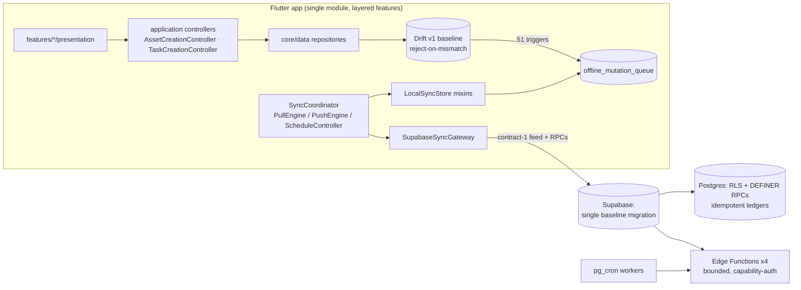

# Owntend Pre-Launch Hardening Implementation Plan

**Status:** Authoritative execution plan (planning only — no implementation performed by this investigation).
**Audience:** The implementing AI agent that will execute this plan end to end. This document is standalone; no other context is required.

---

## 1. Title and investigation metadata

| Item | Value |
| --- | --- |
| Investigation date | 2026-08-25 |
| Repository path | `F:\Owntend` |
| Branch / commit | `main` @ `157ac9e` ("fix(sync): coalesce default column values in SyncRecord.fromRemote and _toLocalValue") |
| Lifecycle mode | **Pre-launch** (`AGENTS.md` lifecycle checkbox is `[ ]` unchecked). Zero users, zero production data, no backward-compatibility obligations. Clean replacement over layered compatibility is authorized and expected. |
| Dirty-worktree summary | **163 dirty/untracked paths.** 9 staged deletions (Shorebird promotion workflow/script, remote-config service, diagnostic-export service, remote-asset service + tests, three Supabase patch migrations), ~130 modified files, ~20 untracked paths (`integration_test/`, `lib/src/core/services/backup/`, `lib/src/features/navigation/route_error_screen.dart`, `supabase/functions/process-media-cleanup/`, `supabase/tests/database/0029_*.sql` & `0030_*.sql`, `supabase/tests/integration/`, five new Dart tests, `tool/run_local_backend_integration.ps1`, `tool/source-policy.test.mjs`, Gradle wrapper binaries). This work-in-progress is a large, coherent hardening effort recorded in `CHANGELOG.md` "Unreleased → Pre-launch hardening (2026-08)" (BACKUP-001 … DEAD-001 entries). **It must be preserved and completed, not reverted.** |
| Applicable instruction files | `AGENTS.md` (root; the only instruction file — no nested AGENTS.md/CLAUDE.md exist), `docs/governance/documentation-maintenance.md` (read in full), `docs/README.md` index, `SECURITY.md`, `CONTRIBUTING.md` |
| Planning artifact path | `F:\Owntend\docs\pre-launch-hardening-implementation-plan.md` (this file) |
| External sources consulted (checked 2026-08-25) | Flutter release notes / SDK archive (docs.flutter.dev — Flutter 3.47.0 is the current August-2026 stable; 2026 cadence 3.41 Feb → 3.44 May → 3.47 Aug → 3.50 Nov); Android Gradle Plugin 9.0.1/9.2.0 release notes (developer.android.com — AGP 9.2 supports API 37, requires Gradle ≥ 9.4.1); Kotlin/KGP compatibility matrix (kotlinlang.org — KGP 2.4.0–2.4.10 lists fully-supported envelope Gradle ≤ 9.5.0, AGP ≤ 9.1.0); JetBrains AGP-9 built-in Kotlin migration guidance (blog.jetbrains.com) |

---

## 2. Executive assessment

**Current overall condition: unusually strong for a pre-launch repository, with a small number of genuinely serious gaps.** The codebase already implements most of what a hardening pass would prescribe: a single-baseline Supabase schema with exhaustive RLS/policy/pgTAP coverage (520 pgTAP asserts), a durable conflict-preserving sync protocol with idempotency keys and clock-skew handling, an encrypted streaming backup container with crash-atomic restore journaling, a server-authoritative monetization ledger, privacy-hardened Sentry scrubbing with fuzz tests, SHA-pinned CI with contract-tested release guards, perfect EN/AR key parity enforced by test, and a near-zero-skip, sleep-free test suite of ~794 cases that passes `flutter analyze` cleanly.

A second observation shapes this entire plan: **a large pre-launch hardening wave is already in flight in the working tree** (~130 modified files, staged deletions, new subsystems: encrypted backup container, media-cleanup worker function, change-feed compaction, toolchain enforcement, source policy). It is roughly 90% complete but currently leaves HEAD uncompilable in one spot and breaks two CI workflows.

**Highest-risk findings (details in §6):**

1. **P1 — Charged asset creation is not crash-safe journaled.** `asset_dialogs.dart::_save()` debits points via RPC then writes locally with no operation-journal entry; the recovery resolver's asset branch is unreachable dead code (F-001). A process death between debit and save loses a paid operation's reconciliation.
2. **P1 — Server-authority hole for charged task creation.** The in-flight baseline removed the INSERT guard on `maintenance_plans`; any authenticated client can now create unlimited tasks via plain REST POST without the point debit that `create_task_with_point_debit` exists to enforce (F-002).
3. **P1 — Two will-break-CI defects in the in-flight workflow edits** (deleted-file parse in `validate-flutter.yml`; invalid npm script name in the new backend-integration job) plus untracked release-critical files (Gradle wrapper JAR, integration-test lane, route-error screen) (F-003/F-004/F-005).
4. **P1 — Two sync correctness edges:** incremental feed skips can silently strand remote changes behind pending/terminal outbox rows while advancing the cursor; and restore-commit visibility depends on a UI-layer epoch bump rather than the service layer (F-006/F-007).
5. **P1 — Drift has no upgrade story beyond reject-on-mismatch.** Acceptable pre-launch, but the first shipped schema becomes immutable-or-wipe; the policy and its consequences must be made explicit before launch (F-008).

**Main architectural changes recommended:** none are rewrites. The target state retains the trigger-based outbox protocol, the single-baseline schemas, the Riverpod/GoRouter structure, and the release trust chain. Changes are: completing the in-flight consolidation; restoring/enforcing one charged-creation boundary per entity type at the database; journaling asset creations through the same recovery machinery as tasks; six targeted sync fixes; breaking four feature-import cycles and dissolving one god barrel; deleting four pieces of production-dead code kept alive by tests; splitting one 7,046-line test monolith; and a documentation truth sweep.

**What should be retained (verified sound):** the entire Supabase security model (RLS everywhere it applies, pinned `search_path` on every SECURITY DEFINER function, ownership always derived from `auth.uid()`, idempotency across all externally retried mutations, exemplary SSV verification); the sync store/coordinator design and its deep test coverage; the encrypted backup container format and restore journal; the observability scrubbing architecture; the toolchain manifest and its enforcement; the VersionDeck fail-closed trust chain; and the localization/accessibility discipline.

**Why this target is appropriate before launch:** every recommendation either closes a money/data-integrity hole, removes a divergence or stale-stream hazard, eliminates dead weight while deletion is still free, or converts an implicit assumption into an explicit tested contract. Nothing recommends churn for churn's sake; nothing preserves an inferior arrangement to minimize diff size.

**Estimated breadth:** ~19 work packages across 8 phases. Phases 0–3 (stabilization, backend authority, sync correctness, persistence posture) are the critical path and are mostly surgical. Phases 4–7 (architecture cleanup, Android hardening, testing quality, docs/hygiene) can largely run in parallel afterward. No package requires rewriting a subsystem wholesale.

---

## 3. Investigation methodology and evidence

### Areas inspected
Full-repository inventory first, then boundary-traced deep dives: `lib/src/core` (database, sync coordinator/store/gateway, services, backup, observability, providers, config, data repositories, domain), `lib/src/features` (all 16 features incl. cross-import analysis), `lib/src/ui`, `lib/l10n`, bootstrap/router, `supabase/` (baseline migration line-by-line consolidation check, all four Edge Functions, config.toml, all pgTAP suites, integration lane), `android/` (Gradle, manifest, res/xml, ProGuard, wrapper), `.github/workflows/` (all eight), `tool/` (all Node validation/test scripts, PowerShell release tooling), `download-site/` (CSP, service worker, verification UI), `config/`, root governance/config files, all 39 documents under `docs/`, and the full `test/` tree (170 files).

### Commands run and results

| Command | Result | Changed tracked files? |
| --- | --- | --- |
| `git status` / `git log --oneline -5` | Branch `main` @ `157ac9e`; 163 dirty paths (see §1) | No |
| `flutter analyze --no-pub` | **"No issues found!"** (ran 342 s, exit 0) | No (verified via before/after `git status --porcelain` snapshots) |
| `npm run validate:test-inventory --silent` | "Test inventory verified: all 20 Node tests are registered and owned", exit 0 | No |
| `node tool/validate_docs_links.mjs` | All local Markdown links resolve | No |

### Checks not run and why

| Check | Reason not run | Required future validation |
| --- | --- | --- |
| `flutter test --no-pub ...` full suite | Time-boxing of planning phase; analyzer clean and suite discipline verified structurally | Executing agent must run the full suite per §13 after Phase 0 lands the worktree |
| `dart run build_runner build` / `flutter gen-l10n` | Generators rewrite tracked files; forbidden without disposable copy | Run during any WP touching schema/ARBs; verify no drift via `git diff` |
| `npm run supabase:lint` / `supabase:test` | Requires local Docker Supabase stack; linked-service safety rules forbid unrequested operations against linked state | WP-002 acceptance; use `npm run test:backend-integration` disposable-stack lane which refuses when repo is linked |
| `npm run test:all`, `validate:toolchain`, etc. | Safe-by-design but time-costly; inventory validator already proved registration integrity | Full matrix in final validation (§13) |
| Any Android build/emulator run | Build/signing boundaries; device evidence out of scope for planning | WP-013 external validation items |
| `git diff` content audit of all 130 modified files | Covered via targeted diffs and agent deep reads of working-tree state | Executing agent reviews final diff per §15 |

### Known investigation limitations
- Runtime behaviors (deep-link destination loss across hydration gate, notification scheduling under OEM battery savers, golden rendering on real devices, SSV end-to-end, hosted advisors) are code-flow-derived hypotheses requiring device/hosted validation; each is flagged where it appears.
- The KGP/AGP/Gradle support-envelope tension is documented from official matrices but the repo's own CHANGELOG records a successful build using AGP built-in Kotlin, which changes the applicable rules; treated as verify-not-churn.
- `pubspec.lock` transitive audit was not exhaustive; the repo's own `validate:dependency-policy` and `validate:google-contracts` gates cover license/vulnerability review continuously.

---

## 4. Repository coverage map

Classification legend: **change** = requires modification; **retain** = verified sound as-is; **generated** = output whose source must change instead; **excluded** = third-party/build output, intentionally untouched; **ext-val** = requires external/device/CI/hosted validation beyond local checks.

| Path / subsystem | Responsibility | Current-state assessment | Class | Evidence | Findings / WPs |
| --- | --- | --- | --- | --- | --- |
| `AGENTS.md` | Agent governance | Accurate; lifecycle `[ ]`; flavor summary says dev/prod but three flavors exist (dev/staging/prod) | retain (+1-line fix) | vs `android/app/build.gradle.kts` flavors block | F-033 / WP-018 |
| Root governance (`README.md`, `SECURITY.md`, `PRIVACY.md`, `CONTRIBUTING.md`, `NOTICE`) | Policy/disclosures | Strong; SECURITY.md references deleted `_maxCompressionRatio`; PRIVACY.md claims verified against implementation | change (minor) | `SECURITY.md:47` symbol gone from `lib/` | F-021 / WP-017 |
| `CHANGELOG.md` | Change record | In-flight hardening wave accurately recorded; historical ZIP-era bullets create internal tension inside Unreleased | change (collapse) | ZIP bullets superseded by BACKUP-001 container entry | F-021 / WP-017 |
| `docs/**` (39 files) | Canonical documentation | High claim-accuracy (~30/30 spot-checks passed except listed stales); mojibake/literal `\n` artifacts; ADR-SHOREBIRD half-stale post REL-001; `docs/plans/` empty | change | Stale table S1–S9 in doc-audit report | F-021,F-027 / WP-017 |
| `lib/src/app` + startup feature | Bootstrap, error zones | Disciplined ordering; blocking account-cleanup resume gate correct; three parallel error-MaterialApps duplicated boilerplate | retain (+split) | `startup_bootstrap.dart` (1,367 L) mixes wiring/init/state machine | F-035 / WP-007-adjacent, WP-010 optional |
| `lib/src/core/database/app_database.dart` (1,167 L) + `.g.dart` (23,890 L) | Drift v1 source schema; reject-on-mismatch baseline; 51 sync triggers; FTS5 search | Sound constrained v1 baseline; no onUpgrade anywhere; epoch doc/comment mismatch; CHECK domains + query-plan-tested indexes | retain (formalize) | `currentSchemaVersion=1` (:624); `_verifyBaselineObjects` (:742–784) | F-007,F-008 / WP-005, WP-008 |
| `lib/src/core/sync/**` (~7,600 L) | Outbox, pull/push coordinators, gateway, DTOs, realtime, media saga | Deep, tested protocol; feed-skip stranding edge; terminal-resurrection on restore snapshot; full-table push scans; silent catches; dead legacy cursor API; part-extension mega-class | change (targeted) | `remote_store.dart:88–143`; `outbox_store.dart:578–593,:329`; `push_coordinator.dart:11–14` | F-006,F-009,F-010,F-011,F-013,F-015 / WP-004–WP-007 |
| `lib/src/core/services/**` | Backup/restore, notifications, permissions, feedback, weather, patch | backup_service (1,760 L) solid but duplicates media activation w/ restore_journal; NotificationMessageGenerator dead+EN-only; notification scheduler sound (desired-state diffing) | change (partial) | `backup_service.dart:1323–1351` vs `restore_journal.dart:247–265` | F-012,F-013,F-037,F-038 / WP-005, WP-010 |
| `lib/src/core/services/backup/` (untracked) | Streaming encrypted container codec, sidecar registry | New BACKUP-001 implementation; hostile-input header caps; solid | retain (commit) | `backup_container.dart` (418 L) | WP-001 |
| `lib/src/core/{config,data,domain,observability,providers,supabase,utils}` | Config validation, repositories, models, scrubbing, wiring | Config validator strong; asset/maintenance repositories large but layered; scrubber whitelist approach verified; English-only user-facing strings in `feature_selectors.dart` | change (l10n only) | `feature_selectors.dart` reason strings → `thing_detail_screen.dart:369` | F-014,F-035 / WP-010 |
| `lib/src/features/assets` | Asset screens/dialogs | Charged creation logic in dialog widget; no crash-safe journal; oversized `asset_dialogs.dart` (1,467 L) | change | `_save()` (:1218–1399); resolver asset branch unreachable | F-001,F-018 / WP-003 |
| `lib/src/features/auth` | Google sign-in, reauth, coordinated deletion | Rigorous: same-identity checks, durable journal phases, receipt validation, restart recovery | retain | `supabase_auth_repository.dart:92–122,:193–200` | F-028 (tests) / WP-016 |
| `lib/src/features/{dashboard,maintenance,rooms,trash,search,more,statistics,notifications,settings}` | Product surfaces | Layered correctly; four bidirectional cycles found; oversized screens (settings 1,685 L, dashboard 1,373 L) | change (imports/split) | Cycle table in investigation §3 | F-017,F-035 / WP-009 |
| `lib/src/features/monetization` | Wallet, ads, SSV claims | Server-authoritative throughout; claim-before-show; fail-closed defaults; offline drafts safe for assets | retain | `ads_service.dart::showReward`; wallet controller canonical-snapshot gating | F-001 crosses here / WP-003 |
| `lib/src/features/permissions` | Education overlay, capability snapshots | Clean layering but `'../../../../src/'` import style deviation; one unlabeled back button | change (minor) | `permission_setup_screen.dart:76` | F-032,F-033 / WP-012, WP-018 |
| `lib/src/features/navigation` | GoRouter config, shell | Route set matches docs exactly; localized error screen; no redirects/deep-link destination persistence; prefix-match bug | change | `startup_bootstrap.dart:1350–1366`; `app_navigation.dart:23–50` | F-019 / WP-011 |
| `lib/src/ui/**` | Shared components, feedback system | Good reuse; `presentation_support.dart` god barrel exports feature internals + every package | change | Barrel exports list (:61–72) | F-016 / WP-009 |
| `lib/l10n/**` + `l10n.yaml` | EN/AR sources + generated output | Perfect 1,022-key parity both directions, test-enforced; generated files fresh | retain (regenerate via source) | `localization_test.dart` parity assertions | WP-010 (regen step) |
| `integration_test/` (untracked) | Real-platform launch smoke | Exists, env-lane documented in header, invisible to CI until committed | commit | `app_launch_test.dart` (27 L) | F-005 / WP-001, WP-013 |
| `test/**` (114 Dart files) | Unit/widget/contract/fuzz suites | Near-zero skips-as-rot; no sleeps; real fuzzing; strong i18n/RTL; wall-clock busy-waits; 7,046-line `widget_test.dart`; duplicated fakes; gated backend suite dark by default | change | Test-agent report §§2–9 | F-022,F-023,F-024,F-028,F-036 / WP-014–WP-016 |
| `supabase/migrations/` (1 file, 5,519 L) | Single consolidated baseline (consolidation #2 in progress) | All three deleted hotfixes verifiably folded in; new compaction/media-worker/cron subsystems coherent; maintenance_plans INSERT guard removed (authority question); cleanup-jobs table missing RLS | change (complete it) | Fold-in markers at :1233,:2703–2726,:5072–5087; policy ~:4441 | F-002,F-020,F-034 / WP-002 |
| `supabase/functions/**` (4 + _shared) | delete-account, account-deletion-status, admob-ssv-handler, process-media-cleanup | All strong: bounded bodies, strict allowlists, constant-time capability compare, pinned deps + lockfiles, exemplary log hygiene | retain | Per-function assessments in Supabase report §3 | WP-001 (commit new fn) |
| `supabase/tests/**` (30 DB suites + integration) | pgTAP 520 asserts + real-HTTP worker integration | Comprehensive incl. negative/cross-user; plan-insert denial test flipped to lives_ok (see F-002); parity RPC lacks functional test; new suites untracked | change (commit + 1 test) | 0012 diff flip; 0029/0030 new | F-002 / WP-002 |
| `android/**` | Native host, flavors, signing guards, manifests | Minimal permissions; deny-all backup rules; exported=launcher only; fail-fast release guards; **no networkSecurityConfig**; prod AdMob ID hardcoded; bleeding-edge AGP/Kotlin/Gradle pins | change (small) | Manifest + build.gradle.kts reads | F-025,F-029,F-033 / WP-012, WP-013 |
| `.github/workflows/` (8) | Validation + protected release rails | All actions SHA-pinned (64 refs, contract-tested); two CI-breaking defects in working tree; reset-prelaunch job appropriately guarded today | change | Workflow defect list | F-003,F-004 / WP-001; F-051 launch item WP-019 |
| `download-site/**` | VersionDeck static site | Strict CSP; fail-closed disabled publication; revisioned SW; accessibility/reduced-motion honored; no secrets; hardcoded repo identity in links | retain (+minor) | Site report §4 | F-026 / WP-018 |
| `tool/**` (55 files) | Release/validation tooling + 20 registered test suites | Fail-closed validators; toolchain manifest enforcement incl. wrapper-JAR hash; state-mutating scripts properly guarded | retain | Tooling report §3 | WP-017 (notices regen) |
| `config/*.example.json`, `toolchain.json`, `asset_provenance.json` | Safe config examples + canonical pins | Placeholders only; pins match gradle/pubspec/toolchain docs exactly | retain | Configuration audit | WP-013 (verify build) |
| `artifacts/`, `release/`, `build/`, `.dart_tool`, `node_modules` | Local outputs / deps | Untracked or gitignored local state; `artifacts/supabase-advisors-*` are local advisor evidence copies | excluded | .gitignore coverage | None |
| `shorebird.yaml.template` + shorebird rails | OTA patch channel (release/patch retained; promotion path deleted) | Coherent post-REL-001; runtime updater + observability attribution live | retain | `release-workflows.test.mjs:186–200` asserts absence of promotion path | F-021 (ADR amendment) / WP-017 |
| `deno.json`, `deno.lock`, `package.json`, `package-lock.json`, `l10n.yaml`, `dart_test.yaml`, `flutter_native_splash.yaml`, `.gitattributes`, `.gitignore` | Root configs | Deno pins exacted; dart_test.yaml minimal (tag decl only); node_modules ignore narrowed | change (tiny) | Config audits | F-031,F-036 / WP-015, WP-018 |

No major directory is left unclassified.

---

## 5. Verified strengths to retain

These are load-bearing decisions with positive evidence. The executing agent must **not** replace them:

1. **Trigger-based durable outbox** (51 SQLite triggers → `offline_mutation_queue` with generation CAS, state machine, backoff+jitter, dependency-ordered push). Evidence: `app_database.dart:334–371,:850–1023`; `outbox_store.dart:327–424`; deep coverage in `sync_coordinator_test.dart` (2,986 L). Replacement would discard battle-tested semantics.
2. **Conflict-preserving sync with explicit resolution API** (losing intents persist as outbox `conflict` rows + `sync_conflicts` evidence; keep-local/keep-remote resolution). Evidence: `mutation_store.dart`, `sync_conflict_preservation_test.dart` (570 L).
3. **Supabase security model**: RLS enabled on all client-visible tables; ownership exclusively from `auth.uid()` (init-plan cached); empty `search_path` on every SECURITY DEFINER function (pgTAP-enforced, test 0023); anon zero privileges; sequence lockdown; storage paths CHECK-constrained; session-active gating on storage policies. Evidence: baseline migration + tests 0002/0003/0009/0023.
4. **Idempotency everywhere externally retried mutations occur**: charged creation (`creation_point_operations` PK + request-hash + advisory locks), task completion (`operation_id` UNIQUE + structured conflict taxonomy), SSV settlement (transaction PK + advisory lock + idempotency-keyed transactions), media saga (unique staging keys, replay returns identical economics). Evidence: tests 0011/0012/0013/0022/0030.
5. **Encrypted streaming backup container** (Argon2id + chunked AES-GCM bound by AAD, manifest-first framing, budgets 256 MiB container / 512 MiB aggregate / 256 MiB entry / 10k entries, VACUUM INTO snapshot, ATTACH-based transactional import with commit-proof probe). Evidence: `backup_container.dart`, `backup_service.dart`, `restore_journal.dart`, `backup_resource_budgets_test.dart`.
6. **Privacy-preserving observability**: allowlist-only Sentry scrubber (user/request nulled, exception payloads replaced by sanitized type token, breadcrumb whitelist, screenshots/replay/view-hierarchy/raw bodies disabled) + property-style fuzz test. Evidence: `sentry_event_scrubber.dart`, `sentry_bootstrap.dart:62–98`, `sentry_scrubber_fuzz_test.dart`.
7. **Release trust chain**: SHA-pinned actions everywhere (64 refs, contract-tested), kill-switch variables, dry-run-first protected builds, exact-SHA main-equality checks, provenance attestations, VersionDeck fail-closed disabled publication, canonical-AAB-once derivation rule. Evidence: all eight workflows + `tool/release-workflows.test.mjs` + `verify_android_apk_artifact_set.mjs`.
8. **Toolchain manifest enforcement** (`config/toolchain.json` + `tool/toolchain_manifest.mjs --enforce` incl. wrapper-JAR SHA-256): prevents silent drift better than prose pinning. Retain; do not loosen.
9. **Localization discipline**: perfect 1,022-key EN/AR parity test-enforced; zero hardcoded user-visible strings found in `lib/src`; behavioral RTL tests; matched en/ar goldens. Evidence: `localization_test.dart`, widget RTL matrix tests.
10. **Test-suite hygiene norms**: no sleeps, no retry flags, no weak assertions, honest env-gating (two deliberate skips, both contract-gated), real fuzzing, real in-memory-Drift repository tests. Preserve these norms in all new tests.
11. **Coordinated account-deletion workflow**: durable phase journal in secure storage, receipt-validated acknowledgement, restart recovery at auth-watch start, error-code-specific UX. Evidence: `auth/` feature + tests 0014/0016 equivalents + `account_cleanup_startup_recovery_test.dart`.

---

## 6. Findings register

Severity scale: P0 credible security compromise / data-loss / cross-account risk or release-blocking integrity failure; P1 foundational correctness/security/privacy/architecture problem to fix before launch; P2 important maintainability/reliability/testing/performance/UX hardening; P3 polish/consistency/low-risk cleanup.

### F-001 · P1 · Monetization data-integrity · Confidence: high (verified)
- **Evidence:** `lib/src/features/assets/presentation/asset_dialogs.dart::_save()` lines ~1218–1399; `charged_operation_resolver.dart:80–86,:110–121` (asset branch never triggered); contrast `task_creation_controller.dart:199–200` which journals tasks.
- **Current behavior:** Free asset creation is fine; **charged** asset creation calls `createAsset` RPC (server debits points) then writes locally — with no `TaskCreationOperationStore`-equivalent journal entry.
- **Root cause:** Asset creation UI predates the journaled-task pattern; the resolver's asset branch was written speculatively and never wired.
- **Consequences:** Process death between successful debit and local write leaves a paid operation unreconciled; user charged, no asset, no automatic recovery (only manual draft reuse sharing the same `operation_id`). Violates AGENTS.md monetization rule that offline charged creation must be recoverable/idempotent.
- **Resolution:** Journal asset creations like tasks; extract the flow into an application-layer controller (also fixes F-018). Wire the existing resolver branch.
- **WPs:** WP-003.

### F-002 · P1 · Server authority / monetization boundary · Confidence: high (verified)
- **Evidence:** Working-tree `supabase/migrations/20260821124930_initial_schema.sql` policy `maintenance_plans_insert_own` (~line 4441) is now a plain owner check; HEAD version additionally required `owntend_monetization_private.can_reconcile_maintenance_plan(...) OR current_setting('owntend.completion_plan_insert')='true'`. Test flip: `supabase/tests/database/0012_points_monetization.test.sql` changed `throws_ok('direct charged task inserts are denied','42501')` → `lives_ok(...)`. Dead GUC setter remains at migration lines ~1939/:1974. `docs/backend/supabase.md:74` still claims denial.
- **Current behavior:** Any authenticated client can POST `/rest/v1/maintenance_plans` and create unlimited tasks without the 1-point debit.
- **Root cause:** Guard dropped during in-flight baseline consolidation without a recorded product decision.
- **Consequences:** Direct revenue-integrity bypass contradicting AGENTS.md monetization rules and the documented contract; leaves orphaned mechanism.
- **Resolution (recommended default):** **Restore the guard** in the consolidated baseline (policy condition referencing the reconcile helper or completion GUC), update test 0012 accordingly, delete the dead `owntend.completion_plan_insert` setter if the guard no longer needs it, and synchronize docs. Alternative (only if owner explicitly decides tasks are free): remove `create_task_with_point_debit` entirely so exactly one creation path exists — do not leave both.
- **WPs:** WP-002 (decision + execution).

### F-003 · P1 · CI integrity · Confidence: high (verified)
- **Evidence:** `.github/workflows/validate-flutter.yml:136` lists `tool/promote_shorebird_patch.ps1` in a PowerShell parse loop; the file is staged-deleted and absent; meanwhile `tool/release-workflows.test.mjs:186–200` asserts its non-existence. ParseFile on missing path throws → whole validation job fails.
- **Resolution:** Remove the entry; extend the loop (or the contract test) to assert absence explicitly.
- **WPs:** WP-001.

### F-004 · P1 · CI integrity · Confidence: high (verified)
- **Evidence:** `.github/workflows/validate-google-backend.yml` `edge-endpoint-integration` job invokes `npm run test:backend-integration/..`. npm matches script names literally; `package.json` defines `test:backend-integration` (and companion lanes). Empirically verified behavior: "Missing script".
- **Resolution:** Drop the `/..` suffix; tighten the release-workflows contract regex so malformed invocations fail the contract test too.
- **WPs:** WP-001.

### F-005 · P1 · Repository completeness · Confidence: high (verified)
- **Evidence:** Untracked: `android/gradle/wrapper/gradle-wrapper.jar`, `gradlew`, `gradlew.bat` (deliberately de-ignored; hashed by `toolchain_manifest.mjs --enforce` via new `gradleWrapperJarSha256`), `integration_test/`, `lib/src/core/services/backup/`, `lib/src/features/navigation/route_error_screen.dart`, `supabase/functions/process-media-cleanup/`, `supabase/tests/database/0029_*.sql`+`0030_*.sql`, `supabase/tests/integration/`, five new Dart tests, two tool scripts. `route_error_screen.dart` is imported by modified tracked files ⇒ **HEAD does not compile**.
- **Consequences:** Fresh clones and CI cannot bootstrap Gradle or compile; the hardening wave is not actually delivered until tracked.
- **Resolution:** Land the in-flight worktree as coherent commits (with user approval), verifying each untracked path is intentional and complete.
- **WPs:** WP-001.

### F-006 · P1 · Sync correctness · Confidence: medium-high (code-verified mechanics; divergence consequence analytical)
- **Evidence:** `lib/src/core/sync/local_store/remote_store.dart:88–121` (record skip when any outbox row exists for key) and `:123–143` (delete skip); cursor advances regardless; daily integrity check only removes locally-present-but-remotely-deleted rows (`outbox_store.dart:36–85`).
- **Current behavior:** An incoming remote change is masked whenever *any* outbox row exists for the key — including terminal `failedVisible` or unresolved `conflict` rows — yet the feed cursor moves past it. Shadows are not updated for skipped rows.
- **Root cause:** Skip predicate conflates "pending intent may win" with "any intent exists"; no deferred-refetch bookkeeping.
- **Consequences:** If the masking mutation later fails terminally and is dismissed, the remote update is never auto-fetched; devices diverge until a manual full reconcile.
- **Resolution:** Define skip semantics precisely: when skipping due to *active* (pending/inFlight) intents, record the skipped seq/key so completion re-pulls; when masking rows are terminal/conflicted, apply-or-defer explicitly (do not advance past silently). Add regression tests for dismiss-after-mask and conflict-resolution refetch.
- **WPs:** WP-004.

### F-007 · P1 · Restore visibility · Confidence: high (doc-vs-code mismatch verified)
- **Evidence:** `app_database.dart:13–29` comment says restore "increments this epoch exactly once"; actual `bump()` call site is `backup_screen.dart:494` (UI only); `backup_service._importDatabaseFrom` (:1172–1237) uses raw SQL on the same connection without drift invalidation.
- **Root cause:** Epoch publication implemented at the presentation layer during the APP-001 change.
- **Consequences:** Any restore completing outside that screen (recovery path, future callers) leaves stale streams showing pre-restore data.
- **Resolution:** Move epoch bump into `OwntendBackupService` restore-completion (after verified commit marker), keep screen as consumer; add service-level test asserting stream rebuild after restore without UI.
- **WPs:** WP-005.

### F-008 · P1 · Persistence upgrade story · Confidence: high (verified absence)
- **Evidence:** `MigrationStrategy` has only `onCreate`+`beforeOpen` (`app_database.dart:689–705`); `_verifyBaselineObjects` throws `StateError` listing missing objects (:742–784); `database_schema_test.dart` covers v1-only creation, zero upgrade paths.
- **Root cause:** Deliberate blank-baseline policy (DB-001) with reject-on-mismatch; upgrade machinery deliberately absent.
- **Consequences:** First shipped schema instantly becomes immutable-or-wipe; any post-launch change without machinery bricks upgraded installs (StateError at open). Also couples to backup format and sync payload contracts.
- **Resolution:** Make the policy explicit and launch-scoped (see §9): keep reject-on-mismatch through launch; define the trigger and skeleton for introducing stepwise migrations at the first post-launch schema change; encode the decision in `docs/architecture/data-model.md` and a launch checklist item. No speculative framework now.
- **WPs:** WP-008.

### F-009 · P2 · Sync correctness · Confidence: medium-high
- **Evidence:** `enqueueRestoreSnapshot` sets `attempts = 0` on every outbox row including `failedVisible`/`conflict` (`outbox_store.dart:578–593`).
- **Consequence:** Terminal failures resurrect automatically post-restore, possibly re-executing operations the user dismissed.
- **Resolution:** Restrict resurrection to pending/failed-with-attempts rows; leave `conflict` untouched; leave `failedVisible` visible-unless-user-action. Tests for each state.
- **WPs:** WP-005.

### F-010 · P2 · Performance · Confidence: high
- **Evidence:** `pendingMutations()` loads every outbox row into memory per outer loop iteration (`outbox_store.dart:329`; loop at `push_coordinator.dart:11–14`); bespoke comparator decodes payloads O(n).
- **Consequence:** Cost grows unbounded with backlog size; battery/CPU on low-end devices.
- **Resolution:** Bound the query (due-only, LIMIT batch window, indexed columns already present: `idx_outbox_retry`), cache dependency order per cycle instead of recomputing per mutation; keep comparator semantics covered by existing ordering tests.
- **WPs:** WP-006.

### F-011 · P2 · Architecture complexity · Confidence: high
- **Evidence:** `SyncCoordinator` facade + four `part` extensions ≈ 2,700 logical lines sharing ~30 mutable fields and 7 timers (`sync_coordinator.dart`, `coordinator/*.dart`).
- **Consequence:** Highest-regression-risk area; phase/message override ownership scattered across parts.
- **Resolution:** Extract collaborator objects (PullEngine, PushEngine, ScheduleController) behind narrow interfaces while preserving public behavior; existing 2,986-line coordinator test is the safety net. Do this after WP-004/006 land so diffs stay separable.
- **WPs:** WP-007.

### F-012 · P2 · Duplication in destructive path · Confidence: high
- **Evidence:** Media-generation activation duplicated: `backup_service.dart:1323–1351` vs `restore_journal.dart:247–265`.
- **Consequence:** Drift risk in the most data-destructive code path.
- **Resolution:** Consolidate onto the journal implementation; delete the duplicate.
- **WPs:** WP-005.

### F-013 · P2/P3 · Dead code kept alive by tests · Confidence: high
- **Evidence:** `NotificationMessageGenerator` (`notification_service.dart:1180–1276`, test-only, hardcoded English); `homeKeeperWorkManagerCallback` alias (:155, contract-test-pinned); `SupabaseSyncGateway.syncHead` (gateway :224, test-only); per-entity cursor quartet `cursor()/cursorCheckpoint()/setCursor()/applyRemoteRecordsAndCheckpoints()` (`remote_store.dart:4–156`, test-only remnant of superseded protocol).
- **Consequence:** Violates pre-launch dead-code rules; the generator violates l10n policy if revived.
- **Resolution:** Delete implementations + their pinning tests; rename `hk*` residue opportunistically where cheap (`feedback_messenger.dart` key is frozen by entry-point contract — verify before renaming).
- **WPs:** WP-010.

### F-014 · P2 · Localization gap in core · Confidence: high
- **Evidence:** `lib/src/core/domain/feature_selectors.dart` builds English-only user-facing reason strings ("No maintenance plan yet.", "Warranty has expired.") consumed by `thing_detail_screen.dart:369`.
- **Resolution:** Convert to message codes resolved via `AppLocalizations` at presentation boundary (mirror `notification_localization.dart` pattern); ARB additions en+ar.
- **WPs:** WP-010.

### F-015 · P2 · Silent failure handling · Confidence: high
- **Evidence:** `catch (_) {}` at `outbox_store.dart:375`, `remote_store.dart:521`, `mutation_store.dart:384`, `maintenance_repository.dart:425`; inconsistent media materialization failure semantics (hydration defers; incremental feed fails whole sync).
- **Consequence:** Mutes exactly the corruption signals the outbox depends on; diagnostics blind spots.
- **Resolution:** Replace bare catches with typed parse-failure counters (non-PII) surfaced in sync status; unify media-materialization failure policy toward deferral with bounded retry in both paths.
- **WPs:** WP-006.

### F-016 · P2 · Architecture coupling · Confidence: high
- **Evidence:** `lib/src/ui/presentation_support.dart` god barrel (~50 libraries incl. `dart:io`, router, supabase, sentry + other features' internals at :61–72); 18 feature files + tests import it.
- **Consequence:** Hides true dependency edges; enables F-017 cycles; makes `ui` a hub instead of leaf.
- **Resolution:** Shrink barrel to genuine shared UI primitives; migrate consumers to direct imports; enforce with an import-lint style contract test consistent with house source-scan style.
- **WPs:** WP-009.

### F-017 · P2 · Architecture coupling · Confidence: high (concrete pairs verified)
- **Evidence:** settings↔dashboard (`settings_screen.dart` ↔ `location_picker_sheet.dart`), rooms↔assets (`room_dialogs.dart` ↔ `assets_presentation.dart`), maintenance↔monetization (incl. presentation↔presentation via `daily_completion_reward_sheet.dart`), trash↔maintenance (`task_actions.dart` ↔ `trash_actions.dart`).
- **Resolution:** Hoist shared sheets/actions to neutral locations (ui components or application layer); break each pair; add boundary contract test enumerating allowed cross-feature imports.
- **WPs:** WP-009.

### F-018 · P2 · Architecture (companion to F-001) · Confidence: high
- **Evidence:** ~180 lines of connectivity/payload-signing/wallet-adoption logic inside `asset_dialogs.dart::_save`.
- **Resolution:** Subsumed by WP-003 extraction.
- **WPs:** WP-003.

### F-019 · P2 · Navigation/deep-link UX correctness · Confidence: medium (mechanics verified; user impact needs device check)
- **Evidence:** Router has no redirects; after sign-in `_goHomeAfterReadyIfRequested` forces `go('/')` (`startup_bootstrap.dart:1350–1366`); `validatedNotificationRoute` uses `startsWith('/assets')` accepting `/assets-anything` (`app_navigation.dart:23–50`).
- **Consequence:** Cold-start notification/deep-link destinations likely replaced by home after readiness; prefix bug fails closed (cosmetic) but sloppy.
- **Resolution:** Capture intended route pre-ready; navigate there after authentication/hydration completes (or queue via router redirect); switch to exact-segment matching; add cold-start routing tests.
- **WPs:** WP-011.

### F-020 · P2 · Defense-in-depth · Confidence: high
- **Evidence:** `owntend_private.account_deletion_cleanup_jobs` lacks `ENABLE ROW LEVEL SECURITY` (only sibling operations table has it, ~migration line 4303); mitigated by service-role-only schema USAGE (test 0009 proves client isolation).
- **Resolution:** Enable RLS + service_role-all policy in baseline; extend test 0002/0009.
- **WPs:** WP-002.

### F-021 · P2 · Documentation truth · Confidence: high
- **Evidence (stale cluster):** ZIP→container stragglers: `system-overview.md:112`, `product/feature-catalog.md:77`, `SECURITY.md:47` (`_maxCompressionRatio` deleted); `testing.md:153` "12 suites" vs actual 20; `testing.md:289` exact-alarm fallback rows describe deleted surface (NOTIF-001); `v1-contracts.md:13` pins mutable `1.0.0+1` vs pubspec `1.0.0+6`; `ADR-SHOREBIRD-CODE-PUSH.md` "three workflows"/promotion model contradicted post-REL-001; `docs/README.md` omits Backend section and `plans/`; encoding artifacts (mojibake `monetization.md:59,:107,:143`, ADR-0001 quotes; literal `\n` `backend/supabase.md:108–121`).
- **Resolution:** Single truth sweep (WP-017) executed against executable sources; link don't copy.
- **WPs:** WP-017.

### F-022 · P2 · Test maintainability · Confidence: high
- **Evidence:** `test/widget_test.dart` = 7,046 lines, 122 tests, zero groups, ~14 hand-rolled fakes duplicated across the suite.
- **Resolution:** Split into ~10 area files mirroring existing sections; hoist fakes to `test/support/fakes.dart`; introduce groups; no assertion changes.
- **WPs:** WP-014.

### F-023 · P2 · Integration-evidence darkness · Confidence: high
- **Evidence:** `test/backend_integration/local_backend_sync_test.dart` (312 L, real loopback Supabase: two-user RLS denials, convergence, storage saga) skips without dart-defines and runs in no default lane; Node-side `test:backend-integration` lane exists but is CI-disposable-stack based.
- **Resolution:** Schedule the disposable-backend lane in CI (nightly or per-PR job already added — ensure green) and/or surface skip counts in test reports so darkness is visible.
- **WPs:** WP-016.

### F-024 · P2 · Flakiness vector · Confidence: high
- **Evidence:** Wall-clock busy-wait polling (`while (DateTime.now().isBefore(deadline))`) in `sync_coordinator_test.dart:754,:3233`, `sync_store_test.dart:1116`, `hydration_lease_readiness_test.dart:306`, `live_runtime_updates_test.dart:291`; no clock abstraction anywhere in tests.
- **Resolution:** Completer-driven awaits or shared generously-bounded `waitFor` helper keyed off injected fake clocks; add `timeout`/concurrency defaults to `dart_test.yaml`.
- **WPs:** WP-015.

### F-025 · P3 · Android security posture (explicitness) · Confidence: high
- **Evidence:** No `android:networkSecurityConfig` attribute nor XML resource; default at targetSdk 36 already forbids cleartext.
- **Resolution:** Add deny-cleartext NSC making the guarantee explicit/auditable; reference from routes-and-permissions/configuration docs.
- **WPs:** WP-012.

### F-026 · P3 · Mutable identity literals · Confidence: high
- **Evidence:** `zuhak5/Owntend` literal in `deploy-download-site.yml` post-deploy verification + `download-site/index.html` links; `owntend.app` canonical/OG tags.
- **Resolution:** Acceptable short-term; centralize into `tool/versiondeck-control.json` (already the control plane) and read from there where feasible; document transfer procedure.
- **WPs:** WP-018.

### F-027 · P2 · Docs sync for in-flight consolidation · Confidence: high
- **Evidence:** `docs/backend/supabase.md:95,:97` still say INVOKER wrappers; baseline + test 0023 assert public SECURITY DEFINER with internal guards; stray `\n` artifacts :108–121.
- **Resolution:** Included in WP-017 sweep; verify against migration + test 0023.
- **WPs:** WP-017.

### F-028 · P2 · Missing assembled test · Confidence: medium
- **Evidence:** Account-deletion partial-failure pieces exist across 5+ test files; no single orchestration test walks restart-during-cleanup and cloud-success/local-failure end-to-end with injected failures.
- **Resolution:** Assemble one orchestration-level widget/unit test composing existing fakes; assert journal phase progression and recovery outcomes.
- **WPs:** WP-016.

### F-029 · P3 · Config duplication · Confidence: high
- **Evidence:** Prod AdMob App ID hardcoded at `android/app/build.gradle.kts:113` while dev/staging inject per-flavor placeholders; value ships in APK + app-ads.txt anyway; exactness enforced by release evidence.
- **Resolution:** Either inject prod ID like siblings (preferred, consistent) or document the deliberate hardcoding in configuration docs; do both halves of whichever choice.
- **WPs:** WP-012.

### F-030 · P3 · Generated notices staleness · Confidence: high
- **Evidence:** `THIRD_PARTY_NOTICES.md` generated 2026-08-22; working tree adds `cryptography`, drops `archive`/`collection`/`cupertino_icons`.
- **Resolution:** Regenerate via `npm run generate:sbom-and-notices` within the landing PR (WP-001 scope) and at release (already automated).
- **WPs:** WP-001/WP-018.

### F-031 · P3 · Ignore-rule precision · Confidence: high
- **Evidence:** `.gitignore` swaps `node_modules/` → rooted `/node_modules/`; nested future sub-package node_modules would become trackable.
- **Resolution:** Keep root anchored entry AND re-add unanchored `node_modules/` for safety.
- **WPs:** WP-018.

### F-032 · P3 · Accessibility nit · Confidence: high
- **Evidence:** `permission_setup_screen.dart:76` custom AppBar back `IconButton` lacks tooltip/semantic label (only unlabeled one of 20).
- **Resolution:** Add localized tooltip/Semantics label; extend widget test.
- **WPs:** WP-012.

### F-033 · P3 · Hygiene cluster · Confidence: high
- **Evidence:** No-op `ref.listenManual(streakRefreshProvider,…)` (`owntend_app.dart:261`); dead `DynamicText.sourceLanguage`; `'../../../../src/…'` imports ×3 in permissions; duplicated tab-path lists in `HomeShell` (:13 vs :20–26); portrait lock `portraitUp` only (confirm `portraitDown` intentionally excluded or add); AGENTS.md flavor summary drift (dev/prod vs dev/staging/prod).
- **Resolution:** Batch cleanup with individual justifications; keep no-op listener only if documented as keep-alive (prefer explicit keepAlive).
- **WPs:** WP-018.

### F-034 · P3 · Backend cosmetics/fragility · Confidence: high
- **Evidence:** REVOKE names parameter `p_error` vs definition `p_error_code` (migration ~:5357,:5410); `validate_change_feed_parity` grant decorative over Data API (requires session GUC via SQL); CORS dev origins unconditional in delete-account/status functions; watermark RPC does full count(*); test 0006 hardcodes 17 tables while publication holds 18.
- **Resolution:** Fix parameter name in baseline; align 0006 to enumerate dynamically or assert 18; env-gate dev origins; document parity-run procedure; watermark cost acceptable pre-compaction-growth (note in sync docs).
- **WPs:** WP-002.

### F-035 · P3 · File-size concentration · Confidence: high (sizes measured)
- **Evidence:** >1,200-line files: backup_service 1,760; settings_screen 1,685; asset_dialogs 1,467; asset_repository 1,482; supabase_sync_gateway 1,349; dashboard_screen 1,373; startup_bootstrap 1,367; backup_screen 1,290; thing_detail_screen 1,232; notification_service 1,276; app_database 1,167.
- **Resolution:** Split opportunistically **where a WP already touches the file** (WP-003 splits asset_dialogs' logic; WP-007 decomposes coordinator; WP-014 touches test side). No churn-only splitting.
- **WPs:** cross-cutting note.

### F-036 · P3 · Golden/dart_test infra · Confidence: high
- **Evidence:** Goldens render with synthetic test font (no loader in `flutter_test_config.dart`); stale failure PNGs in gitignored `test/failures/`; `dart_test.yaml` declares only the production-config tag.
- **Resolution:** Document font reliance in testing.md; widen Arabic goldens to inbox/editor surfaces (optional); purge stale failures locally; add timeout/concurrency defaults post-split.
- **WPs:** WP-015, WP-017.

### F-037 · P3 · Risky constructor default · Confidence: medium
- **Evidence:** `MemoryReminderScheduleStore` is the scheduler's constructor default; production always passes the Drift store.
- **Resolution:** Make the Drift store a required positional parameter; compiler catches all call sites.
- **WPs:** WP-010.

### F-038 · P3 · Diagnostic fidelity · Confidence: high
- **Evidence:** `deferPendingAfterFailure` stamps one error message onto all due rows regardless of cause (`outbox_store.dart:306–325`).
- **Resolution:** Stamp only the failing row; leave others' last_error intact.
- **WPs:** WP-006.

**Counts:** P1×8, P2×15 (F-009…F-028 range including F-027), P3×10 (F-029…F-038 minus F-035 counted once). Total findings: 38. No P0 findings: no evidence of secret exposure, cross-account authorization holes in shipped code paths, or RLS bypasses; the closest candidates (F-001/F-002) are monetization-integrity issues caught before launch.

---

## 7. Target-state architecture

The target is the **completed current design**, hardened — not a redesign.



**Module and dependency boundaries.** Features remain presentation-first; business flows that touch money or durability live in application-layer controllers (`TaskCreationController` exists; `AssetCreationController` added). Cross-feature imports become acyclic: shared sheets/actions hoisted to `lib/src/ui/components` or application services; `presentation_support.dart` shrinks to genuine shared UI primitives. A boundary contract test enumerates permitted cross-feature imports.

**State management.** Unchanged: Riverpod 3, app-lifetime non-autoDispose streams for collections, `autoDispose.family` + fingerprint dedupe for details, restore-epoch provider as the single invalidation boundary — with the epoch bump moved into the restore service (F-007).

**Navigation/authentication model.** GoRouter remains declarative with ShellRoute; add destination preservation: intended route captured before the auth/hydration gate and honored after readiness (F-019); exact-segment notification-route validation; localized route-error screen retained.

**Local data model.** Drift v1 stays the immutable launch baseline: `schemaVersion = 1`, canonical creation path, `beforeOpen` object-inventory verification, reject-on-mismatch. Upgrade machinery is **deferred by explicit decision** until the first post-launch schema change (§9). Timestamp convention (unix-second truncation) documented once and referenced.

**Synchronization protocol and invariants (retained, with fixed edges).**
Invariants: (1) every domain mutation durably produces exactly one outbox intent via triggers; special ops journal explicitly under suppression flag; (2) outbox survives process death; inFlight leftovers retry; conflicts never auto-delete local intent; (3) cursors advance only when a page is atomically applied or a skip is *bookkept for refetch* (F-006 fix); (4) terminal failures stay terminal unless the user acts (F-009 fix); (5) account binding revalidated around every remote call; media paths enforce `$userId/` prefix; (6) realtime events are hints only; (7) clock skew ±5 min with deterministic winners; (8) push works from bounded due-windows, not whole-table scans (F-010).

**Supabase security/server-authority model.** One baseline migration. Exactly one authorized creation path per charged entity type (REST inserts blocked by policy — decision D1). RLS enabled on every table including private-schema ones (F-020). Public wrappers SECURITY DEFINER with internal `auth.uid()` guards and pinned empty `search_path` (docs corrected to match). Idempotency unchanged. pg_cron workers Vault-guarded.

**Error/recovery model.** Typed failures at boundaries (existing `app_failure`/`supabase_failure` taxonomies); parse failures in sync become counters, not silence (F-015); media-materialization failures defer uniformly (hydration == feed); restore publishes epoch from the service; route errors localized with single recovery action (retained).

**Background work model.** Retained: Workmanager sync callback constructing throwaway coordinator; desired-state reminder diffing vs snapshot; boot receivers limited to reminder restoration; foreground `dataSync` service only for active restore. Entry points stay frozen by contract test.

**Backup model.** Encrypted `.owntend-backup` container v1 (retained); restore journal commit-proof retained; media activation consolidated to journal implementation (F-012); restore snapshot no longer resurrects terminal rows (F-009); format gains no compatibility readers — ever.

**Observability/privacy model.** Retained allowlist scrubber + fuzz; add non-PII counters for previously-silent paths; no expansion of collected fields.

**Build/release trust chain.** Retained: toolchain manifest enforcement, SHA-pinned actions, kill switches, dry-run-first protected builds, provenance attestations, canonical-AAB-once, VersionDeck fail-closed. CI defects fixed (F-003/F-004); wrapper binaries tracked (F-005); notices regenerated.

**VersionDeck trust chain.** Retained fail-closed disabled publication until operator enablement; identity literals centralized where feasible (F-026); SW revisioning untouched.

**Components to remove or replace (summary).** Dead cursor quartet + `syncHead`; `NotificationMessageGenerator`; `homeKeeper*` alias (after contract check); duplicate media-activation; god-barrel feature exports; four import cycles; dialog-embedded charged flow (moved); busy-wait test loops; `reset-prelaunch-database` workflow job (at launch only, WP-019).

**Rejected alternatives.** Rewriting sync as event-sourced CRDT (massive risk, no user need); adopting a migration framework now (speculative abstraction); replacing Riverpod/GoRouter (working, idiomatic, deeply tested); consolidating Drift migrations to version 0 (meaningless — already v1-only); weakening release guards to simplify CI (forbidden by AGENTS.md).

---

## 8. Ordered implementation roadmap

Phases ordered by dependency and risk. Within a phase, packages marked ∥ may run in parallel.

### Phase 0 — Stabilize the in-flight hardening wave

#### WP-001 · Land the in-flight worktree coherently and fix CI-breaking defects
- **Priority/Rationale:** P1. Everything else assumes a compiling, CI-green baseline; HEAD currently does not compile (F-005) and two validation workflows are broken (F-003/F-004).
- **Outcome:** All 163 dirty/untracked paths either committed in coherent commits (user-approved) or explicitly discarded-by-owner; CI validation workflows pass.
- **Findings:** F-003, F-004, F-005, F-030.
- **Prerequisites:** User approval to commit their WIP (mandatory — never discard/overwrite).
- **Steps:**
  1. Inventory untracked paths; for each, verify completeness (compile/import references) — especially `route_error_screen.dart` (consumed by tracked `app_router.dart`), `process-media-cleanup/` (wired in `validate-google-backend.yml`), Gradle wrapper trio (hashed by toolchain manifest).
  2. Edit `.github/workflows/validate-flutter.yml`: remove `tool/promote_shorebird_patch.ps1` from the parse list (:136 area); optionally assert absence.
  3. Edit `.github/workflows/validate-google-backend.yml`: `npm run test:backend-integration/..` → `npm run test:backend-integration` (both occurrences if repeated); tighten `tool/release-workflows.test.mjs` regex to reject `/..` script suffixes.
  4. Regenerate notices: `npm run generate:sbom-and-notices` (F-030) — confirm output diff matches current pubspec deps.
  5. Stage in logical commits mirroring CHANGELOG tags (BACKUP-001, MEDIA-001, TOOL-001, NAV-001, …); run focused validations between groups.
- **Delete:** nothing beyond the already-staged deletions (confirm they remain staged).
- **Generated-output steps:** notices regeneration; confirm `app_localizations*.dart` and `app_database.g.dart` freshness (timestamps already postdate sources; re-verify after any pull).
- **Data-integrity implications:** none directly; establishes trustworthy base.
- **Tests:** full local gate per §13 fast set; `npm run validate:test-inventory`.
- **Validation:** `flutter analyze --no-pub`; `npm run test:all`; PowerShell parse of edited workflows; `node tool/release-workflows.test.mjs`.
- **Docs/CHANGELOG:** CHANGELOG gains entries for the two CI fixes (operator-facing); no other docs.
- **Acceptance:** `git status` clean after commits; `validate-flutter.yml` parse loop succeeds; backend job's npm invocation resolves; fresh `git clone` → `flutter pub get` → analyze passes (clone test may be simulated via `git stash`-free worktree copy).
- **External:** first real GitHub Actions run of both edited workflows (CI evidence).
- **Checkpoint:** commit groups are independent; interruption leaves prior groups valid.

### Phase 1 — Server authority and monetization integrity

#### WP-002 · Complete the Supabase baseline: charged-creation boundary + RLS closure
- **Priority:** P1 (F-002 is the top security/economic finding).
- **Outcome:** Consolidated baseline enforces exactly one creation path per charged entity; every table RLS-enabled; docs match.
- **Findings:** F-002 (decision D1), F-020, F-034.
- **Prerequisites:** WP-001.
- **Decision D1 (execute default unless owner overrides):** restore the `maintenance_plans` INSERT guard. Implementation: in `20260821124930_initial_schema.sql`, restore policy condition requiring `owntend_monetization_private.can_reconcile_maintenance_plan(auth.uid(), id)` OR `current_setting('owntend.completion_plan_insert', true) = 'true'` (retain the GUC setter used by `complete_maintenance_task` — i.e., do NOT delete it in this branch; if owner chooses "tasks are free" instead, delete `create_task_with_point_debit` + impl + grants + tests and make plain insert the sanctioned path, updating AGENTS.md monetization section).
- **Steps (default branch):**
  1. Amend baseline policy `maintenance_plans_insert_own`; revert test 0012 flip to `throws_ok('direct charged task inserts are denied','42501')`.
  2. Add `ENABLE ROW LEVEL SECURITY` + `service_role` ALL policy to `owntend_private.account_deletion_cleanup_jobs`; extend test 0009.
  3. Fix REVOKE param name `p_error` → `p_error_code` in the two statements (~:5357,:5410).
  4. Align test 0006 to assert the actual publication contents (17 synced + `point_wallets` = 18).
  5. Env-gate dev origins (`localhost:4173`) in `delete-account/index.ts` + `account-deletion-status/index.ts` CORS builders behind `APP_ENV !== 'production'` style check consistent with existing config patterns; update function unit tests.
- **Data/sync implications:** clients already route plan creation through RPC/GUC-sanctioned paths; verify `DriftMaintenanceRepository` completion flow unaffected (it relies on the GUC during completion).
- **Tests:** `0012` (restored denial + positive reconcile-path insert), `0009` (jobs RLS), `0006`, function unit tests for CORS.
- **Validation:** `npm run supabase:lint`; `npm run supabase:test` (Docker stack); `npm run test:backend-integration` disposable lane.
- **Docs:** `docs/backend/supabase.md` (plan-insert claim now true again; DEFINER wrapper posture corrected — F-027 overlap), `docs/architecture/monetization.md` if wording references the guard; CHANGELOG entry.
- **Acceptance:** pgTAP suites green including restored denial; lint clean; grep shows no unguarded `maintenance_plans_insert_own` plain-owner-only policy.
- **External:** hosted deployment happens solely via the protected `deploy-supabase-migrations.yml` when authorized (not in this WP).
- **Checkpoint:** baseline edits are single-file + test files; interrupt-safe.

#### WP-003 · Crash-safe journaled asset creation (application-layer controller)
- **Priority:** P1. Money-losing recovery gap.
- **Outcome:** Charged asset creation persists a durable operation journal before the network call; recovery resolver reconciles it at startup; UI logic leaves the dialog.
- **Findings:** F-001, F-018.
- **Prerequisites:** WP-001.
- **Steps:**
  1. Create `lib/src/features/assets/application/asset_creation_controller.dart` modeled on `task_creation_controller.dart`: journal entry to `TaskCreationOperationStore` (consider renaming to `ChargedCreationOperationStore` if the rename is mechanical — it stores entity_type already) **before** invoking `wallet_repository.createAsset`; adopt server balance; write asset locally on success; mark outcomeUnknown on transport ambiguity.
  2. Move `_pointAssetDetailsPayload` and connectivity/signing/adoption logic from `asset_dialogs.dart:_save` into the controller; dialog reduces to input collection + progress/error states.
  3. Activate the resolver's asset branch (`charged_operation_resolver.dart:80–86,:110–121`): ensure it replays with the same `operation_id`, verifies request-hash match, and writes locally after confirmed server success.
  4. Offline path: keep existing `OfflineCreationDraftStore` behavior for unpaid drafts; charged attempts offline produce outcomeUnknown journal (never silent success).
- **Delete:** the moved dialog code blocks.
- **Tests:** new `asset_creation_controller_test.dart` (journal-before-RPC ordering, debit-success-local-fail recovery via resolver, OPERATION_ID_REUSED mapping, insufficient-points fail-closed); extend `charged_operation_journal_test.dart` for asset entity type; widget test that dialog renders controller states.
- **Validation:** focused: `flutter test --no-pub test/asset_creation_controller_test.dart test/charged_operation_journal_test.dart test/free_asset_creation_test.dart`; then analyze/format.
- **Docs:** `docs/architecture/monetization.md` (asset creation now journaled identically to tasks); feature catalog if it describes draft behavior; CHANGELOG.
- **Acceptance:** grep proves no charged RPC call sites outside controllers/journal stores; recovery test demonstrates charged→crash→restart→reconciliation.
- **Device:** none strictly; manual smoke on emulator recommended.
- **Checkpoint:** controller addition is additive until cutover commit.

### Phase 2 — Synchronization correctness hardening

#### WP-004 · Feed-skip bookkeeping (no silent divergence)
- **Priority:** P1. Data-divergence edge.
- **Outcome:** Skipped remote changes are guaranteed refetch or applied; cursor never advances past an unbookkept skip.
- **Findings:** F-006.
- **Prerequisites:** WP-001.
- **Design:** Introduce durable `skipped_feed_keys` bookkeeping (reuse `reminder_schedule_snapshot`-style sidecar table or a `sync_cursors` pseudo-row list — prefer a dedicated small table `sync_skipped_feed_entries(seq bigint pk, record_key text, entity text, reason text)` created **in the Drift source schema** since we're pre-launch and v1 isn't shipped). Semantics:
  - Active intent (pending/inFlight) masks remote record → insert skip row; on outbox intent reaching terminal success (server ack), delete skip row and schedule targeted refetch.
  - Terminal/conflicted intent masks remote record → apply remote to shadows but keep local visible state governed by conflict machinery (align with existing conflict preservation) OR defer with skip row; choose **apply-and-record** so shadows stay truth-adjacent.
  - After each push cycle, drain skip rows via targeted fetch (`afterRecordKey`-style by key) and clear.
- **Steps:** schema addition → regenerate `app_database.g.dart` via `dart run build_runner build` → implement in `remote_store.dart` skip branches + drain hook in `run_coordinator.dart` post-push → wire daily integrity check to also drain stale skip rows.
- **Tests:** `sync_coordinator_test.dart` extensions: mask→dismiss→auto-refetch; mask→conflict→resolve-keepRemote→shadow already current; restart mid-drain resumes.
- **Validation:** focused sync suite; `change_feed_contract_test.dart`.
- **Docs:** `docs/architecture/sync-protocol.md` (skip/refetch invariant); CHANGELOG.
- **Acceptance:** property: for any feed record, either shadows reflect it or a durable skip row exists.
- **Note:** Because v1 is unshipped, adding a table is a baseline edit, not a migration (§9).

#### WP-005 · Restore integrity bundle
- **Priority:** P1 (F-007) + P2 (F-009, F-012).
- **Outcome:** Service-owned epoch publication; terminal states respected on restore snapshot; one media-activation implementation.
- **Findings:** F-007, F-009, F-012.
- **Prerequisites:** WP-001.
- **Steps:**
  1. Move `databaseRestoreEpochProvider.bump()` invocation from `backup_screen.dart:494` into `OwntendBackupService` restore completion (after commit-marker verification); screen listens/observes instead of triggering. Update the `app_database.dart:13–29` comment to match reality.
  2. `enqueueRestoreSnapshot`: stop resetting `attempts` for `state IN ('conflict')` and for `state='failedVisible'`; preserve their terminality; document rationale inline.
  3. Delete `backup_service._activateStagedMedia`; route to `restore_journal.activateStagedMediaGenerations`; keep failpoint tests green.
- **Tests:** service-level restore test asserting stream rebuild post-restore without UI; snapshot tests per outbox state (pending/failedVisible/conflict); existing `restore_journal_test.dart` + failpoint convergence tests must stay green.
- **Docs:** `docs/architecture/backup-and-restore.md` (epoch ownership, terminal-state rule); CHANGELOG.
- **Acceptance:** grep shows single `activateStagedMediaGenerations` implementation and no UI-layer epoch bump.

#### WP-006 · Outbox efficiency, typed diagnostics, uniform deferral
- **Priority:** P2 (F-010, F-015, F-038).
- **Outcome:** Bounded memory push; silent catches become observable counters; media-materialization failures defer uniformly; accurate per-row error stamps.
- **Prerequisites:** WP-001.
- **Steps:**
  1. Rewrite `pendingMutations` to a bounded due-window query (LIMIT e.g. 200 per cycle, ORDER BY existing comparator columns via `idx_outbox_retry`); iterate cycles instead of loading everything; preserve global ordering semantics by merging windows in the coordinator.
  2. Replace bare `catch (_)` at `outbox_store.dart:375`, `remote_store.dart:521`, `mutation_store.dart:384`, `maintenance_repository.dart:425` with parse-failure counters surfaced through sync status (`clockSkewConflicts`-style field) — non-PII counts only.
  3. Unify media materialization: incremental-feed photo failures defer to post-ready worker (same as hydration) instead of failing the whole sync; bounded retry counter reused.
  4. `deferPendingAfterFailure`: stamp error only on the triggering row.
- **Tests:** ordering-equivalence test (old comparator vs windowed merge over randomized fixtures); counter increments on corrupt payloads; feed-photo failure defers (extend `media_staging_saga_test.dart`/feed tests).
- **Docs:** sync-protocol doc (failure semantics table); CHANGELOG.
- **Acceptance:** no `catch (_) {}` remains in sync local_store; memory profile test with 5k-row backlog stays flat (benchmark-style test optional).

#### WP-007 · Coordinator decomposition (behavior-preserving)
- **Priority:** P2 (F-011). Execute **after** WP-004/005/006 settle.
- **Outcome:** PullEngine/PushEngine/ScheduleController collaborators with narrow interfaces; `SyncCoordinator` reduced to façade + shared context object with documented field ownership.
- **Steps:** mechanical extraction keeping method bodies; move phase/message override writes behind context setters; keep all timers owned by ScheduleController; zero behavior change (2,986-line coordinator suite is the gate).
- **Tests:** existing suite green; add ownership contract test (source-scan: override fields written only via context).
- **Docs:** system-overview module map sentence update.
- **Acceptance:** `sync_coordinator_test.dart` fully green; each extracted file <800 lines.

### Phase 3 — Persistence posture

#### WP-008 · Formalize v1 baseline & upgrade-story decision
- **Priority:** P1 (decision clarity, minimal code).
- **Outcome:** Documented, tested policy: reject-on-mismatch through launch; stepwise migrations introduced at first post-launch change; fixture proving the failure UX is actionable (localized "clear storage" guidance).
- **Steps:**
  1. Add test: opening a database missing one baseline object produces the specific StateError path and the startup surface shows the localized recovery message (assert l10n key usage).
  2. Write the decision into `docs/architecture/data-model.md` (trigger condition, skeleton outline for future `onUpgrade`, backup-format coordination requirement) and add a launch-checklist line in `docs/operations/release-runbook.md`.
  3. Record second-precision timestamp convention (`canonicalSyncSecond`) in data-model doc.
- **No schema change.** Docs + tests only.
- **Acceptance:** docs reviewed against `app_database.dart`; test green.

### Phase 4 — Flutter architecture cleanup (∥ after Phase 1–2 start)

#### WP-009 · Break feature cycles & dissolve god barrel
- **Findings:** F-016, F-017.
- **Steps:** hoist `location_picker_sheet` → `features/settings` stays but dashboard consumes via neutral abstraction OR relocate sheet to `lib/src/ui/widgets`; hoist `daily_completion_reward_sheet` to monetization presentation consumed by maintenance (kills presentation↔presentation); move shared swipe/task action helpers to `ui/components`; shrink `presentation_support.dart` to ui-primitives-only export list; migrate 18 importing files; add boundary contract test (source-scan allowlist of cross-feature imports).
- **Tests:** existing widget suites green; new boundary test.
- **Docs:** system-overview dependency diagram note; CONTRIBUTING conventions line.
- **Acceptance:** zero bidirectional feature pairs (script-checked); barrel exports only `lib/src/ui/**`.

#### WP-010 · Delete dead code; localize selectors; require Drift schedule store
- **Findings:** F-013, F-014, F-037 (+F-033 subset: dead `DynamicText.sourceLanguage`, no-op listener).
- **Steps:** delete `NotificationMessageGenerator`, `homeKeeperWorkManagerCallback` alias (first verify `frozen_entry_points_contract_test.dart` expectations — update contract to assert absence), `syncHead`, cursor quartet + their pinning tests; convert `feature_selectors.dart` reasons to message codes + ARB keys en/ar + presentation lookup; make Drift `ReminderScheduleStore` a required param; replace no-op listener with explicit keepAlive annotation or removal; drop dead `sourceLanguage` param.
- **Regeneration:** `flutter gen-l10n` after ARB edits.
- **Tests:** localization parity test auto-covers new keys; delete obsolete tests; adjust `core_services_test.dart`.
- **Docs:** testing.md contract-test inventory rows updated.
- **Acceptance:** grep finds no symbols; analyze clean.

#### WP-011 · Destination preservation & exact route matching
- **Findings:** F-019.
- **Steps:** capture pending route in `StartupBootstrapController` (from notification payload / initial URI); after authenticatedReady, `go(pendingRoute)` if set (else current behavior); switch `validatedNotificationRoute` to exact-segment matching (`/assets` or `/assets/...` segments); add cold-start tests: notification tap pre-auth → destination honored; unknown suffix rejected.
- **Device validation:** real cold-start deep link on emulator (external).
- **Docs:** routes-and-permissions.md behavior note.
- **Acceptance:** new tests green; manual emulator check recorded.

### Phase 5 — Android/native hardening (∥)

#### WP-012 · Android explicitness & a11y micro-fixes
- **Findings:** F-025, F-029, F-032, F-033 (portraitDown decision).
- **Steps:** add `res/xml/network_security_config.xml` (cleartextTrafficPermitted=false baseline config) + manifest attribute; decide AdMob prod-ID injection: prefer moving prod App ID into flavor placeholder sourcing from a checked-in non-secret constant file referenced by toolchain manifest (it is public by nature) — or document hardcoding in configuration.md (pick injection for consistency); add tooltip to permission back button; portrait: add `portraitDown` unless product memo says otherwise (recommend adding).
- **Validation:** `flutter build apk --flavor dev --debug` local compile; `startup_resources_test.dart`/`supabase_android_config_test.dart` green; a11y widget test.
- **Docs:** routes-and-permissions (NSC), configuration.md (AdMob sourcing), CHANGELOG.
- **Acceptance:** merged-manifest debug dump shows networkSecurityConfig; tests green.

#### WP-013 · Toolchain & platform verification (external-heavy)
- **Purpose:** close the bleeding-edge-pin question with evidence, not churn (§10).
- **Steps (executing agent coordinates access):** run one full `flutter build appbundle --flavor prod` (validation-mode only, no signing upload) locally or in CI validate job; run emulator `integration_test/app_launch_test.dart` lane; record Gradle/AGP/Kotlin versions resolved; capture results into `docs/development/toolchain.md` evidence table; confirm compileSdk 37 + buildTools 36.0.0 combination builds clean.
- **Acceptance:** documented successful build + launch smoke; any failure becomes a pin-adjustment WP with the official compatibility matrix cited.

### Phase 6 — Testing quality (∥)

#### WP-014 · Split `widget_test.dart`
- **Findings:** F-022.
- **Steps:** create `test/support/fakes.dart` (move 14 fakes + geometry helpers); split into area files (startup, snackbars/feedback, hydration/restore, home shell/header, permission education, theme, goldens-matrix, tasks/editors, inbox/notifications, backup/restore screens, statistics/calendar/trash/search); introduce `group()`s; pure moves — zero assertion changes; delete original file last.
- **Validation:** full affected-area runs + `dart format` on touched files; total test count before==after.
- **Docs:** testing.md file map update.
- **Acceptance:** no `widget_test.dart` remains; suite count preserved; runtime not worse.

#### WP-015 · Deterministic waits & runner config
- **Findings:** F-024, F-036.
- **Steps:** add `test/support/wait_for.dart` completer-driven helper (deadline generous, no wall-clock spin); refactor 5 busy-wait sites; add `dart_test.yaml` `timeout: 2m` (suite-level) and concurrency note matching `--concurrency=1` command; document golden synthetic-font reliance in testing.md; purge local `test/failures/` (untracked).
- **Acceptance:** grep finds no `DateTime.now().isBefore(deadline)` polling in tests.

#### WP-016 · Integration-evidence surfacing & deletion orchestration test
- **Findings:** F-023, F-028.
- **Steps:** add nightly/dispatch-triggered CI job (or extend validate-google-backend) running `npm run test:backend-integration` on a Docker-capable runner with disposable stack (script already refuses linked state); add summary step printing Dart-side skip counts (`flutter test --reporter expanded` parse or custom) so gated suites are visible; assemble `test/account_deletion_orchestration_test.dart` walking prepared→remoteCompleted→(inject cloud-success/local-failure)→restart→acknowledged with wrong-account and cancellation branches composed from existing fakes.
- **Acceptance:** CI job definition merged (green on next scheduled run = external evidence); orchestration test green locally.

### Phase 7 — Documentation truth & hygiene (∥)

#### WP-017 · Documentation truth sweep
- **Findings:** F-021, F-027 (+F-035 note in testing map).
- **Steps:** fix each stale row from §6-F-021 against its executable source; amend `ADR-SHOREBIRD-CODE-PUSH.md` (status note: promotion path removed by REL-001; two workflows; direct-to-stable patches); add Backend + plans sections to `docs/README.md`; repair mojibake (monetization.md :59/:107/:143; adr-0001 quotes) and literal `\n` (backend/supabase.md :108–121); collapse superseded ZIP-era bullets inside CHANGELOG Unreleased into clearly-superseded notes; verify every revised claim against the cited source file; run `npm run validate:docs-links`.
- **Acceptance:** stale-table recheck passes 100%; links green.

#### WP-018 · Hygiene batch
- **Findings:** F-026 (centralize identities where feasible), F-031, F-033 remainder (imports, HomeShell dup lists, AGENTS flavor line), F-034 leftovers assigned here if not done in WP-002.
- **Steps:** trivial edits with individual justification; AGENTS.md flavor correction; `.gitignore` add unanchored `node_modules/`; centralize `zuhak5/Owntend` read from `tool/versiondeck-control.json` in deploy verification step (keep site links static but note transfer procedure in versiondeck runbook).
- **Acceptance:** validators green; each item individually greppable.

#### WP-019 · Launch-containment checklist (execute ONLY at launch authorization)
- **Purpose:** pre-stage the containment-lift steps so they're not improvised later. Not executed during normal hardening.
- **Contents (documented in `docs/operations/release-runbook.md` + checklist file):** delete `reset-prelaunch-database` job from `deploy-supabase-migrations.yml`; flip `AGENTS.md` checkbox to `[x]` (which also arms the workflow's own grep guard to refuse resets); lift production-containment items per `production-containment.md`; enable VersionDeck verified publication via `tool/versiondeck-control.json`; confirm Play data-safety evidence rows; physical-device evidence per SECURITY.md blockers.
- **Acceptance:** checklist merged as documentation; no runtime changes now.

---

## 9. Schema and migration reset strategy

**Decision: complete the single-baseline reset that is already in flight; ship exactly one Supabase migration and one immutable Drift v1 baseline; introduce upgrade machinery only after launch.**

**Local Drift:** Source of truth `lib/src/core/database/app_database.dart` with `currentSchemaVersion = 1`, canonical `createAll()` path, `beforeOpen` inventory verification, reject-on-mismatch. WP-004 adds one new table (`sync_skipped_feed_entries`) **by editing the v1 baseline directly** — legal because v1 has never shipped; regenerate `app_database.g.dart` with `dart run build_runner build`; extend `database_schema_test.dart` final-object-set assertions. No `onUpgrade` scaffolding now (rejected: speculative abstraction); WP-008 documents the post-launch trigger and skeleton.

**Supabase:** The working tree already folds migrations #2–#4 into `20260821124930_initial_schema.sql` and adds compaction/worker/cron subsystems with new pgTAP suites (0029/0030). WP-002 completes it: restores the charged-creation guard (decision D1), enables RLS on `account_deletion_cleanup_jobs`, fixes cosmetic REVOKE naming, aligns test 0006. Result: exactly one forward baseline; append-only history starts at launch. **Renames already settled in-tree:** `create_asset(_impl)` (from `create_asset_with_point_debit`), removal of `is_authorized_point_creation`/`can_reconcile_maintenance_plan`-as-policy-dependency (re-added only per D1), `get_charged_operation_status` signature `(p_operation_id uuid, p_request_hash text)`. Fixtures/tests replaced alongside (0012 flip-back, 0029/0030 tracked).

**Why no compatibility layer is needed:** zero users/devices/hosted accounts carry these schemas; the protected migration workflow itself requires grepping AGENTS.md for the unchecked lifecycle checkbox before any `db reset --linked`, institutionalizing the zero-data assumption. Post-launch, the first schema change creates migration #2 forward-only; the reject-on-mismatch Drift cliff is replaced then by real `onUpgrade` steps with fixture coverage from the shipped v1.

**Authorization note:** this section authorizes source-level baseline editing and local disposable-stack validation only. Hosted Supabase mutation occurs exclusively through the protected workflow with explicit operator authorization.

---

## 10. Dependency and toolchain plan

**Posture: retain the contract-enforced pins; verify with evidence; no blind upgrades.**

| Dependency / tool | Current (pinned) | Recommended target | Reason | Compatibility constraints / breaking changes | Affected paths | Required tests | Official source (checked 2026-08-25) |
| --- | --- | --- | --- | --- | --- | --- | --- |
| Flutter SDK | 3.47.0 (pubspec `>=3.47.0`, Dart `^3.13.0`) | **Retain** — it is the current stable released Aug 2026 | Already latest stable; quarterly cadence means next stable Nov 2026 (3.50) — not a launch blocker | None pending | `pubspec.yaml`, `config/toolchain.json`, CI setup steps | Full §13 suite | docs.flutter.dev/release/release-notes; install/archive schedule |
| Gradle wrapper | 9.6.1-bin + distributionSha256Sum + tracked JAR hash | **Retain**, verify build | Contract-enforced; CHANGELOG records successful build | See AGP/Kotlin rows — envelope tension noted below | `gradle-wrapper.properties`, `config/toolchain.json` | WP-013 real build | docs.gradle.org 9.6 release notes |
| Android Gradle Plugin | 9.3.0 | **Retain**, verify | AGP 9.x required for built-in Kotlin (repo migrated); AGP 9.2+ supports API 37 | AGP 9.0 max API 36.1; 9.2 supports 37.0 — 9.3 assumed ≥; Kotlin matrix lists KGP 2.4.x fully-supported envelope below repo's Gradle/AGP — mitigated because repo uses AGP **built-in Kotlin** (standalone KGP not applied) per CHANGELOG BG-001 | `settings.gradle.kts`, toolchain manifest | WP-013 | developer.android.com agp-9-0-0/agp-9-2-0 release notes |
| Kotlin | 2.4.10 | **Retain** | Used via AGP built-in Kotlin toolchain selection | Standalone-KGP envelope caveat above; if WP-013 build fails, step AGP/Gradle down to documented-compatible pairing rather than up | same | WP-013 | kotlinlang.org gradle-configure-project matrix |
| compile/target/min SDK | 37 / 36 / 26; buildTools 36.0.0 | **Retain** | Matches AGP 9.2+ API-37 support; targetSdk 36 appropriate for Play submission timing | Play target-API policy at submission time (owner tracks) | `build.gradle.kts` | android config tests + WP-013 | developer.android.com |
| Node / npm | 24 / 11 majors (enforced) | **Retain** | Node 24 LTS line current through 2026 | — | `config/toolchain.json`, workflows | `validate:toolchain` | nodejs.org schedule (majors enforced by manifest) |
| Deno | 2.9.3 exact | **Retain** | Exact pins + per-function lockfiles (EDGE-001) | — | `deno.json`, function `deno.json`s | Deno frozen CI lanes | deno.com releases |
| Supabase CLI | 2.115.0 exact | **Retain** | Enforced | — | toolchain manifest, workflows | `supabase:lint/test` | github.com/supabase/cli releases |
| `sentry_flutter` ^9.27.0 | caret | Retain range; lockfile governs | Scrubber tightly coupled to SDK internals (internal-member ignores) — upgrades need scrubber re-validation | Major bumps would touch `sentry_event_scrubber.dart` ignore surfaces | pubspec, observability tests | scrubber+fuzz tests | pub.dev/sentry_flutter changelog |
| `google_mobile_ads` ^9.1.0 | caret | Retain | SSV flow + native ad factory contract-tested cross-language | AdMob SDK major bumps historically break native factories | `native_ad_factory_contract_test.dart` guards | contract test | pub.dev/google_mobile_ads |
| `geolocator` ^14.0.3 | caret | **Review for possible removal** | Used solely for one-shot coarse location pick for weather (per PRIVACY/docs). If `image_picker`-style OS picker suffices, dropping geolocator removes a permission-sensitive plugin | Verify location_picker_sheet usage; plugin provides coarse-one-shot convenience | `weather` feature, manifest (permission stays via manifest anyway) | weather refresh ownership test; manual picker check | pub.dev/geolocator |
| `crypto` + `cryptography` (both) | carets | **Retain both** (verified distinct roles: sha256 hashing vs Argon2id/AES-GCM) | Backup container depends on `cryptography`; request_hash on `crypto` | — | backup/, wallet signing | backup + signing tests | pub.dev |
| Removed already in-tree | `archive`, `collection`, `cupertino_icons` | Confirm removal lands | DEAD-001 | — | pubspec | dependency-policy gate | CHANGELOG |
| Transitive vulnerabilities/licenses | continuous | Automated | `validate:dependency-policy` + `test:dependency-security` block unreviewed issues; waivers in `tool/dependency-exceptions.json` fail closed | — | tooling | those gates | SECURITY.md §governance |

**Action items only:** (a) WP-013 evidence run; (b) geolocator necessity review (small, bounded); (c) regenerate notices (WP-001). Everything else: no change.

---

## 11. Deletion and consolidation ledger

| # | Obsolete item | Why obsolete | Replacement | References to update | Safety proof |
| --- | --- | --- | --- | --- | --- |
| D1 | `NotificationMessageGenerator` (`notification_service.dart:1180–1276`) | Production-unused; hardcoded English strings violate l10n rule if revived | None (scheduler localizes via message codes) | `test/core_services_test.dart` pins — delete pins | grep zero prod refs; suite green |
| D2 | `homeKeeperWorkManagerCallback` alias (`notification_service.dart:155`) | Legacy-name alias, no prod caller | Direct callback reference | `frozen_entry_points_contract_test.dart` expectation rewritten to assert absence | entry-point contract test updated & green; Workmanager registrant verified at runtime by background-consumer tests |
| D3 | `SupabaseSyncGateway.syncHead` (gateway :224) | Superseded by watermark/feed-generation API | `get_user_change_feed_watermark` | gateway contract test rows | grep zero prod refs |
| D4 | Per-entity cursor quartet `cursor/cursorCheckpoint/setCursor/applyRemoteRecordsAndCheckpoints` (`remote_store.dart:4–156`) | Remnant of superseded per-table pull protocol | Atomic feed-page checkpoint API | sync_store tests exercising them | delete tests; coordinator suite green |
| D5 | `backup_service._activateStagedMedia` (:1323–1351) | Duplicate of journal implementation | `restore_journal.activateStagedMediaGenerations` | failpoint/convergence tests rerouted | convergence tests green |
| D6 | God-barrel feature-internal exports in `presentation_support.dart`(:61–72) | Hub anti-pattern hiding dependency edges | Direct feature imports | 18 importer files + tests | boundary contract test |
| D7 | Four bidirectional feature import pairs (F-017) | Cycles obscure boundaries | Neutral homes for shared sheets/actions | importer files | boundary contract test |
| D8 | Dialog-embedded charged asset flow (`asset_dialogs.dart:_save` body) | Business logic in widget; unjournaled | `AssetCreationController` | dialog widget + tests | WP-003 recovery tests |
| D9 | Bare `catch (_)` blocks (4 sites, F-015) | Silent corruption tolerance | Counters + typed fallbacks | adjacent tests | counter assertions |
| D10 | Busy-wait polling loops (5 sites, F-024) | Flakiness vector; wall-clock dependence | completer-driven helper | 5 test files | suites green faster |
| D11 | `reset-prelaunch-database` workflow job (launch-time only) | Footgun once users exist | Protected migration workflow minus reset | `deploy-supabase-migrations.yml`; runbook | WP-019 checklist; grep guard flips with checkbox |
| D12 | `owntend.completion_plan_insert` GUC setter **only under the "tasks are free" D1 alternative** | Orphaned if guard not restored | N/A (product decision branch) | baseline SQL, 0011/0012 tests | pgTAP green on chosen branch |
| D13 | Stale `test/failures/*.png` (32, gitignored) | Masks real golden diffs | N/A (local hygiene) | none | local rm |
| D14 | ZIP-era CHANGELOG bullets (collapsed, not deleted) | Internal tension inside Unreleased | Superseded-note phrasing | CHANGELOG | reader-facing clarity |

---

## 12. File and documentation change map

### Code/file → WP map (major entries; executing agent discovers exact neighbors via grep at edit time)

| Path | WPs | Intended change |
| --- | --- | --- |
| `.github/workflows/validate-flutter.yml` | WP-001 | Remove deleted-script parse entry |
| `.github/workflows/validate-google-backend.yml` | WP-001, WP-016 | Fix npm script name; add scheduled disposable-backend job |
| `tool/release-workflows.test.mjs` | WP-001 | Tighten npm-invocation regex; absence assertions |
| `android/gradle/wrapper/*`, `integration_test/`, `lib/src/core/services/backup/`, `route_error_screen.dart`, `process-media-cleanup/`, `0029/0030 sql`, `supabase/tests/integration/`, new tests, tool scripts | WP-001 | Commit (track) |
| `THIRD_PARTY_NOTICES.md` | WP-001 | Regenerate |
| `supabase/migrations/20260821124930_initial_schema.sql` | WP-002 | Restore plan-insert guard; jobs RLS; REVOKE param fix |
| `supabase/tests/database/0012…`, `0009…`, `0006…` | WP-002 | Flip back denial; add RLS assert; publication count |
| `supabase/functions/delete-account/index.ts`, `account-deletion-status/index.ts` (+tests) | WP-002 | Env-gate dev CORS origins |
| `lib/src/features/assets/application/asset_creation_controller.dart` (**new**) | WP-003 | Journaled charged creation |
| `lib/src/features/assets/presentation/asset_dialogs.dart` | WP-003 | Slim dialog to input+states |
| `lib/src/features/monetization/src/charged_operation_resolver.dart` | WP-003 | Activate asset branch |
| `lib/src/core/database/app_database.dart` (+regenerated `.g.dart`) | WP-004 | Add `sync_skipped_feed_entries`; epoch comment fix (WP-005) |
| `lib/src/core/sync/local_store/remote_store.dart` | WP-004, WP-006, WP-010 | Skip bookkeeping; delete cursor quartet; counters |
| `lib/src/core/sync/coordinator/run_coordinator.dart` | WP-004, WP-006, WP-007 | Drain hook; windowed push; decomposition |
| `lib/src/core/sync/coordinator/push_coordinator.dart` | WP-006, WP-007 | Windowed cycles; engine extraction |
| `lib/src/core/sync/local_store/outbox_store.dart` | WP-004, WP-005, WP-006, WP-038→WP-006 | Terminal-aware snapshot; bounded query; error stamp; counters |
| `lib/src/core/services/backup_service.dart` | WP-005, (WP-007-adjacent) | Epoch publication; delete duplicate activation |
| `lib/src/features/backup/presentation/backup_screen.dart` | WP-005 | Consume epoch change |
| `lib/src/core/domain/feature_selectors.dart` + ARBs + `thing_detail_screen.dart` | WP-010 | Message codes + l10n |
| `lib/src/core/services/notification_service.dart` | WP-010 | Delete generator + alias; required store param |
| `lib/src/core/providers/app_providers.dart`, `lib/src/app/owntend_app.dart` | WP-010 | Listener/no-op cleanup |
| `lib/src/features/navigation/app_router.dart`, `startup_bootstrap.dart`, `app_navigation.dart` | WP-011 | Destination preservation; exact matching |
| `android/app/src/main/AndroidManifest.xml`, `res/xml/network_security_config.xml`(**new**), `app/build.gradle.kts`, `permission_setup_screen.dart` | WP-012 | NSC; AdMob sourcing; a11y label; orientation |
| `test/widget_test.dart` → ~11 area files + `test/support/fakes.dart`(**new**) | WP-014 | Split |
| `test/{sync_coordinator,sync_store,hydration_lease_readiness,live_runtime_updates}_test.dart` + `test/support/wait_for.dart`(**new**), `dart_test.yaml` | WP-015 | Deterministic waits; runner config |
| `test/account_deletion_orchestration_test.dart`(**new**) | WP-016 | Assembled orchestration |
| `docs/**` (per matrix below) | WP-002/003/004/005/006/007/008/011/012/017 | Truth sweep + feature docs |
| `CHANGELOG.md` | every WP | Entries per change |

### Documentation-impact matrix

| Document | WPs driving change | Claims requiring updates | Executable source to verify against | CHANGELOG needed |
| --- | --- | --- | --- | --- |
| `docs/architecture/sync-protocol.md` | WP-004, WP-006 | Skip/refetch invariant; failure-semantics table; bounded push | `remote_store.dart`, `outbox_store.dart`, tests | Yes |
| `docs/architecture/data-model.md` | WP-004, WP-008 | New table; upgrade-story decision; timestamp convention | `app_database.dart`, schema test | Yes |
| `docs/architecture/backup-and-restore.md` | WP-005 | Epoch ownership; terminal-state rule; single activation impl | `backup_service.dart`, `restore_journal.dart` | Yes |
| `docs/architecture/monetization.md` | WP-002, WP-003 | Plan-insert boundary; journaled asset creation | migration policy; controller tests | Yes |
| `docs/backend/supabase.md` | WP-002, WP-017 | Plan-insert denial (true again); DEFINER wrapper posture; `\n` artifacts | migration + test 0023 | Yes |
| `docs/backend/migrations-and-functions.md` | WP-002 | CORS gating note | function sources + config.toml | Yes |
| `docs/reference/routes-and-permissions.md` | WP-011, WP-012 | Destination preservation; NSC attribute | router, manifest | Yes |
| `docs/reference/configuration.md` | WP-012 | AdMob ID sourcing decision | gradle + config examples | Yes |
| `docs/development/testing.md` | WP-010, WP-014, WP-015, WP-016, WP-017 | Suite count 20; remove exact-alarm matrix rows; file map; wait helper; integration-lane scheduling | test_inventory.mjs, NOTIF-001 reality, new files | Yes |
| `docs/development/toolchain.md` | WP-013 | Evidence table for build verification | toolchain.json + build logs | Yes |
| `docs/architecture/system-overview.md` | WP-007, WP-009, WP-017 | Module map; remove ZIP claim (:112) | code layout | Yes |
| `docs/product/feature-catalog.md` | WP-017, WP-003 | Backup format naming (:77); draft/journal behavior | backup container; controller | Yes |
| `docs/architecture/v1-contracts.md` | WP-017 | Stop pinning `1.0.0+1`; link pubspec | `pubspec.yaml` | No |
| `adr/ADR-SHOREBIRD-CODE-PUSH.md` | WP-017 | Amendment: promotion path removed; two workflows; direct-to-stable | workflows + release-workflows test | No (changelog covers REL-001) |
| `adr/0001-offline-first-sync.md` | WP-017 | Mojibake repair only | none | No |
| `docs/architecture/monetization.md` encoding | WP-017 | Mojibake :59/:107/:143 | none | No |
| `docs/README.md` | WP-017 | Index Backend section + plans/ | file tree | No |
| `SECURITY.md` | WP-017 | Remove `_maxCompressionRatio` mention; keep other four budgets | `backup_service.dart` constants | Yes |
| `docs/operations/release-runbook.md` | WP-008, WP-019 | Upgrade-story line; launch checklist pointer | AGENTS.md checkbox mechanics | Yes |
| `docs/versiondeck-release-runbook.md` | WP-018 | Identity-transfer procedure note | `tool/versiondeck-control.json` | No |
| `AGENTS.md` | WP-018 | Flavor summary dev/staging/prod | `build.gradle.kts` | No |
| `CONTRIBUTING.md` | WP-009 | Import-boundary convention | boundary test | Yes |

Documents reviewed with **no changes required**: `docs/governance/documentation-maintenance.md`, `docs/governance/license-decision.md`, `docs/development/{getting-started.md (except minor command confirmations), dependency-integrity.md, dependency-security-and-notices.md, localization-and-rtl.md, test-and-asset-inventory.md, transient-feedback.md, android-lint.md}`, `docs/agent-skills/**` (catalog-only proposals, self-consistent), `docs/reference/routes-and-permissions.md` route table (verified exact), `PRIVACY.md` (claims verified against implementation this pass), `docs/operations/{production-containment.md, google-play-data-safety-evidence.md (owner-TBD rows stand), google-play-release-runbook.md}`, `docs/SENTRY_OPERATIONS.md`, `docs/versiondeck-release-runbook.md` (except optional identity note), `docs/architecture/auth-and-account-deletion.md` (verified accurate).

---

## 13. Validation and quality-gate matrix

All commands run from repo root on Windows PowerShell. Fast set after **every** package; broad sets at phase ends and finally. Expected success criteria stated per row. Local evidence ≠ CI/device/hosted evidence; the executing agent's final report must label each.

**G0 · Per-package fast gate**
```
flutter analyze --no-pub                     # expect: "No issues found!"
dart format --output=none --set-exit-if-changed lib test   # expect: exit 0 (format edited files first with --output=write if needed)
<package-focused flutter test file(s)>       # expect: all green
```

**G1 · Generator & freshness checks (when schema/ARB/toolchain inputs changed)**
```
flutter gen-l10n                             # then: git diff --exit-code lib/l10n  (expect no unexpected drift)
dart run build_runner build                  # then: git diff --exit-code "**/*.g.dart"
npm run generate:sbom-and-notices            # when deps changed; review diff
```

**G2 · Full Flutter/Dart validation (phase-end)**
```
flutter pub get
flutter gen-l10n
dart run build_runner build
dart format --output=none --set-exit-if-changed lib test
flutter analyze --no-pub
flutter test --no-pub --concurrency=1 --timeout 3m --exclude-tags production-config
# expect: 794+ cases green; count preserved across WP-014 split
```

**G3 · Production-config contract (unchanged by this plan; run at phase ends touching config)**
```
flutter test --no-pub test/prod_build_config_test.dart `
  --dart-define-from-file=config/prod.example.json `
  --dart-define=VERIFY_PRODUCTION_CONFIG=true
```

**G4 · Supabase (requires local Docker; disposable lane preferred)**
```
npm ci
npm run supabase:lint                        # expect: zero warnings/errors on baseline
npm run supabase:test                        # expect: all 30 pgTAP suites green (520+ asserts, plus new)
npm run test:backend-integration             # expect: isolated stack provisions, all endpoint tests green, teardown clean; refuses if linked
```

**G5 · Node/tooling**
```
npm run validate:test-inventory              # expect: 20/20 registered
npm run test:all                             # expect: all 20 suites green
npm run validate:toolchain                   # expect: enforced fields match installed tools (needs pinned tools present)
npm run validate:dependency-policy           # expect: pass
npm run validate:google-contracts            # expect: pass
npm run validate:secrets                     # expect: pass
npm run validate:docs-links                  # expect: pass
```

**G6 · Security/privacy checks (continuous)**
- `npm run validate:secrets` (above); scrubber+fuzz suites in G2; boundary contract test (WP-009); pgTAP ACL matrix (G4).

**G7 · Android build/emulator (WP-012/013; device-class evidence)**
```
flutter build apk --flavor dev --debug       # expect: BUILD SUCCESSFUL (resolves Gradle/AGP/Kotlin question with evidence)
flutter test integration_test --flavor dev --dart-define-from-file=config/dev.json   # expect: launch smoke passes on emulator/device
```

**G8 · EN/AR & RTL** — covered by `localization_test.dart`, goldens pairs, RTL matrix tests inside G2; any ARB-touching WP must run `flutter test --no-pub test/localization_test.dart` and one Arabic-surface widget test.

**G9 · Backup hostile-input & sync concurrency/restart** — existing suites in G2: `backup_service_test.dart` (failpoint convergence), `restore_journal_test.dart`, `sqlite_concurrency_test.dart`, `sync_conflict_preservation_test.dart`, `outbox_generation_cas_test.dart`; WP-004/005 add the new edges; run them focused during those WPs.

**G10 · Final clean-environment suite** — fresh clone (or pristine worktree copy): G1→G2→G3→G4→G5 in order, then G7. Expect everything green with zero tracked-file deltas after generators.

**CI/device/hosted/protected validation remaining after local greens:** GitHub Actions runs of edited workflows; hosted Advisors dispatch; protected Shorebird validate-mode runs; VersionDeck deploy in disabled mode; real-device matrix (notifications reboot/timezone, Google sign-in round trip, ad serving/SSV, backup restore on hardware); Play data-safety rows; Sentry release publication — all governed by `docs/operations/production-containment.md`.

---

## 14. Risks, decisions, and unresolved evidence

### Manual decisions with materially different product outcomes

| ID | Decision | Options | **Recommended default** |
| --- | --- | --- | --- |
| D1 | Charged task-creation boundary (F-002) | (a) restore INSERT guard; (b) declare tasks free, delete debit RPC entirely | **(a)** — preserves server-authoritative monetization consistent with AGENTS.md; smallest delta; reversible |
| D2 | AdMob prod App ID sourcing (F-029) | (a) inject per-flavor like dev/staging; (b) keep hardcoded + document | **(a)** — consistency; value is public either way |
| D3 | Portrait orientations (F-033) | add `portraitDown` or keep `portraitUp` only | **add** unless a product memo says otherwise |
| D4 | Geolocator dependency (§10) | retain convenience one-shot picker vs replace with OS picker & drop plugin | **review then likely retain** — removal only if trivial; do not expand permissions either way |
| D5 | Cursor-skip semantics detail (F-006) | apply-to-shadows-and-keep-conflict-machinery vs defer-and-refetch | **hybrid as specified in WP-004** (apply for terminal/conflicted masks; defer for active intents) |

### Execution risks
- **R1 — Landing the WIP (WP-001) entangles unrelated user edits.** Mitigation: commit in tagged groups mirroring CHANGELOG entries; user approval gate; never discard.
- **R2 — WP-004 schema addition ripples widely** (row mappers, store mixins, tests). Mitigation: additive table only; build_runner regen; schema test updates enumerated.
- **R3 — WP-007 decomposition regressions in the highest-complexity area.** Mitigation: execute last among sync WPs; 2,986-line behavioral suite as gate; mechanical moves only.
- **R4 — WP-009 import reshuffle merge conflicts** with any concurrent work. Mitigation: single-purpose PR; boundary test arbitrates.
- **R5 — WP-014 split accidentally alters assertions.** Mitigation: pure-move discipline; test-count equality check before/after.
- **R6 — Toolchain pins fail first real CI build (KGP/AGP envelope).** Mitigation: WP-013 evidence-first; pre-approved fallback = step down to documented-compatible pairing, not up.
- **Merge-conflict hotspots to expect:** `initial_schema.sql`, `sync_coordinator_test.dart`, `widget_test.dart` (until split), CHANGELOG.

### Unverified assumptions & exact resolution steps
| Assumption | Resolution step |
| --- | ---|
| Deep-link destination truly lost across gate (F-019 impact) | Emulator cold-start test in WP-011; if disproven, keep exact-match fix only |
| AGP built-in Kotlin legitimizes Gradle 9.6.1 + Kotlin 2.4.10 combo | WP-013 real build; cite resolved versions |
| Resolver asset branch is truly unreachable (F-001) | grep call graph in WP-003 step 0 before rewiring |
| `homeKeeper` alias removal safe re: Workmanager registrant | runtime background-consumer tests + `frozen_entry_points_contract_test.dart` update |
| Hosted-advisor noise unchanged by baseline edits | dispatch `audit-supabase-advisors.yml` after WP-002 merges (authorized operator) |

### Claims requiring environments beyond local
Physical device/emulator evidence (notifications across reboot/timezone, sign-in round trip, real ads/SSV, backup restore on hardware, min-spec benchmark); CI runners (Windows Flutter matrix, disposable Supabase stack, Deno frozen lanes); hosted Supabase (advisors, migration deployment); Google console ownership (AdMob units, UMP message, OAuth); Sentry release publication; VersionDeck verified-mode publication; Play disclosures. Each is fenced by `production-containment.md` and lifted only via WP-019's checklist.

---

## 15. Final definition of done

The executing agent may declare the mission complete only when **all** of the following hold:

- [ ] WP-001 through WP-018 completed (WP-019 merged as documentation only); each package's acceptance criteria objectively checked and recorded.
- [ ] All deletions in §11 verified absent by grep; no compatibility shims retained for nonexistent users or data.
- [ ] Generated files regenerated from sources (`gen-l10n`, `build_runner`, SBOM/notices) with zero unexpected drift in `git diff`.
- [ ] New/updated tests added per package; full G2 suite green with case count ≥ pre-split count; G4/G5 green; G3 green.
- [ ] Security review: monetization boundary (D1) enforced and tested; RLS on every table incl. private schemas; no new permissions; no secrets introduced; scrubbing intact (fuzz suite green).
- [ ] Privacy review: no telemetry expansions; counters are non-PII; PRIVACY.md still accurate.
- [ ] Synchronization review: invariants §7 hold; feed-skip property test proves no silent divergence; restart/concurrency suites green.
- [ ] Data-integrity review: restore epoch service-owned; terminal states respected; charged creations journaled and recoverable.
- [ ] Permissions/platform review: manifest unchanged except NSC attribute; foreground-service alignment intact; background entry points still contract-frozen.
- [ ] Backup review: container format untouched; hostile-input suites green; retention behavior unchanged.
- [ ] Accessibility/i18n review: EN/AR parity test green; new strings localized both languages; a11y nit fixed; RTL unaffected or tested.
- [ ] Documentation synchronized per §12 matrix; every revised claim verified against its cited executable source; `npm run validate:docs-links` green; CHANGELOG entries present for every user/operator-visible change; superseded prose removed or labeled.
- [ ] Final diff inspected for secrets, unrelated edits, generated noise, dead code, and stale prose; diff scoped to plan WPs.
- [ ] Validation report distinguishes: locally-proven evidence, CI-required evidence, device-required evidence, hosted/protected-environment evidence — listing each unexecuted external check with its owning workflow/runbook.
- [ ] Repository left building cleanly at the final commit; worktree clean; all commits coherent and message-tagged consistently with CHANGELOG conventions.

---

*End of plan. Prepared 2026-08-25 from working-tree state at `main` @ `157ac9e` with 163 dirty paths preserved.*
